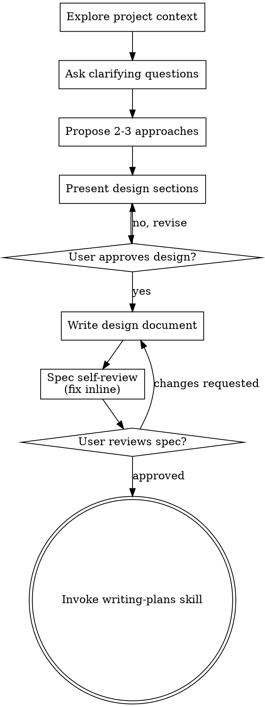

# Brainstorming Ideas Into Designs

Brainstorm the idea into an approved design and specification before any implementation begins.

## Snapshot

This skill is the only skill that may run before implementation work starts. When triggered by a creative-work request (new feature, component, or behavior modification), the writer explores project context, asks clarifying questions one at a time, proposes two to three approaches with a recommendation, presents the design section by section with per-section user approval, writes the validated design to `docs/superpowers/specs/YYYY-MM-DD-<topic>-design.md`, self-reviews the spec, obtains user approval of the written spec, and then hands off to the `writing-plans` skill by name. A Hard Gate blocks every implementation action until the user has approved the design. The terminal state is invoking `writing-plans`; no other implementation skill may be invoked from here. An agent reading only this Snapshot can correctly announce the skill ("I'm using brainstorming to…") and begin the checklist below.

## Quick Reference

*(projection — see Process for full rules)*

| Field | Value |
|---|---|
| Audience | Agent or engineer starting creative work; maintainers/reviewers of produced specs |
| Triggers | Creative-work request received: new feature, component, behavior change, modification |
| Inputs | A user idea or change request; the current project state (files, commits, docs) |
| Outputs | A user-approved spec at `docs/superpowers/specs/YYYY-MM-DD-<topic>-design.md`, committed to git; handoff to `writing-plans` |
| Key files | `skills/brainstorming/visual-companion.md` — just-in-time visual companion guide; `skills/brainstorming/spec-document-reviewer-prompt.md` — spec self-review prompt |

## Related Skills

- **using-superpowers** — `upstream`. Loads and announces this skill first when a creative-work trigger is detected. *Translation:* using-superpowers hands this skill the raw user request plus working directory; this skill treats that handoff as "the idea under exploration" and does not assume the parent's loaded context (L13.1 — separate context per skill).
- **technical-writing** — `shared-kernel`. Co-maintains the Document Metadata, Audience, Purpose/Scope, Definitions, and Revision History slots. Changes to those slot shapes must be flagged in both skills' revision histories.
- **writing-plans** — `downstream`. Brainstorming produces the user-approved spec that writing-plans consumes to build an implementation plan. *Translation:* writing-plans receives the spec file path and a one-line acceptance summary; it calls that artifact "the plan source" and must not re-derive the design.
- **executing-plans** — `downstream`. Consumes the implementation plan that writing-plans produced from this skill's spec. *Translation:* executing-plans sees the spec only indirectly via the plan; this skill never dispatches executing-plans directly.
- **subagent-driven-development** — `downstream`. May consume this skill's spec when a plan step fans out to parallel subagents. *Translation:* subagents receive the relevant spec section as a brief, not the whole brainstorming transcript; they call it "the design context."
- **requesting-code-review** / **receiving-code-review** / **systematic-debugging** / **test-driven-development** / **verification-before-completion** / **documenting-codebases** / **dispatching-parallel-agents** / **finishing-a-development-branch** / **kibana-prod-investigation** / **using-git-worktrees** — `none`. These skills run after implementation begins; this skill's Hard Gate forbids entering their territory from here. Do not chain.

## Document Metadata

| Field | Value |
|---|---|
| Document ID | `SKILL-BS-001` |
| Revision | 2 |
| Effective Date | 2026-07-19 |
| Owner | Skills maintainer |
| Approver | Skills maintainer |
| Doc type | Skill reference |
| Identity strategy | Descriptive name (`brainstorming`), stable across revisions |

## Audience

The writer states the following audience attributes before applying this skill:

- **Primary audience**: Any agent or engineer who starts creative work — a feature, a component, a new behavior, or a modification to an existing system.
- **Secondary audience**: Maintainers who edit this skill; reviewers who audit the specifications it produces.
- **Expertise level**: Intermediate — the reader builds software already and needs the rules that turn an idea into an approved design before implementation.
- **What they already know**: The reader can hold a collaborative design conversation and write Markdown.
- **What they need to learn**: The Hard Gate, the nine-step checklist, the visual-companion rules, and the isolation and clarity principles that this skill enforces.
- **What they will do after reading**: Run the brainstorming process end to end and hand off a written, user-approved specification to the `writing-plans` skill.

## Purpose / Scope

**Purpose**: This skill forces the writer to explore user intent, requirements, and design before any implementation action. The writer presents a design and obtains explicit user approval before writing code.

**Scope covers**:

- Exploring project context before asking questions.
- Asking clarifying questions one at a time to refine the idea.
- Proposing two to three approaches with trade-offs and a recommendation.
- Presenting the design in sections and obtaining user approval per section.
- Writing, self-reviewing, and committing the specification document.
- Offering the visual companion just-in-time, never upfront.

**Scope does NOT cover**:

- Writing or modifying code (governed by code conventions and implementation skills).
- Creating the implementation plan (governed by the `writing-plans` skill, invoked as the terminal state).
- Marketing copy, sales decks, or narrative storytelling.
- Code comments and inline documentation.

## Definitions

The writer defines every acronym and term on first use. This section collects them in one place for reference. In this skill, "design" means the writer's proposed solution as presented in conversation; "spec" means the written, committed artifact.

| Term | Meaning |
|---|---|
| YAGNI | You Aren't Gonna Need It — a principle to defer features until a concrete requirement exists |
| TBD | To Be Determined — banned as a placeholder value in specifications |
| TODO | A marker for unfinished work left in a document |
| UI | User Interface |
| Spec | Specification document produced by this skill and saved under `docs/superpowers/specs/` |
| Design | The proposed solution as presented in conversation, before being written as a spec |
| Hard Gate | The invariant: no implementation action until the user has approved the design |
| Writer | The agent or engineer running this skill |
| User | The person who requested the creative work and must approve the design |
| Visual Companion | The optional browser-based mockup/diagram tool offered just-in-time |
| Sub-project | One independently-shippable piece of an over-large request, brainstormed separately |

## Hard Gate

<HARD-GATE>
Do NOT invoke any implementation skill, write any code, scaffold any project, or take any implementation action until the writer has presented a design and the user has approved it. This rule applies to every project regardless of perceived simplicity.
</HARD-GATE>

This gate exists because two distinct failure modes recur: (1) the agent codes to its first assumption and the user wanted something else, forcing a rewrite; (2) a "simple" request hides an unexamined assumption (scope, boundary, or constraint) that only surfaces mid-implementation. The gate forces both to the surface before any irreversible work.

## Anti-Pattern: "This Is Too Simple To Need A Design"

Every project goes through this process. A todo list, a single-function utility, a config change — all of them. "Simple" projects are where unexamined assumptions cause the most wasted work. The design can be short — a few sentences for truly simple projects — but the writer MUST present it and get approval.

## Checklist

The writer MUST create a task for each of the following items and complete them in order:

1. **Explore project context** — check files, documents, recent commits.
2. **Offer the visual companion just-in-time** — not upfront. The first time a question would genuinely be clearer shown than described, offer it then in its own message; on approval its browser tab opens for the writer. If no visual question ever arises, never offer it. See the Visual Companion section below.
3. **Ask clarifying questions** — one at a time; understand purpose, constraints, and success criteria.
4. **Propose 2–3 approaches** — with trade-offs and the writer's recommendation.
5. **Present design** — in sections scaled to their complexity; get user approval after each section.
6. **Write design document** — save to `docs/superpowers/specs/YYYY-MM-DD-<topic>-design.md` and commit.
7. **Spec self-review** — quick inline check for placeholders, contradictions, ambiguity, and scope (see below).
8. **User reviews written spec** — ask the user to review the spec file before proceeding.
9. **Transition to implementation** — invoke the `writing-plans` skill to create the implementation plan.

## Process Flow

See Figure 1 for the full process flow from project exploration to invoking the `writing-plans` skill.

*Figure 1: The brainstorming process flow from project exploration to invoking the writing-plans skill.*

The terminal state is invoking `writing-plans`. Do NOT invoke frontend-design, mcp-builder, or any other implementation skill. The ONLY skill the writer invokes after brainstorming is `writing-plans`.

## The Process

### Understand the idea

- Check out the current project state first (files, documents, recent commits).
- Before asking detailed questions, assess scope. If the request describes multiple independent subsystems (for example, "build a platform with chat, file storage, billing, and analytics"), flag this immediately. Do not spend questions refining details of a project that needs decomposition first.
- If the project is too large for a single spec, help the user decompose into sub-projects: what are the independent pieces, how do they relate, what order should they be built? Then brainstorm the first sub-project through the normal design flow. Each sub-project gets its own spec, then plan, then implementation cycle.
- For projects scoped to a single spec, ask questions one at a time to refine the idea.
- Prefer multiple choice questions when possible, but open-ended is fine too.
- Send only one question per message. If a topic needs more exploration, break it into multiple questions.
- Focus on understanding: purpose, constraints, and success criteria.

### Explore approaches

- Propose 2–3 different approaches with trade-offs.
- Present options conversationally with the writer's recommendation and reasoning.
- Lead with the recommended option and explain why.

### Present the design

- Once the writer believes they understand what the user is building, present the design.
- Scale each section to its complexity: a few sentences if straightforward, up to 200–300 words if nuanced.
- Ask after each section whether it looks right so far.
- Cover the following: architecture, components, data flow, error handling, and testing.
- Be ready to go back and clarify if something does not make sense.

### Design for isolation and clarity

- Break the system into smaller units that each have one clear purpose, communicate through well-defined interfaces, and can be understood and tested independently.
- For each unit, the writer should be able to answer three questions: what does it do, how do you use it, and what does it depend on?
- Test the boundaries: can someone understand what a unit does without reading its internals? Can the writer change the internals without breaking consumers? If not, the boundaries need work.
- Smaller, well-bounded units are easier for the writer to hold in context at once. The writer reasons better about focused code, and edits are more reliable when files stay focused. A file that grows large is a signal that it is doing too much.

### Work in an existing codebase

- Explore the current structure before proposing changes. Follow existing patterns.
- Where existing code has problems that affect the work (for example, a file that has grown too large, unclear boundaries, or tangled responsibilities), include targeted improvements as part of the design — the way a good developer improves code they are working in.
- Do not propose unrelated refactoring. Stay focused on what serves the current goal.

## After the Design

### Document the design

- Write the validated design (spec) to `docs/superpowers/specs/YYYY-MM-DD-<topic>-design.md`.
  - User preferences for spec location override this default.
- Use the `elements-of-style:writing-clearly-and-concisely` skill if available.
- Commit the design document to git.

### Self-review the spec

After writing the spec document, the writer looks at it with fresh eyes and checks the following:

1. **Placeholder scan**: Spot any "TBD", "TODO", incomplete sections, or vague requirements and fix them.
2. **Internal consistency**: Verify that no sections contradict each other and that the architecture matches the feature descriptions.
3. **Scope check**: Confirm the spec is focused enough for a single implementation plan, or flag that it needs decomposition.
4. **Ambiguity check**: Confirm that no requirement can be interpreted two different ways. If one can, pick one interpretation and make it explicit.

Fix any issues inline. No need to re-review — just fix and move on.

### Obtain user approval of the written spec

After the spec review loop passes, ask the user to review the written spec before proceeding:

> "Spec written and committed to `<path>`. Please review it and let me know if you want to make any changes before we start writing out the implementation plan."

Wait for the user's response. If the user requests changes, make them and re-run the spec review loop. Only proceed once the user approves.

### Hand off to implementation planning

- Invoke the `writing-plans` skill to create a detailed implementation plan.
- Do NOT invoke any other skill. `writing-plans` is the next step.

## Key Principles

*(projection — see The Process for full rules)*

The writer follows these key principles throughout brainstorming:

- **One question at a time** — do not overwhelm the user with multiple questions.
- **Multiple choice preferred** — easier to answer than open-ended when possible.
- **YAGNI ruthlessly** — remove unnecessary features from all designs.
- **Explore alternatives** — always propose 2–3 approaches before settling.
- **Incremental validation** — present the design and get approval before moving on.
- **Be flexible** — go back and clarify when something does not make sense.

## Examples

### Given/When/Expect — canonical trace

- **Given** a user request: "Add a CSV export to the reports page."
- **When** the writer announces "I'm using brainstorming to design the CSV export before implementation."
- **Expect** the writer explores the reports page, asks one clarifying question at a time (e.g., "Export the current view or a custom query?"), proposes 2–3 approaches with a recommendation, presents the design section by section with per-section approval, writes the spec to `docs/superpowers/specs/YYYY-MM-DD-csv-export-design.md`, commits it, asks the user to review, and on approval invokes `writing-plans` — without writing any implementation code first.

### Offer the visual companion just-in-time

- **Given** the writer is mid-brainstorm on a wizard layout and the next question is genuinely visual ("Which of these two step orderings reads better?").
- **When** that question arises.
- **Expect** the writer sends a standalone message offering the visual companion (no question attached), waits for the user's response, and only on acceptance opens the browser tab with `--open`.

### Over-large request — decompose before refining

- **Given** a user request: "Build a platform with chat, file storage, billing, and analytics."
- **When** the writer detects multiple independent subsystems.
- **Expect** the writer flags the scope immediately, helps the user decompose into ordered sub-projects, and brainstorms only the first sub-project through the normal flow — each sub-project gets its own spec, plan, and implementation cycle.

## Visual Companion

A browser-based companion shows mockups, diagrams, and visual options during brainstorming. It is available as a tool, not a mode. Accepting the companion means it is available for questions that benefit from visual treatment; it does NOT mean every question goes through the browser.

**Offering the companion (just-in-time):** Do NOT offer it upfront. Wait until a question would genuinely be clearer shown than told — a real mockup, layout, or diagram question, not merely a UI topic. The first time that happens, offer it then, as its own message:

> "This next part might be easier if I show you — I can put together mockups, diagrams, and comparisons in a browser tab as we go. It's still new and can be token-intensive. Want me to? I'll open it for you."

This offer MUST be its own message. Send only the offer — no clarifying question, summary, or other content. Wait for the user's response. If the user accepts, start the server with `--open` so their browser opens to the first screen automatically. If the user declines, continue text-only and do not offer again unless the user raises it.

**Per-question decision:** Even after the user accepts, decide for each question whether to use the browser or the terminal. The test: would the user understand this better by seeing it than reading it? Choose by content type:

- **Use the browser** for content that is visual — mockups, wireframes, layout comparisons, architecture diagrams, and side-by-side visual designs.
- **Use the terminal** for content that is text — requirements questions, conceptual choices, trade-off lists, A/B/C/D text options, and scope decisions.

A question about a UI topic is not automatically a visual question. "What does personality mean in this context?" is a conceptual question — use the terminal. "Which wizard layout works better?" is a visual question — use the browser.

If the user agrees to the companion, read the detailed guide before proceeding: `skills/brainstorming/visual-companion.md` — it defines the companion's setup, the per-question decision tree, and the token-budget guardrails.

## Revision History

| Rev | Date | Description | Author | Approver |
|---|---|---|---|---|
| 1 | 2026-07-19 | Self-compliance rewrite: added Document Metadata, Audience, Purpose/Scope, Definitions; active voice throughout; lead sentences on all lists; numbered Figure 1 caption; replaced banned vague words; standardized "document" over "doc" | Skills maintainer | Skills maintainer |
| 2 | 2026-07-19 | IDDD layer: added Snapshot, Quick Reference (projection-labeled), Related Skills with typed relationships + Translation notes, Examples in Given/When/Expect, stable identity note, expanded Definitions; renamed Process headings to intent-revealing phrases; rewrote frontmatter description as a specific Domain Event naming the concrete failure mode; added announce line as Factory Method; replaced raw visual-companion inline reference with path + one-line purpose; added Hard Gate motivating scenarios. Deviations: none — all structural rules followed. | Skills maintainer | Skills maintainer |
| 3 | 2026-08-26 | IDDD typology sweep: added type frontmatter, reordered Related Skills by category per _shared/SKILL-ARCH.md | Skills maintainer | Skills maintainer |