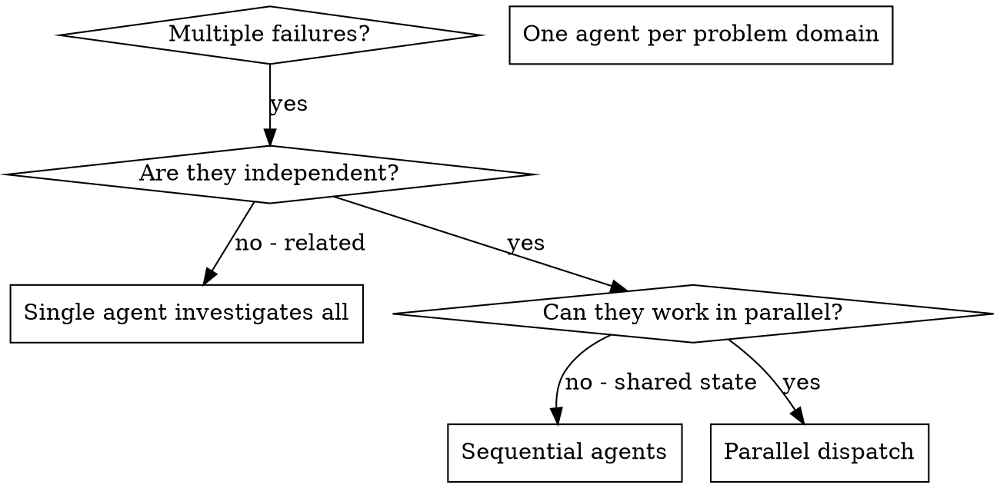

# Dispatching Parallel Agents

Dispatch parallel agents — one subagent per independent problem domain, dispatched in a single response so they run concurrently, results integrated under a shared run ID.

## Snapshot

This skill dispatches one subagent per independent problem domain so the subagents run concurrently and the controller preserves its context for coordination. Trigger: 2+ unrelated failures across different files or subsystems with no shared state between investigations. The controller groups failures by domain, crafts a focused brief per subagent (scope, goal, constraints, expected output), dispatches all subagents in one response so they run in parallel, then integrates results by reading each summary, checking for conflicts, and running the full suite. Do not use when failures are related, when full-system context is required, when subagents would share state, or during exploratory debugging. Each dispatch carries a unique run ID; results without a matching run ID are rejected. One subagent per task — never hand a single subagent a multi-task brief.

## Quick Reference (projection — see Process for full rules)

| Field | Value |
|---|---|
| Audience | Controller agent that coordinates subagents across independent problem domains |
| Triggers | 2+ independent failures across distinct files or subsystems; no shared state between investigations |
| Inputs | Failures grouped by domain; per-domain brief (scope, goal, constraints, expected output); unique run ID |
| Outputs | Integrated fixes; per-subagent summaries; workflow ledger with status per subagent |
| Key files | None — this skill owns no `reference/` or `templates/` directory |

## Document Metadata

| Field | Value |
|---|---|
| Document ID | `SKILL-DPA-001` |
| Revision | 2 |
| Effective Date | 2026-07-20 |
| Owner | Skills maintainer |
| Approver | Skills maintainer |
| Doc type | Skill reference |

## Related Skills

| Sibling skill | Relationship | Notes |
|---|---|---|
| `subagent-driven-development` | `conformist` | Overlaps — both dispatch subagents. This skill is the parallel-dispatch pattern (concurrent, independent domains); SDD is the per-task-sequential pattern (one task, one subagent, ordered). Vocabulary aligns (subagent, brief, dispatch), so this skill adopts SDD's dispatch-brief shape wholesale rather than re-translating. Use SDD when tasks are ordered or dependent; use this skill when tasks are independent. |
| `systematic-debugging` | `downstream` | `systematic-debugging` consumes this skill to parallelize failure investigation when 2+ independent root causes surface. Translation: a "failure" in `systematic-debugging` becomes one "problem domain" here; one debugging hypothesis per subagent. |
| `receiving-code-review` | `none` | Separate ways. Do not chain — `receiving-code-review` operates on review feedback, not on parallel dispatch. |

**Translation notes (A4):**

- *From `subagent-driven-development` (conformist):* SDD's "dispatch brief" arrives as the same four-element brief this skill uses (scope, goal, constraints, expected output). No translation needed — the two skills share the dispatch-brief vocabulary by design (conformist).
- *From `systematic-debugging` (downstream):* A `systematic-debugging` "hypothesis" arrives here as a "problem domain." One hypothesis per subagent; the debugging skill's reproduce→isolate→fix loop runs inside each subagent, not in the controller.

## Audience

The agent states the following audience attributes before applying this skill:

- **Primary audience**: Any controller agent that coordinates subagents across independent problem domains.
- **Secondary audience**: Maintainers who edit this skill; reviewers who audit agent dispatch patterns.
- **Expertise level**: Intermediate — the reader dispatches single agents already and needs the rules that parallelize work safely.
- **What they already know**: The reader can construct a subagent prompt and interpret its summary.
- **What they need to learn**: The decision flow, the dispatch pattern, and the integration steps that keep parallel agents from conflicting.
- **What they will do after reading**: Apply the pattern to dispatch one agent per independent domain and integrate the results.

## Purpose / Scope

**Purpose**: This skill gives the controller the rules to split independent tasks across parallel subagents so the controller preserves its context for coordination work and avoids the wasted wall-clock time of sequential investigation of independent failures.

**Scope covers**:

- The decision flowchart that tells the controller when to parallelize.
- The four-step dispatch protocol: identify domains, craft tasks, dispatch in parallel, integrate.
- The subagent brief structure, run-ID propagation, and the integration checklist.
- A worked example from a debugging session.

**Scope does NOT cover**:

- Sequential agent dispatch (one agent per response) — see `subagent-driven-development`.
- Agent framework configuration or runtime tuning.
- Cross-agent shared state or locking strategies.
- Subagent internal reasoning or tool selection.

## Definitions

The controller defines every acronym on first use. The table below collects them in one place for reference.

| Term | Meaning |
|---|---|
| DPA | Dispatching Parallel Agents (this skill) |
| Subagent | A child agent spawned by the controller with an isolated context |
| Problem domain | One independent cluster of failures the controller can reason about without context from the others |
| Brief | The four-element prompt handed to a subagent: scope, goal, constraints, expected output |
| Run ID | A unique identifier the controller mints per dispatch wave; each subagent result must echo it back |
| Workflow ledger | The controller's per-wave record of dispatched subagents, their status, and the escalation path |

## Core Principle

The controller delegates tasks to specialized subagents that carry isolated context. The controller crafts each subagent's instructions and context so the subagent stays focused and completes its task. The subagent never inherits the controller's session history — the controller constructs exactly what the subagent needs. This isolation also preserves the controller's context for coordination work.

When the controller faces multiple unrelated failures (different test files, different subsystems, different bugs), investigating them sequentially wastes time. Each investigation is independent and can run in parallel. Two scenarios motivate this: (a) 3+ test files failing with different root causes after a refactor; (b) 2+ subsystems broken independently (e.g., abort logic vs. batch completion). Sequential investigation of either burns the controller's context and wall-clock that parallel dispatch recovers.

**Core principle:** The controller dispatches one subagent per independent problem domain and lets them run concurrently.

**Idempotency:** If the same skill is announced twice in one session, the second announcement is a no-op (or a deliberate re-entry with a new run ID and new context), never a fresh dispatch wave.

**Transaction sprawl warning:** One subagent per task, not one subagent handed a multi-task brief. A brief that says "fix all three test files" is a multi-aggregate transaction that reads cleanly in one pass but falls apart under dispatch — the subagent's token budget, attention, and failure surface all compound. Split into three single-domain briefs and dispatch in parallel instead.

## Trigger Conditions

See Figure 1 for the decision flowchart the controller follows before parallelizing.



*Figure 1: Decision flow the controller follows to choose between single-agent, sequential, and parallel dispatch.*

**Use this skill when the controller observes any of the following:**

- 3 or more test files failing with different root causes.
- 2 or more subsystems broken independently.
- Each problem the controller can understand without context from the others.
- No shared state between the investigations.

**Do not use this skill when any of the following holds:**

- The failures are related (fixing one may fix the others).
- The controller must understand the full system state first.
- The subagents would interfere with each other.

## Anti-Triggers

The controller avoids this skill in the following cases:

- **Related failures:** fixing one may fix the others — investigate together first.
- **Full context required:** the problem spans the entire system.
- **Exploratory debugging:** the controller does not know what is broken yet.
- **Shared state:** the subagents would edit the same files or use the same resources.

## Dispatch Protocol

### 1. Identify Independent Domains

The controller groups the failures by what is broken:

- File A tests cover the tool approval flow.
- File B tests cover the batch completion behavior.
- File C tests cover the abort functionality.

Each domain is independent — fixing tool approval does not affect the abort tests.

### 2. Create Focused Subagent Briefs

Each subagent receives the following four elements as a self-contained brief:

- **Specific scope:** one test file or one subsystem.
- **Clear goal:** make these tests pass.
- **Constraints:** do not change other code.
- **Expected output:** a summary of what the subagent found and fixed.

### 3. Mint a Run ID

The controller mints a unique run ID for this dispatch wave (e.g., `dpa-2026-07-20-001`) and includes it in every subagent brief. Each subagent must echo the run ID back in its summary. The controller rejects any result whose run ID does not match the wave's — do not merge results without matching run ID.

### 4. Dispatch in Parallel

The controller issues all three subagent dispatches in the same response so they run in parallel:

```text
Subagent (general-purpose): "Fix agent-tool-abort.test.ts failures"
Subagent (general-purpose): "Fix batch-completion-behavior.test.ts failures"
Subagent (general-purpose): "Fix tool-approval-race-conditions.test.ts failures"
# All three run concurrently.
```

Multiple dispatch calls in one response mean parallel execution. One dispatch call per response means sequential execution.

### 5. Read Each Subagent Summary

When the subagents return, the controller reads each summary and confirms the run ID matches the wave's.

### 6. Verify Fixes Do Not Conflict

The controller checks whether the subagents edited the same code. If they did, the controller resolves the conflict manually before integrating.

### 7. Run the Full Test Suite

The controller runs the full test suite to verify all fixes work together.

### 8. Integrate All Changes

The controller integrates the non-conflicting changes and records the result in the workflow ledger.

## Workflow Ledger

The controller maintains one ledger per dispatch wave. The ledger is a file (or in-memory record) the orchestrator reads and writes, indexed by run ID:

| Subagent | Run ID | Domain | Status | Escalation |
|---|---|---|---|---|
| Subagent 1 | `dpa-2026-07-20-001` | `agent-tool-abort.test.ts` | pending → confirmed / timed-out | Re-dispatch once; on second timeout, escalate to the user with the partial summary |
| Subagent 2 | `dpa-2026-07-20-001` | `batch-completion-behavior.test.ts` | pending → confirmed / timed-out | Same |
| Subagent 3 | `dpa-2026-07-20-001` | `tool-approval-race-conditions.test.ts` | pending → confirmed / timed-out | Same |

**Status values:** `pending` (dispatched, awaiting return), `confirmed` (summary received, run ID matches), `timed-out` (no summary within the controller's threshold).

**Escalation path:** On `timed-out`, re-dispatch the same brief once with the same run ID. On a second timeout, escalate to the user with the partial summaries from the confirmed subagents and the timed-out subagent's brief, so the user can decide whether to drop the domain or investigate it themselves.

## Subagent Brief Format

Good subagent briefs share the following three properties:

1. **Focused** — one clear problem domain.
2. **Self-contained** — all context the subagent needs to understand the problem.
3. **Specific about output** — the controller states what the subagent returns.

```markdown
Fix the 3 failing tests in src/agents/agent-tool-abort.test.ts:

1. "should abort tool with partial output capture" - expects 'interrupted at' in message
2. "should handle mixed completed and aborted tools" - fast tool aborted instead of completed
3. "should properly track pendingToolCount" - expects 3 results but gets 0

These are timing/race condition issues. Your task:

1. Read the test file and understand what each test verifies
2. Identify root cause - timing issues or actual bugs?
3. Fix by:
   - Replacing arbitrary timeouts with event-based waiting
   - Fixing bugs in abort implementation if found
   - Adjusting test expectations if testing changed behavior

Do NOT just increase timeouts - find the real issue.

Run ID: dpa-2026-07-20-001
Return: Summary of what you found and what you fixed, prefixed with the Run ID.
```

## Common Mistakes (projection — see Dispatch Protocol for full rules)

The table below contrasts common mistakes with the corrected pattern the controller uses instead:

| Mistake | Correction |
|---|---|
| ❌ Too broad: "Fix all the tests" — the subagent gets lost | ✅ Specific: "Fix agent-tool-abort.test.ts" — focused scope |
| ❌ No context: "Fix the race condition" — the subagent does not know where | ✅ Context: paste the error messages and the test names |
| ❌ No constraints: the subagent might refactor everything | ✅ Constraints: "Do NOT change production code" or "Fix tests only" |
| ❌ Vague output: "Fix it" — the controller does not know what changed | ✅ Specific: "Return summary of root cause and changes" |
| ❌ Multi-task brief: "fix all three files" handed to one subagent | ✅ One subagent per task: three briefs, three subagents, parallel dispatch |
| ❌ No run ID: results cannot be matched to the dispatch wave | ✅ Mint a run ID per wave; reject results without a matching ID |

## Worked Example

**Given:** 6 test failures across 3 files after a major refactoring, no shared state between the failures.

**When:** The controller announces `dispatching-parallel-agents`, mints run ID `dpa-2026-07-20-001`, and dispatches one subagent per file in a single response.

**Expect:** All three subagents return summaries prefixed with the run ID; the controller confirms each run ID, verifies the fixes do not conflict, runs the full suite, and records `confirmed` for all three in the workflow ledger.

**Failures:**

- `agent-tool-abort.test.ts`: 3 failures (timing issues).
- `batch-completion-behavior.test.ts`: 2 failures (tools not executing).
- `tool-approval-race-conditions.test.ts`: 1 failure (execution count = 0).

**Decision:** independent domains — abort logic is separate from batch completion, which is separate from race conditions.

**Dispatch:**

```
Agent 1 → Fix agent-tool-abort.test.ts
Agent 2 → Fix batch-completion-behavior.test.ts
Agent 3 → Fix tool-approval-race-conditions.test.ts
```

**Results:**

- Agent 1 replaced timeouts with event-based waiting.
- Agent 2 fixed the event structure bug (`threadId` in the wrong place).
- Agent 3 added a wait for async tool execution to complete.

**Integration:** all fixes are independent, no conflicts, full suite green.

**Time saved:** 3 problems solved in parallel instead of sequentially.

## Benefits

The controller gains the following four benefits from this pattern:

1. **Parallelization** — multiple investigations run simultaneously.
2. **Focus** — each subagent has a narrow scope with less context to track.
3. **Independence** — subagents do not interfere with each other.
4. **Speed** — 3 problems solved in the time of 1.

## Integration Checklist

After the subagents return, the controller runs the following checklist:

1. **Confirm run ID on each summary** — reject any result whose run ID does not match the wave.
2. **Review each summary** — understand what changed.
3. **Check for conflicts** — did the subagents edit the same code?
4. **Run the full suite** — verify all fixes work together.
5. **Spot check** — subagents can make systematic errors.
6. **Update the workflow ledger** — mark each subagent `confirmed` or `timed-out`.

## Deviations

None. This skill follows all structural rules from the IDDD spec: required slots intact, small aggregate (one responsibility — parallel dispatch), reference-by-name for siblings, projections labeled, snapshot present.

## Revision History

| Rev | Date | Description | Author | Approver |
|---|---|---|---|---|
| 1 | 2026-07-19 | Technical-writing compliance rewrite: added Document Metadata, Audience, Purpose/Scope, Definitions, figure caption, active voice, lead sentences on all lists, Revision History | Skills maintainer | Skills maintainer |
| 2 | 2026-07-20 | IDDD-layer rewrite: added Snapshot, Quick Reference (projection), Related Skills with typed relationships (`conformist`/`downstream`/`none`) + Translation notes, Idempotency line, Workflow ledger subsection, Run ID requirement (L4.6), Transaction sprawl warning (L12.5); rewrote `description` as a specific Domain Event naming the failure mode; added Factory announce line; renamed generic headings to ubiquitous language (Overview→Core Principle, The Pattern→Dispatch Protocol, When to Use→Trigger Conditions, When NOT to Use→Anti-Triggers, Subagent Prompt Structure→Subagent Brief Format, Common Mistakes labeled projection, Real Example→Worked Example with Given/When/Expect, Verification→Integration Checklist); split the Review-and-Integrate god-method into one-intent-per-step steps; added run ID + transaction-sprawl rows to Common Mistakes; added Definitions entries for Problem domain, Brief, Run ID, Workflow ledger; no deviations | Skills maintainer | Skills maintainer |