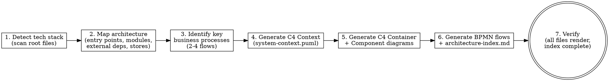

# Documenting Codebases

Document codebases by reading the source, extracting the architecture, and generating C4 and BPMN diagrams as PlantUML files that diff cleanly in git.

## Snapshot

This skill turns a previously-undocumented codebase into a durable, reviewable architecture record. The writer reads the code (the source of truth), runs a 7-phase workflow — detect tech stack, map architecture, identify key business processes, generate C4 Context, generate C4 Container + Component, generate BPMN flows + index, verify — and writes C4 model diagrams (Context, Container, Component) plus 2–4 BPMN process flows as PlantUML text files under `docs/architecture/`. The output is diff-friendly text, not binary diagrams, so it tracks the code in version control. The writer never guesses: every Person, System, Container, Component, and relationship in the diagrams is traced to code the writer has actually read. C4 Level 4 (Code) is intentionally skipped because class-level diagrams drift faster than diagrams can track and already live in the source. Use this skill for onboarding, architecture reviews, ADR companion diagrams, or post-refactoring state capture; do not use it for single-file scripts, codebases under 3 files, or quick overviews (use a Markdown sketch instead).

## Quick Reference

(projection — see Workflow for full rules.)

| Aspect | Value |
|---|---|
| Audience | Agents/engineers documenting an existing codebase's architecture |
| Triggers | No architecture docs exist; current diagrams drift from code; onboarding/audit/ADR/refactoring needs current state |
| Inputs | Readable source tree (root files, entry points, modules, config) |
| Outputs | `docs/architecture/` PlantUML files: C4 Context, Container, Component (per significant container), 2–4 BPMN flows, README index |
| Key files | `c4-plantuml-reference.md`, `bpmn-plantuml-reference.md`, `tech-detection-guide.md`, `templates/*.puml`, `templates/architecture-index.md` |

## Related Skills

| Sibling | Relationship | Why |
|---|---|---|
| `technical-writing` | `shared-kernel` | Both define document structure and co-maintain the Definitions/audience/scope overlap. Flag both revision histories when the shared terms change. |
| `writing-skills` | `downstream` | This skill is a documentation skill that `writing-skills`' TDD-for-skills process would pressure-test; its SKILL.md is a candidate for `writing-skills` micro-tests. |
| `brainstorming` | `none` | Documentation of an existing codebase is descriptive, not creative ideation; do not chain `brainstorming` before this skill. |

**Translation notes:**

- **From `writing-skills` (downstream):** when `writing-skills` pressure-tests this SKILL.md, its "skill" concept maps onto this file's self-description; its "test" concept maps onto the 7-phase verification (Phase 7). The `writing-skills` micro-test treats the snapshot + announce line as the executable assertion.
- **From `technical-writing` (shared-kernel):** the four required slots (Audience, Purpose/Scope, When to Use, When NOT to Use), active voice, lead sentences, Definitions, and Revision History are co-maintained. Both skills call them the same thing; a change here must be flagged in `technical-writing`'s history and vice versa.

## Document Metadata

| Field | Value |
|---|---|
| Document ID | `SKILL-DC-001` |
| Revision | 2 |
| Effective Date | 2026-07-20 |
| Owner | Skills maintainer |
| Approver | Skills maintainer |
| Doc type | Skill reference |

## Audience

The writer states the following audience attributes before drafting any document this skill governs:

- **Primary audience**: Any agent or engineer who documents an existing codebase's architecture.
- **Secondary audience**: Reviewers who audit the generated PlantUML files; maintainers who edit this skill.
- **Expertise level**: Intermediate — the reader reads source code already and needs the workflow that turns that reading into PlantUML diagrams.
- **What they already know**: The reader can read source code in the target language and write Markdown.
- **What they need to learn**: The C4 and BPMN mapping tables, the 7-phase workflow, and the PlantUML output conventions.
- **What they will do after reading**: Apply the 7-phase workflow to produce C4 and BPMN PlantUML files under `docs/architecture/`.

## Purpose / Scope

**Purpose**: This skill gives the rules the writer follows to generate architecture documentation for an existing codebase. The output is C4 model diagrams (3 levels: Context, Container, Component) and BPMN process flows (2 to 4 key business processes) as PlantUML text files that diff cleanly in git.

**Scope covers**:

- Tech stack detection from root files.
- Code reading to map entry points, modules, external dependencies, data stores, and deployment units.
- C4 Context, Container, and Component diagram generation as PlantUML files.
- BPMN process flow generation as PlantUML activity diagrams.
- Verification of generated files before the writer claims completion.

**Scope does NOT cover**:

- Single-file scripts or throwaway prototypes.
- Codebases with fewer than 3 files (too small for C4 levels).
- Quick overviews (use a Markdown sketch instead).
- C4 Level 4 (Code) diagrams — they live in the source code and drift faster than diagrams can track.

## Definitions

The writer defines every acronym and term on first use. This section collects them in one place for reference.

| Term | Meaning |
|---|---|
| C4 | Context, Container, Component, Code — a four-level model for software architecture diagrams |
| BPMN | Business Process Model and Notation — a standard for modeling business process flows |
| ADR | Architecture Decision Record — a short text document that captures one architectural decision |
| PlantUML | A text-to-diagram tool that renders diagrams from a domain-specific language |
| PUML | The file extension used for PlantUML source files |

## When to Use

Use this skill when the writer faces any of these tasks:

- A new codebase needs architecture documentation from scratch.
- Onboarding documentation for a project.
- An architecture review or audit.
- ADR companion diagrams that visualize decisions.
- A major refactoring needs the new state documented.

## When NOT to Use

Do not use this skill for the following:

- Single-file scripts or throwaway prototypes.
- Codebases with fewer than 3 files (too small for C4 levels).
- The writer only needs a quick overview (use a Markdown sketch instead).

## Documentation Approach

The writer generates architecture documentation for an existing codebase using **C4 model diagrams** (3 levels: Context, Container, Component) and **BPMN process flows** (2 to 4 key business processes). All output is PlantUML text files that diff cleanly in git, written to `docs/architecture/`.

**Core principle**: The writer reads the code thoroughly, extracts the architecture, then generates the PlantUML diagrams. The code is the source of truth. The writer does not guess — the writer reads, maps, then draws.

## Workflow

See Figure 1 for the 7-phase workflow the writer follows.



*Figure 1: The 7-phase workflow the writer follows to document a codebase.*

### Phase 1: Detect Tech Stack

The writer scans root files to identify the language, build tool, framework, and module structure. Read `tech-detection-guide.md` for the full detection table — it defines the root-file-to-tech mapping used here.

The writer scans these root files in order:

1. `pom.xml` / `build.gradle` → Java (Maven/Gradle)
2. `package.json` / `tsconfig.json` → JS/TS (npm/yarn)
3. `go.mod` → Go
4. `pyproject.toml` / `setup.py` → Python
5. `Cargo.toml` → Rust
6. `docker-compose.yml` / `Dockerfile` → deployment context
7. `AGENTS.md` / `README.md` / `CONTRIBUTING.md` → project conventions

**Output**: A tech stack summary (language, build, framework, modules, entry points).

### Phase 2: Map Architecture

The writer reads the codebase thoroughly (full code reading). The writer identifies the following items:

1. **Entry points** — where execution starts (main methods, verticles, CLI commands, server bootstrap).
2. **Modules/packages** — top-level decomposition (Maven modules, npm workspaces, Go packages, Python packages).
3. **External dependencies** — databases, message brokers, external APIs, cloud services (scan config files, connection strings, HTTP client calls).
4. **Data stores** — databases, caches, file systems, queues.
5. **Deployment units** — what the team deploys independently (services, SPAs, batch jobs, scheduled tasks).

The writer maps the architecture to C4 elements as follows:

- Entry points → starting point for the Container diagram
- Modules → Components within a Container
- External deps → `System_Ext` in Context, relationships in Container
- Data stores → `ContainerDb` in Container
- Deployment units → `Container` in Container

### Phase 3: Identify Key Business Processes

The writer reads route definitions, event handlers, CLI commands, and scheduled jobs to identify the 2 to 4 most important business processes. The writer looks for the following handlers:

- **HTTP route handlers** (`@GetMapping`, `router.get()`, `app.get()`) → request flows
- **Event listeners** (`@EventListener`, `@EventPattern`, `on()`) → event-driven flows
- **Webhook handlers** (POST endpoints receiving external callbacks) → integration flows
- **Scheduled jobs** (`@Scheduled`, cron expressions) → background flows
- **CLI commands** (`@ShellComponent`, `click.command()`) → operational flows

The writer selects 2 to 4 processes that meet the following criteria:

- Are critical to the business (core value proposition)
- Involve multiple components or external systems
- Have non-trivial logic (branching, error handling, async operations)

### Phase 4: Generate C4 Context Diagram

The writer writes `docs/architecture/system-context.puml` with the following macros:

- `!include <C4/C4_Context>`
- `Person` for each user role
- `System` for the software system being documented
- `System_Ext` / `SystemDb_Ext` for external dependencies
- `Rel` for relationships (who calls what)
- `LAYOUT_WITH_LEGEND()`

**Reference**: See `c4-plantuml-reference.md` for the full macro reference and `templates/system-context.puml` for the starting skeleton.

### Phase 5: Generate C4 Container + Component Diagrams

The writer writes `docs/architecture/container.puml` with the following macros:

- `!include <C4/C4_Container>`
- `Container` for each deployable unit (specify technology)
- `ContainerDb` for databases
- `ContainerQueue` for message queues
- `Container_Ext` for external deployable systems
- `System_Boundary` to group containers

The writer writes `docs/architecture/component-<container>.puml` for each significant container with the following macros:

- `!include <C4/C4_Component>`
- `Component` for each module/package within the container (specify technology)
- `Container_Boundary` to scope the diagram
- Show relationships to external systems (greyed out with `System_Ext`)
- **Max 15 components per diagram.** If a container has more than 15 meaningful components, the writer splits into multiple diagrams by subsystem (for example, `component-api-security.puml`, `component-api-data.puml`).

The writer produces one component diagram per significant container. The writer skips trivial containers (a database does not need a component diagram).

**Reference**: See `c4-plantuml-reference.md` for the Container/Component macro reference and `templates/container.puml` / `templates/component.puml` for the starting skeletons.

### Phase 6: Generate BPMN + Index

The writer writes `docs/architecture/bpmn-<process>.puml` for each of the 2 to 4 key business processes with the following syntax:

- Use PlantUML activity diagram syntax (beta)
- `partition` for swimlanes (module/service boundaries)
- `if/else` for business decisions (XOR gateways)
- `fork/end fork` for parallel execution
- `start` / `stop` for begin/end events
- `note` for annotations (HTTP calls, payloads, error codes)

**Reference**: See `bpmn-plantuml-reference.md` for the BPMN-to-PlantUML activity mapping and `templates/bpmn-process.puml` for the starting skeleton.

The writer writes `docs/architecture/README.md` (index) with the following content:

- Use `templates/architecture-index.md` as the starting point
- List all generated `.puml` files with descriptions
- Include the tech stack summary
- Include rendering instructions

### Phase 7: Verify

Before the writer claims completion, the writer verifies the following items:

- [ ] `system-context.puml` exists and shows Person + System + System_Ext + Rel
- [ ] `container.puml` exists and shows Container + ContainerDb + Rel with technologies
- [ ] At least one `component-*.puml` exists per significant container
- [ ] 2 to 4 `bpmn-*.puml` files exist, each with start/stop and at least one partition
- [ ] `README.md` index references all generated files
- [ ] All `.puml` files have valid PlantUML syntax (no `## TODO ##` placeholders remaining)
- [ ] No `## TODO ##` markers left in any generated file

## Quick Reference: C4 Mapping

(projection — see Workflow for full rules. When this table and the Workflow prose disagree, the Workflow wins.)

The writer maps code constructs to C4 elements as follows:

| Code construct | C4 Element | Level |
|---|---|---|
| End user, admin, operator | `Person` | Context |
| Third-party API, external service | `System_Ext` | Context |
| The software system as a whole | `System` | Context |
| Deployable service (API server, SPA, batch job) | `Container` | Container |
| Database, cache, object store | `ContainerDb` | Container |
| Message queue, event bus | `ContainerQueue` | Container |
| Module, package, layer within a container | `Component` | Component |
| HTTP call, import, DB query, event publish | `Rel` | All levels |

## Quick Reference: BPMN Mapping

(projection — see Workflow for full rules. When this table and the Workflow prose disagree, the Workflow wins.)

The writer maps code constructs to BPMN elements as follows:

| Code construct | BPMN Element | PlantUML |
|---|---|---|
| HTTP request handler, CLI command, event listener | Start event | `start` |
| Response, return, completion | End event | `stop` |
| Handler method, service call | Task | `:task name;` |
| if/switch, conditional logic | Exclusive gateway | `if (cond) then ... else ... endif` |
| Async parallel operations | Parallel gateway | `fork ... end fork` |
| Module/service boundary | Swimlane | `partition "Name" { }` |
| Error handling, early return | Error end event | `stop` inside `if` |
| Loop, retry | Loop activity | `while (cond) is (yes) ... endwhile (no)` |

## Output Artifacts

The writer produces the following files under `docs/architecture/`:

```
docs/architecture/
  README.md                      # Index + tech stack + rendering instructions
  system-context.puml            # C4 Level 1: System Context
  container.puml                 # C4 Level 2: Container
  component-<container1>.puml    # C4 Level 3: Component (per significant container)
  component-<container2>.puml
  bpmn-<process1>.puml           # BPMN: Key business process 1
  bpmn-<process2>.puml           # BPMN: Key business process 2
  bpmn-<process3>.puml           # BPMN: Key business process 3 (if needed)
```

## Failure Modes and Corrections

(projection — see Workflow for full rules. When this list and the Workflow prose disagree, the Workflow wins.)

The writer avoids the following mistakes when generating architecture documentation:

| Mistake | Fix |
|---|---|
| **Too many components** — listing every class or exceeding 15 per diagram | Group by package/module. One Component per package, not per class. **Max 15 components per diagram — if more, split into multiple component diagrams** (for example, `component-api-core.puml`, `component-api-security.puml`). |
| **Missing external systems** — forgetting the database or third-party APIs | Scan config files, connection strings, and HTTP client calls explicitly. |
| **BPMN too granular** — documenting every if/else branch | Focus on business decisions, not implementation details. Skip null checks and validation boilerplate. |
| **C4 Level 4 (Code)** — generating class diagrams | Intentionally skip Level 4. It drifts faster than diagrams can track and lives in the source code. |
| **No technology labels** — `Container(api, "API", "", "")` | Always specify technology: `Container(api, "API", "Java 25 + Vert.x 5", "HTTP API")`. |
| **Placeholder leftovers** — `## TODO ##` in final output | Phase 7 verifies no placeholders remain. Re-check before finishing. |
| **All files in one .puml** — multiple @startuml blocks | One file per diagram. Easier to diff, easier to maintain, easier to render individually. |
| **Guessing instead of reading** — inventing architecture without code analysis | Read the actual code. The code is the source of truth. Never guess relationships or components. |
| **Too many BPMN diagrams** — documenting every endpoint | 2 to 4 key processes maximum. Select the most important business flows, not every route handler. |
| **Inconsistent naming** — `api` in one diagram, `API` in another | Use consistent aliases across all diagrams. An alias defined in Context should match Container and Component. |

## Red Flags — STOP and Re-read

The writer stops and re-reads the code on any of these signals:

- The writer is about to write a diagram without having read the actual source files
- The writer is guessing what a module does based on its name alone
- The writer has more than 15 components in a single component diagram
- The writer has more than 4 BPMN diagrams
- The writer is generating C4 Level 4 (Code) diagrams
- The writer left `## TODO ##` placeholders in the output
- The writer did not create the `README.md` index

Each of these means: stop, re-read the code, and fix the output.

## Worked Example

This example is the skill's self-test (L5.4): if the agent follows the Workflow on the inputs, it produces the stated output.

**Given** a polyglot repo with `pom.xml` (Java service), `package.json` (React SPA), `docker-compose.yml` (Postgres + Redis), and three HTTP route handlers, one of which orchestrates a payment that fans out to a payment gateway and writes to Postgres.

**When** the agent announces this skill and runs the 7-phase Workflow,

**Expect** `docs/architecture/` to contain: `system-context.puml` (Person + System + payment-gateway `System_Ext` + Postgres/Redis `ContainerDb`), `container.puml` (Java service Container + React SPA Container + Postgres `ContainerDb` + Redis `ContainerDb`, each with a technology label), `component-api.puml` (Components for the Java service's modules, ≤15), `bpmn-payment.puml` (start → validate → fork to gateway + persist → end), and `README.md` indexing all files with the tech stack summary and rendering instructions — and Phase 7 verification passes with no `## TODO ##` markers.

A second motivating scenario for the same rule: **Given** a Python monorepo (`pyproject.toml` + `docker-compose.yml`) with an event-driven ingestion pipeline, **When** the agent runs the Workflow, **Expect** a `bpmn-ingest.puml` with a `partition` per service and a `fork/end fork` for the parallel write-to-store and publish-to-bus branches. Two distinct codebases exercising the same Workflow confirm it generalizes rather than being overfit to one story.

## Rules and Motivating Scenarios

Two "always" rules in this skill, each with the scenarios that motivate it:

- **Always specify technology on every `Container`/`Component`.** Motivated by (1) onboarding readers cannot infer the stack from an empty technology field and (2) audits comparing the diagram to the deployment manifest need the label to detect drift.
- **Always cap components at 15 per diagram and split beyond it.** Motivated by (1) diagrams over 15 components render illegibly in a code-review diff and (2) reviewers cannot hold 20+ boxes in working memory to spot a missing relationship.

## Files in this Skill

The writer finds the following files in this skill:

| File | Purpose |
|---|---|
| `SKILL.md` | This file — main reference and workflow |
| `c4-plantuml-reference.md` | C4-PlantUML syntax, macros, and complete examples |
| `bpmn-plantuml-reference.md` | BPMN-to-PlantUML activity mapping and examples |
| `tech-detection-guide.md` | Language/framework detection table |
| `templates/system-context.puml` | Template for C4 Level 1 |
| `templates/container.puml` | Template for C4 Level 2 |
| `templates/component.puml` | Template for C4 Level 3 |
| `templates/bpmn-process.puml` | Template for BPMN process diagrams |
| `templates/architecture-index.md` | Template for `docs/architecture/README.md` |

## Revision History

| Rev | Date | Description | Author | Approver |
|---|---|---|---|---|
| 1 | 2026-07-19 | Initial self-compliance rewrite: added Document Metadata, Audience, Purpose/Scope (with "does NOT cover"), Definitions (C4, BPMN, ADR, PlantUML, PUML), active voice throughout, numbered caption on Figure 1, Revision History | Skills maintainer | Skills maintainer |
| 2 | 2026-07-20 | IDDD-layer rewrite (additive to technical-writing): added Snapshot (≤200 words), Quick Reference table, Related Skills with typed relationships (`writing-skills` downstream, `technical-writing` shared-kernel, `brainstorming` none) + Translation notes, Worked Example in Given/When/Expect form with a second motivating scenario, Rules and Motivating Scenarios section; rewrote `description` to name the concrete failure mode (undocumented architecture decays faster than diagrams can track); added imperative announce line whose verb matches the skill name; renamed generic headings (Overview → Documentation Approach, Output Convention → Output Artifacts, Common Mistakes → Failure Modes and Corrections); labeled all quick-reference/projection tables "(projection — see Workflow for full rules)"; replaced inline reference-file content with path + purpose references; bumped Revision to 2. **Deviations:** none — all IDDD structural rules applied without exception. | Skills maintainer | Skills maintainer |
| 3 | 2026-08-26 | IDDD typology sweep: added type frontmatter, reordered Related Skills by category per _shared/SKILL-ARCH.md | Skills maintainer | Skills maintainer |