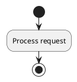
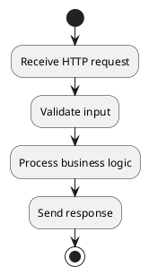
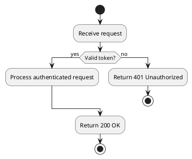
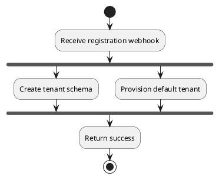
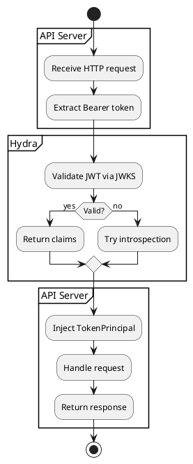
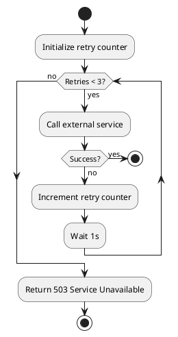
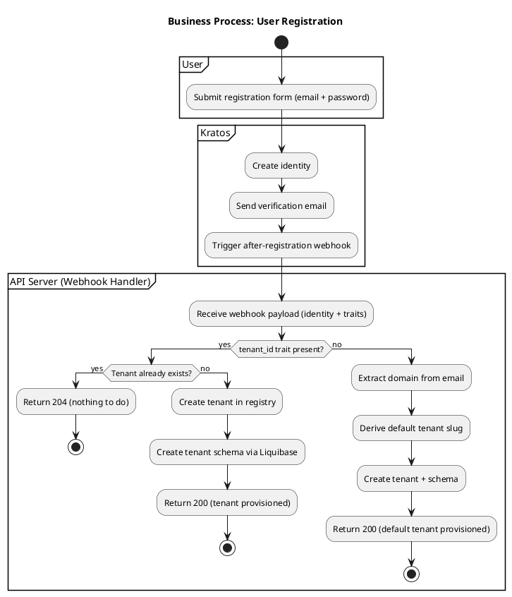
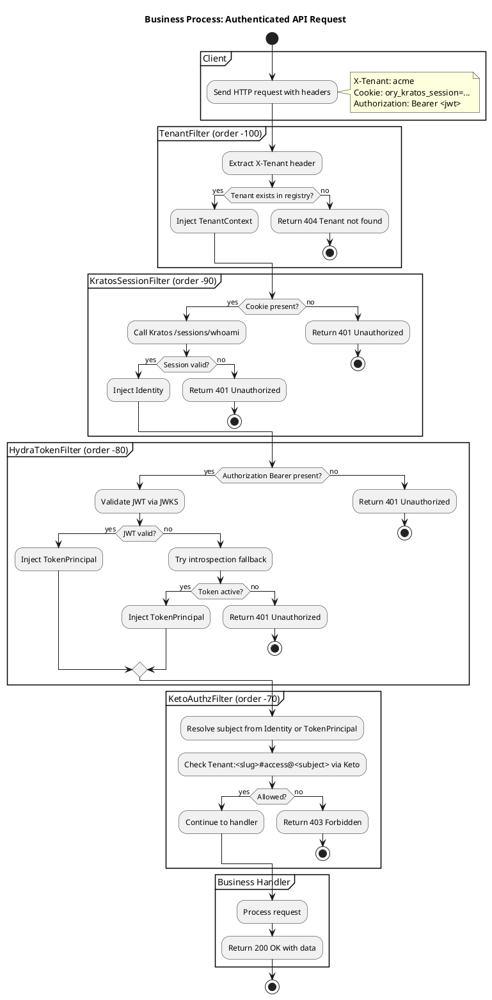
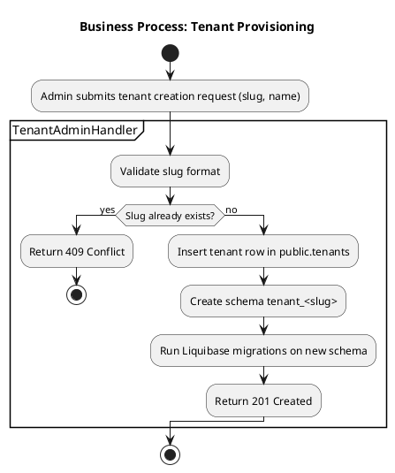

# BPMN Process Diagrams with PlantUML Activity

PlantUML does not have native BPMN 2.0 support, but its **activity diagram (beta syntax)**
maps well to BPMN constructs and is text-based, diffable, and git-friendly.

## BPMN → PlantUML Activity Mapping

| BPMN Element | PlantUML Activity Syntax | Notes |
|---|---|---|
| Start event | `start` | Single entry point per process |
| End event | `stop` | Can have multiple end events |
| Task | `:Task name;` | Colon prefix, semicolon suffix |
| Sub-process | `:Label;` then `note right: see sub-process diagram` | Reference separate diagram |
| Exclusive gateway (XOR) | `if (condition) then (yes)\n :task;\n else (no)\n :task;\n endif` | Branch on condition |
| Parallel gateway (AND) | `fork\n :task A;\n fork again\n :task B;\n end fork` | Concurrent execution |
| Inclusive gateway (OR) | Multiple `if` blocks, each independent | No native OR; use multiple ifs |
| Swimlane (pool/lane) | `partition "Lane Name" {\n ...\n }` | Groups tasks by role/system |
| Error boundary event | `if (condition?) then (yes)\n :handle error;\n stop\n endif` | Error as conditional branch |
| Message flow | `note right: HTTP call to Kratos` | Annotate cross-system calls |
| Timer event | `:Wait for schedule;` | Cron or scheduled trigger |
| Loop activity | `while (condition?) is (yes)\n :task;\nendwhile (no)` | Loop with condition |

## Basic Syntax

### Start and Stop

### Tasks

### Conditional (Exclusive Gateway)

### Parallel (Parallel Gateway)

### Swimlanes (partition)

### Loop

## Complete Example: User Registration Flow

## Complete Example: Authenticated API Request Flow

## Complete Example: Tenant Provisioning Flow

## Tips

- Use `partition` for swimlanes — maps to BPMN pools/lanes
- Use `note right` or `note left` to annotate HTTP calls, payloads, or error codes
- One `.puml` file per business process (e.g., `bpmn-registration.puml`, `bpmn-auth-flow.puml`)
- Keep diagrams readable: max 20-30 elements per diagram. Split into sub-processes if larger
- Use `if/else` for business decisions (XOR gateways) — the most common BPMN pattern
- Use `fork/end fork` sparingly — only when true parallelism exists in the process
- End every path with `stop` (BPMN end event) — avoid implicit termination
- Label tasks with action verbs: "Validate token", "Create schema", "Send response"