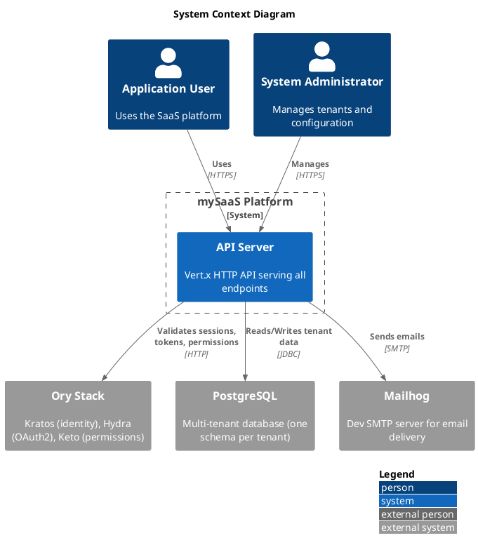
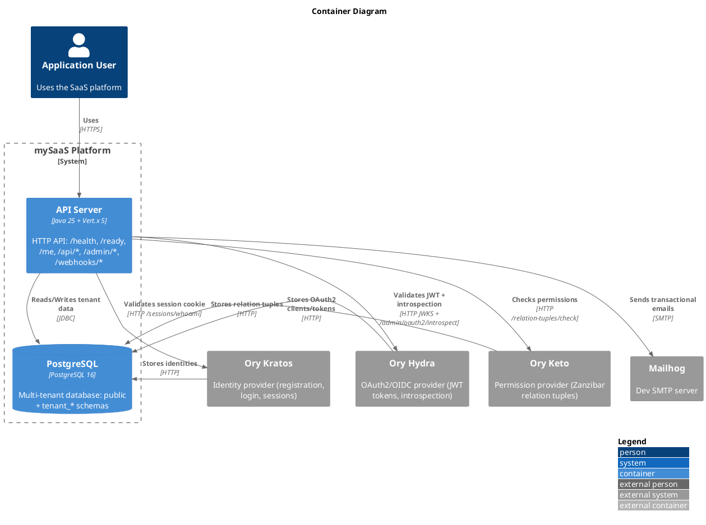

# C4-PlantUML Reference

## Including the library

PlantUML includes C4 macros as standard library (no internet or additional files needed):

```
!include <C4/C4_Context>       !// System Context & Landscape
!include <C4/C4_Container>     !// Container (includes Context macros)
!include <C4/C4_Component>     !// Component (includes Container macros)
!include <C4/C4_Deployment>    !// Deployment (includes Container macros)
!include <C4/C4_Dynamic>       !// Dynamic (includes Component macros)
```

Use the most specific include for your diagram type. `C4_Component` includes all
macros from `C4_Container` which includes `C4_Context`.

## Element Macros

### Context Level (C4_Context)

```
Person(alias, "Label", "Optional Description")
Person_Ext(alias, "Label", "Optional Description")
System(alias, "Label", "Optional Description")
System_Ext(alias, "Label", "Optional Description")
SystemDb(alias, "Label", "Optional Description")
SystemDb_Ext(alias, "Label", "Optional Description")
SystemQueue(alias, "Label", "Optional Description")
SystemQueue_Ext(alias, "Label", "Optional Description")
Boundary(alias, "Label", "Optional Type")
Enterprise_Boundary(alias, "Label")
System_Boundary(alias, "Label")
```

### Container Level (C4_Container)

All Context macros plus:

```
Container(alias, "Label", "Technology", "Optional Description")
ContainerDb(alias, "Label", "Technology", "Optional Description")
ContainerQueue(alias, "Label", "Technology", "Optional Description")
Container_Ext(alias, "Label", "Technology", "Optional Description")
ContainerDb_Ext(alias, "Label", "Technology", "Optional Description")
ContainerQueue_Ext(alias, "Label", "Technology", "Optional Description")
Container_Boundary(alias, "Label")
```

### Component Level (C4_Component)

All Container macros plus:

```
Component(alias, "Label", "Technology", "Optional Description")
ComponentDb(alias, "Label", "Technology", "Optional Description")
ComponentQueue(alias, "Label", "Technology", "Optional Description")
Component_Ext(alias, "Label", "Technology", "Optional Description")
ComponentDb_Ext(alias, "Label", "Technology", "Optional Description")
ComponentQueue_Ext(alias, "Label", "Technology", "Optional Description")
```

## Relationship Macros

```
Rel(from, to, "Label", "Optional Technology")
BiRel(from, to, "Label", "Optional Technology")

!// Directional variants
Rel_U(from, to, "Label")   !// Up
Rel_D(from, to, "Label")   !// Down
Rel_L(from, to, "Label")   !// Left
Rel_R(from, to, "Label")   !// Right

!// Layout (arrange without relationship)
Lay_U(from, to)
Lay_D(from, to)
Lay_L(from, to)
Lay_R(from, to)
```

## Layout & Styling

```
LAYOUT_WITH_LEGEND()          !// Show legend
LAYOUT_AS_SKETCH()            !// Sketch style (hand-drawn look)
HIDE_STEREOTYPE()             !// Hide stereotype labels
SHOW_LEGEND()                 !// Show tag-based legend

!// New style (cleaner, recommended)
!define NEW_C4_STYLE
```

## Tags & Custom Styling

```
!// Define a tag with styling
AddElementTag("v1.0", $borderColor="#d73027")
AddRelTag("async", $lineStyle=DashedLine())

!// Apply tag to element
Container(api, "API", "Java", "Handles logic", $tags="v1.0")

!// Apply tag to relationship
Rel(api, db, "Writes", "JDBC", $tags="async")
```

## Complete Example: System Context



## Complete Example: Container Diagram



## Complete Example: Component Diagram

```plantuml
@startuml component
!include <C4/C4_Component>

LAYOUT_WITH_LEGEND()

title Component Diagram - API Server

!// External systems (greyed out)
System_Ext(kratos, "Ory Kratos", "Identity provider")
System_Ext(hydra, "Ory Hydra", "OAuth2 provider")
System_Ext(keto, "Ory Keto", "Permission provider")
System_Ext(pg, "PostgreSQL", "Multi-tenant DB")

Container_Boundary(api, "API Server (Java 25 + Vert.x 5)") {
  Component(httpServer, "HttpServerVerticle", "Vert.x", "HTTP server + router, mounts all filters and routes")

  Component(tenantFilter, "TenantFilter", "Vert.x filter", "Resolves tenant from X-Tenant header, order -100")
  Component(tenantRegistry, "TenantRegistry", "JDBC", "CRUD operations on public.tenants table")
  Component(schemaMgr, "TenantSchemaManager", "Liquibase", "Per-tenant schema migrations (tenant_* schemas)")

  Component(sessionFilter, "KratosSessionFilter", "Vert.x filter", "Validates Kratos session cookie, order -90")
  Component(kratosClient, "KratosClient", "WebClient", "HTTP client to Kratos /sessions/whoami")

  Component(tokenFilter, "HydraTokenFilter", "Vert.x filter", "Validates Bearer JWT, order -80")
  Component(tokenValidator, "HydraTokenValidator", "vertx-auth-jwt", "Local JWT validation via JWKS")
  Component(introspectionClient, "HydraIntrospectionClient", "WebClient", "Fallback introspection for opaque tokens")

  Component(authzFilter, "KetoAuthzFilter", "Vert.x filter", "Checks tenant permissions, order -70")
  Component(ketoClient, "KetoClient", "WebClient", "HTTP client to Keto /relation-tuples/check")

  Component(healthHandler, "HealthHandler", "Vert.x handler", "/health and /ready endpoints")
}

Rel(httpServer, tenantFilter, "Mounts", "order -100")
Rel(httpServer, sessionFilter, "Mounts", "order -90")
Rel(httpServer, tokenFilter, "Mounts", "order -80")
Rel(httpServer, authzFilter, "Mounts", "order -70")

Rel(tenantFilter, tenantRegistry, "Resolves tenant")
Rel(tenantRegistry, schemaMgr, "Creates schemas")
Rel(tenantRegistry, pg, "Reads/Writes", "JDBC public.tenants")

Rel(sessionFilter, kratosClient, "Delegates")
Rel(kratosClient, kratos, "GET /sessions/whoami", "HTTP")

Rel(tokenFilter, tokenValidator, "Validates JWT")
Rel(tokenFilter, introspectionClient, "Fallback")
Rel(tokenValidator, hydra, "Fetches JWKS", "HTTP")
Rel(introspectionClient, hydra, "POST /admin/oauth2/introspect", "HTTP")

Rel(authzFilter, ketoClient, "Delegates")
Rel(ketoClient, keto, "GET /relation-tuples/check", "HTTP")

Rel(httpServer, healthHandler, "Mounts /health, /ready")
@enduml
```

## Rendering

PlantUML can be rendered via:
- VS Code extension (PlantUML extension, preview on save)
- CLI: `java -jar plantuml.jar diagram.puml` (produces PNG/SVG)
- Online: https://www.plantuml.com/plantuml/uml/
- GitHub: renders in markdown with PlantUML extension (browser add-on)
- Mermaid CLI for C4 if using Mermaid C4 syntax instead

## Tips

- One `.puml` file per diagram (easier diff, easier maintenance)
- Always use `LAYOUT_WITH_LEGEND()` so readers understand notation
- Use `$techn` argument to specify technology (e.g., "Java 25", "PostgreSQL 16")
- Use `System_Ext` for external systems you don't own (Ory, third-party APIs)
- Use `Container_Boundary` to scope component diagrams to one container
- Keep descriptions short (1 line) — details go in accompanying markdown
- Use directional `Rel_U/D/L/R` to control layout when auto-layout is poor