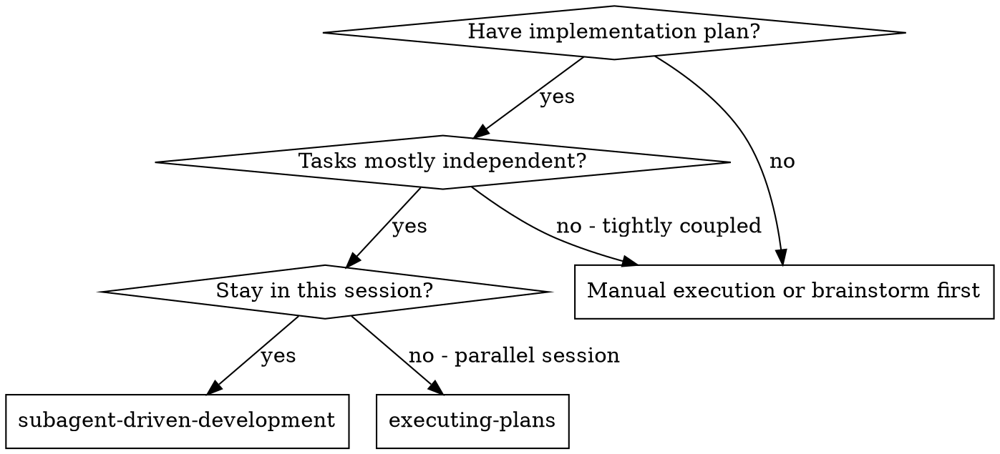
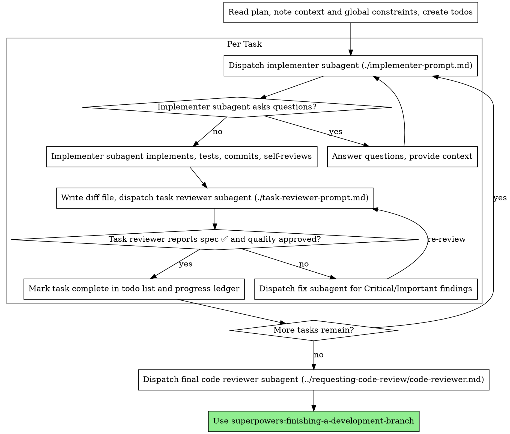

# Subagent-Driven Development

## Snapshot

This skill is the primary orchestration saga for executing a written implementation plan in the current session by dispatching one fresh subagent per task. The controller stays in the session as coordinator: it never implements, never reviews its own work, never lets a subagent inherit its context. Each task runs as a dispatch → implement → review → fix loop; when all tasks are confirmed, the controller dispatches one final whole-branch review and hands off to `finishing-a-development-branch`.

Use it when a plan exists, its tasks are mostly independent, and the platform supports subagents. Do not use it to author the plan, create the workspace, or finish the branch — those are sibling skills. The alternative `executing-plans` covers the same plan-consumption contract when subagents are unavailable or the plan is small enough to run in one context.

This skill is a saga: it tracks every dispatched subagent (implementer, task-reviewer, fix-subagent, final-reviewer) in a workflow ledger at `.superpowers/sdd/progress.md` with status, retry policy, and escalation path. Every dispatch is a self-contained Command with an enrichment checklist; every output artifact carries a version the controller checks before acting. Announcing it twice in one session is a no-op unless the plan changed.

## Quick Reference

*(projection — see Process for full rules)*

| Field | Value |
|---|---|
| Audience | Controller agent executing a written plan by dispatching subagents in the current session |
| Trigger | A written implementation plan exists, its tasks are mostly independent, and the platform supports subagents |
| Inputs | Plan file path; isolated workspace (from `using-git-worktrees`); per-task brief (from `scripts/task-brief`) |
| Outputs | Completed tasks, per-task report files, review packages, final whole-branch review, workflow ledger |
| Key artifact | Workflow ledger at `.superpowers/sdd/progress.md` (per-task status, escalations) |
| Handoff | To `finishing-a-development-branch` after the final whole-branch review |
| Stop conditions | BLOCKED the controller cannot resolve, ambiguity that prevents progress, all tasks complete |
| Core principle | Fresh subagent per task + task review (spec + quality) + broad final review |

## Related Skills

| Skill | Relationship | Notes |
|---|---|---|
| `writing-plans` | `upstream` | Produces the plan file this skill executes. |
| `using-git-worktrees` | `upstream` | Ensures an isolated workspace before execution begins. |
| `executing-plans` | `none` (alternative) | Same plan-consumption contract, no subagent dispatch. |
| `requesting-code-review` | `downstream` | Provides the final whole-branch reviewer template. |
| `receiving-code-review` | `downstream` | The task-reviewer and fix-subagents follow this protocol on findings. |
| `test-driven-development` | `downstream` | Implementer and fix-subagents follow TDD for each task. |
| `finishing-a-development-branch` | `downstream` | Consumed at the natural completion checkpoint. |
| `dispatching-parallel-agents` | `conformist` | Overlapping dispatch pattern; this skill is sequential per-task, that one is parallel across independent problems. |
| `using-superpowers` | `upstream` (composer) | Composes this skill as a sub-skill; see Public Interface for Composition. |

**Choice criterion — `subagent-driven-development` vs `executing-plans`:** Use this skill when the platform supports subagents and the plan's tasks are independent enough that one fresh context per task keeps the controller's coordination context clean. Use `executing-plans` when subagents are unavailable, when tasks must run strictly sequentially in one context, or when the plan is small enough that in-session execution does not pollute the orchestrator. The two are `none` (alternatives), not `upstream`/`downstream` of each other — pick one per run, do not chain.

**Translation notes (ACL):**

- *From `writing-plans` (`upstream`):* writing-plans produces a task-by-task plan file (Markdown, ordered tasks, each with steps and verifications, plus a Global Constraints section). This skill consumes that file as the execution script — it does not re-author or re-order tasks. The plan's task list and Global Constraints are the source of truth; this skill only dispatches, reviews, and tracks status against them.
- *From `using-git-worktrees` (`upstream`):* using-git-worktrees produces an isolated workspace (a worktree path or confirmation one exists). This skill consumes that path as its working directory and does not create or switch worktrees itself.
- *From `requesting-code-review` (`downstream`):* requesting-code-review publishes a reviewer template (`code-reviewer.md`) and a review-report artifact contract. This skill dispatches that template for the final whole-branch review and expects back a single review report covering the whole branch. It does not restate requesting-code-review's rubric.
- *From `dispatching-parallel-agents` (`conformist`):* dispatching-parallel-agents adopts this skill's dispatch shape (one subagent per independent unit, hand-assembled brief, status contract). No translation needed — the two share a kernel dispatch vocabulary. The difference is concurrency model: sequential per-task here, parallel across independent problems there.

## Document Metadata

| Field | Value |
|---|---|
| Document ID | `SKILL-SDD-001` |
| Revision | 2 |
| Effective Date | 2026-07-19 |
| Owner | Skills maintainer |
| Approver | Skills maintainer |
| Doc type | Skill reference |
| Identity strategy | descriptive-name, stable (see `name` field; do not rename) |

## Definitions

Terms defined here are local to this skill only (L2.2). Where a term means something different in a sibling skill, the sibling's own Definitions governs there.

| Term | Meaning (in this skill only) |
|---|---|
| Controller | The agent that orchestrates this skill — reads the plan, dispatches subagents, reviews, tracks the ledger. Never implements. |
| Subagent | A fresh agent context dispatched for one task; does not inherit the controller's session, history, or files. |
| TDD | Test-Driven Development — the discipline `test-driven-development` governs; implementer and fix-subagents follow it. |
| SDD | Subagent-Driven Development — this skill. |
| PR | Pull Request. |
| SHA | Secure Hash Algorithm commit identifier. |
| BASE | The commit the controller recorded before dispatching the implementer for a task. |
| HEAD | The current tip commit of the working branch. |
| Task brief | The per-task file `scripts/task-brief` extracts from the plan; the single source of requirements for one dispatch. |
| Report file | The file an implementer writes its full report to; the durable output artifact for one task. |
| Review package | The diff file `scripts/review-package` writes; the reviewer's view of one task's change. |
| Workflow ledger | The durable tracker at `.superpowers/sdd/progress.md` recording every dispatched subagent's status. |
| Dispatch Command | The self-contained prompt object the controller fills per dispatch (see Dispatch Command shape). |
| Fix-subagent (fixer) | A subagent dispatched with one task's complete findings list to fix Critical/Important issues; re-runs covering tests and appends results to the report file. |
| Run ID | A unique identifier the controller mints for the final whole-branch review dispatch and echoes back. |
| Enrichment | Display context a dispatch carries so the receiver need not call back: tenant (skill family), product (artifact + path), prior-step name, key file paths. |
| Tenant | The skill family this run belongs to (`subagent-driven-development`) and where the task sits in the plan — an enrichment field. |
| Product | The artifact a dispatch produces and its path — an enrichment field. |
| Prior-step | The name of the immediately preceding step and the commits it produced — an enrichment field. |

## Audience

The writer states the following audience attributes before this document governs any execution:

- **Primary audience**: Any agent or engineer who executes an implementation plan by dispatching subagents in the current session.
- **Secondary audience**: Maintainers who edit this skill; reviewers who audit sessions produced from it.
- **Expertise level**: Intermediate — the reader dispatches subagents already and needs the rules that keep execution on track.
- **What they already know**: The reader can run an implementation plan and can dispatch subagents.
- **What they need to learn**: The per-task loop, the review gates, the file handoffs, the dispatch Command shape, and the progress ledger that prevent rework.
- **What they will do after reading**: Execute a plan by dispatching one fresh implementer per task, reviewing each task, and running one final whole-branch review.

## Purpose / Scope

**Purpose**: This skill gives the controller the rules to execute an implementation plan by dispatching fresh subagents per task, with one task review after each task and one broad review at the end, while tracking every dispatch in a durable workflow ledger so no task is silently dropped.

**Scope covers**:

- The decision flowchart for when to use this skill.
- The per-task process flowchart from dispatch to completion.
- The dispatch Command shape, enrichment checklist, and version-on-artifact rule.
- Pre-flight plan review, model selection, status handling, and reviewer-prompt construction.
- File handoffs and the durable workflow ledger.
- The transaction-sprawl warning and the run-ID requirement for the final review.

**Scope does NOT cover**:

- Plan authoring, which the `writing-plans` skill governs.
- Parallel-session execution, which the `executing-plans` skill governs.
- Code review rubric details, which the `requesting-code-review` skill governs.
- Branch finishing, which the `finishing-a-development-branch` skill governs.

## Idempotency

If this skill is announced twice in one session against the same plan file, the second announcement is a no-op unless the plan file changed. The controller re-reads the workflow ledger and resumes from the first task not marked complete — it does not re-dispatch confirmed tasks. A deliberate re-entry with a new or revised plan is a fresh run, not a duplicate. [L13.5]

## Why Subagents

The controller delegates tasks to specialized agents with isolated context. By crafting their instructions and context precisely, the controller keeps each subagent focused on its task. Subagents never inherit the controller's session context or history — the controller constructs exactly what each subagent needs. This also preserves the controller's own context for coordination work.

**Core principle:** Fresh subagent per task + task review (spec + quality) + broad final review = high quality, fast iteration.

**Narration:** Between tool calls, the controller narrates at most one short line — the ledger and the tool results carry the record.

**Continuous execution:** The controller does not pause to check in with the human partner between tasks. The controller executes all tasks from the plan without stopping. The only reasons to stop are: BLOCKED status the controller cannot resolve, ambiguity that genuinely prevents progress, or all tasks complete. "Should I continue?" prompts and progress summaries waste the human partner's time — the human asked the controller to execute the plan, so the controller executes it.

## When to Use

See Figure 1.



*Figure 1: Decision flowchart for choosing subagent-driven-development against the alternatives.*

The controller compares this skill against `executing-plans` along these dimensions:

- Same session (no context switch).
- Fresh subagent per task (no context pollution).
- Review after each task (spec compliance + code quality), broad review at the end.
- Faster iteration (no human-in-loop between tasks).

## The Process

See Figure 2.



*Figure 2: The per-task process flowchart from plan read through final review.*

## Dispatch Command Shape

Every dispatch the controller sends is a self-contained Command object — a serialized invocation that could be queued, retried, and replayed without the surrounding conversation. [LA.1] A dispatch that references "the previous conversation" or "you know what I mean" is a broken Command. The controller fills every field below before sending any dispatch; an empty field is a stop condition.

| Field | Required contents |
|---|---|
| Skill name | Which skill the subagent follows (`test-driven-development` for implementers; the reviewer template path for reviewers). |
| Announce line | The imperative sentence the subagent speaks, verb matching the work (e.g. "Implement Task N: …"). |
| Task brief path | The path `scripts/task-brief PLAN_FILE N` printed — the single source of requirements. |
| Inputs | Working directory, interfaces the task touches, decisions from earlier tasks the brief cannot know, the controller's resolution of any ambiguity spotted in the brief. |
| Expected artifact path | The report file path the subagent writes to (and, for reviewers, the review-package path). |
| Model | The model the controller chose per Model Selection, named explicitly. An omitted model silently inherits the session's most expensive one. |

## Enrichment Checklist for Dispatches

Every dispatch carries display context so the receiver does not have to call back for it. [L13.7] The controller fills all four fields per dispatch; a dispatch missing any field is not sent.

| Enrichment field | What it carries |
|---|---|
| Tenant | Which skill family this run belongs to (`subagent-driven-development`) and where this task sits in the plan. |
| Product | What artifact this dispatch produces (report file, review package, review report) and its path. |
| Prior-step name | The name of the immediately preceding step (e.g. "Task 2 review clean", "Task 3 implementer DONE_WITH_CONCERNS") and the commits it produced. |
| Key file paths | Brief path, report path, review-package path, and any interface file paths the task touches. |

## Versioning Output Artifacts

Each subagent writes a version/timestamp line to its output artifact before returning. [LA.2] The controller checks that line before acting on the artifact; if the artifact changed since dispatch (version mismatch, unexpected timestamp, or a second subagent's output present), the controller escalates rather than blindly proceeding — a stale or clobbered handoff is a stop condition, not a silent overwrite. Concretely:

- The implementer's report file opens with `<!-- version: <sha-of-HEAD-at-dispatch> <ISO timestamp> -->` and appends a new version line for each fix dispatch.
- The reviewer's report opens with `<!-- version: <BASE>..<HEAD> <ISO timestamp> -->`.
- On re-review after a fix, the controller confirms the report file's newest version line post-dates the fix dispatch before trusting the re-review.

## Transaction Sprawl Warning

One subagent per task — never one subagent handed a multi-task brief. [L12.5] A multi-task dispatch reads cleanly in the author's head but falls apart under real dispatch: the subagent's context fills, later tasks get shallower treatment, and a single failure loses all the work. Two distinct scenarios motivate this rule: (1) a controller handed an implementer "Tasks 1-3" and the subagent rushed Task 3 to fit its context budget, producing a review that failed on spec compliance; and (2) a controller handed a fix subagent three independent findings and the subagent fixed only the first because the report file's version line showed it returned before reading the other two. The controller dispatches one task at a time; when a task needs multiple fixes, it dispatches ONE fix subagent with the complete findings list (not one fixer per finding).

## Run ID for the Final Whole-Branch Review

The final whole-branch review is a long-running dispatch across the whole branch, so it carries a unique run ID every step echoes back. [L4.6] The controller mints a run ID (e.g. `sdd-final-<branch>-<ISO date>`) at dispatch, includes it in the dispatch prompt, and requires the final reviewer's report to carry it back. The controller does not merge or trust a final-review report whose run ID does not match the one it sent — a mismatch means the report belongs to a different dispatch and must be re-requested.

## Workflow Ledger

This skill is the saga: it tracks every dispatched subagent across the run so none is silently dropped. [L13.6] The ledger is the file `.superpowers/sdd/progress.md` at the repo root — the controller reads it at skill start and writes one line to it as each dispatch changes status. The ledger is the controller's recovery map after compaction; conversation memory does not survive compaction but the ledger file does.

| Dispatched subagent | Status values | Notes / Escalation |
|---|---|---|
| Implementer (Task N) | `pending` / `in_progress` / `confirmed` / `timed-out` / `blocked` | Commits `<base7>..<head7>`; status from the implementer report. |
| Task-reviewer (Task N) | `pending` / `confirmed` / `timed-out` | Spec ✅/❌ and quality verdict; ⚠️ items the controller must resolve. |
| Fix-subagent (Task N) | `pending` / `confirmed` / `timed-out` | Findings addressed; test results appended to the report file. |
| Final-reviewer (whole branch) | `pending` / `confirmed` / `timed-out` | Run ID; review-report path; Minor findings triaged before merge. |

**Retry policy:** Re-dispatch a `timed-out` or `blocked` subagent once after a targeted change (more context, more capable model, or smaller task). A second failure on the same task is escalated — do not loop silently. For reviewers, re-review once after a fix dispatch; a second failed re-review is escalated.

**Escalation path:** A subagent `blocked` or `timed-out` longer than one retry is escalated to the human partner with the blocker stated in the ledger. If the human partner does not respond within the session, the controller leaves the task `blocked`, records the escalation, and does not proceed past it (sequential per-task contract). A plan-level contradiction (the plan mandates a defect) is escalated as one batched question before execution, not one interrupt mid-plan.

On session resumption, the controller re-reads the ledger and resumes from the first non-`confirmed` task — it does not re-dispatch confirmed tasks. `git clean -fdx` will destroy the ledger (it is git-ignored scratch); if that happens, the controller recovers from `git log`.

## Pre-Flight Plan Review

Before dispatching Task 1, the controller scans the plan once for conflicts:

- Tasks that contradict each other or the plan's Global Constraints.
- Anything the plan explicitly mandates that the review rubric treats as a defect (a test that asserts nothing, verbatim duplication of a logic block).

The controller presents everything it finds to the human partner as one batched question — each finding beside the plan text that mandates it, asking which governs — before execution begins, not one interrupt per discovery mid-plan. If the scan is clean, the controller proceeds without comment. The review loop remains the net for conflicts that only emerge from implementation.

## Model Selection

The controller uses the least powerful model that can handle each role to conserve cost and increase speed.

**Mechanical implementation tasks** (isolated functions, clear specs, 1-2 files): the controller uses a fast, cheap model. Most implementation tasks are mechanical when the plan is well-specified.

**Integration and judgment tasks** (multi-file coordination, pattern matching, debugging): the controller uses a standard model.

**Architecture and design tasks**: the controller uses the most capable available model. The final whole-branch review is one of these — the controller dispatches it on the most capable available model, not the session default.

**Review tasks**: the controller chooses the model with the same judgment, scaled to the diff's size, complexity, and risk. A small mechanical diff does not need the most capable model; a subtle concurrency change does.

The controller always specifies the model explicitly when dispatching a subagent. An omitted model inherits the controller's session model — often the most capable and most expensive — which silently defeats this section. Two distinct scenarios motivate this rule: (1) a controller omitted the model on a mechanical transcription task and the session's most capable model billed 10× the expected cost, and (2) a controller omitted the model on a small review and the inherited model produced a 4,000-word review report whose detail obscured the one Important finding. [L10.5]

Turn count beats token price. Wall-clock and context cost scale with how many turns a subagent takes, and the cheapest models routinely take 2-3× the turns on multi-step work — costing more overall. The controller uses a mid-tier model as the floor for reviewers and for implementers working from prose descriptions. When the task's plan text contains the complete code to write, the implementation is transcription plus testing: the controller uses the cheapest tier for that implementer. Single-file mechanical fixes also take the cheapest tier.

The controller reads task complexity signals for implementation tasks as follows:

- Touches 1-2 files with a complete spec → cheap model.
- Touches multiple files with integration concerns → standard model.
- Requires design judgment or broad codebase understanding → most capable model.

## Handling Implementer Status

Implementer subagents report one of four statuses. The controller handles each one as follows:

**DONE:** The controller generates the review package (`scripts/review-package BASE HEAD`, from this skill's directory — see Repository Index for purpose; it prints the unique file path it wrote; BASE is the commit the controller recorded before dispatching the implementer — never `HEAD~1`, which silently drops all but the last commit of a multi-commit task), then dispatches the task reviewer with the printed path.

**DONE_WITH_CONCERNS:** The implementer completed the work but flagged doubts. The controller reads the concerns before proceeding. If the concerns are about correctness or scope, the controller addresses them before review. If the concerns are observations (e.g., "this file is getting large"), the controller notes them and proceeds to review.

**NEEDS_CONTEXT:** The implementer needs information that the controller did not provide. The controller provides the missing context and re-dispatches.

**BLOCKED:** The implementer cannot complete the task. The controller assesses the blocker along these steps:

1. If the blocker is a context problem, the controller provides more context and re-dispatches with the same model.
2. If the task requires more reasoning, the controller re-dispatches with a more capable model.
3. If the task is too large, the controller breaks it into smaller pieces.
4. If the plan itself is wrong, the controller escalates to the human.

The controller never ignores an escalation or forces the same model to retry without changes. If the implementer said it is stuck, something needs to change.

## Handling Reviewer ⚠️ Items

The task reviewer may report "⚠️ Cannot verify from diff" items — requirements that live in unchanged code or span tasks. These do not block the rest of the review, but the controller must resolve each one before marking the task complete: the controller holds the plan and cross-task context the reviewer lacks. If the controller confirms an item is a real gap, the controller treats it as a failed spec review — sends it back to the implementer and re-reviews.

## Constructing Reviewer Prompts

Per-task reviews are task-scoped gates. The broad review happens once, at the final whole-branch review. When the controller fills a reviewer template, the controller follows these rules:

- The controller does not add open-ended directives like "check all uses" or "run race tests if useful" without a concrete, task-specific reason.
- The controller does not ask a reviewer to re-run tests the implementer already ran on the same code — the implementer's report carries the test evidence.
- The controller does not pre-judge findings for the reviewer — never instructs a reviewer to ignore or not flag a specific issue. If the controller believes a finding would be a false positive, the controller lets the reviewer raise it and adjudicates it in the review loop. If the prompt the controller is writing contains "do not flag," "don't treat X as a defect," "at most Minor," or "the plan chose" — the controller stops: it is pre-judging, to spare itself a review loop in the typical case.
- The global-constraints block the controller hands the reviewer is its attention lens. The controller copies the binding requirements verbatim from the plan's Global Constraints section or the spec: exact values, exact formats, and the stated relationships between components ("same layout as X", "matches Y"). The reviewer's template already carries the process rules (YAGNI, test hygiene, review method) — the constraints block is for what THIS project's spec demands.
- The controller hands the reviewer its diff as a file: it runs this skill's `scripts/review-package BASE HEAD` and passes the reviewer the file path it prints (or, without bash: `git log --oneline`, `git diff --stat`, and `git diff -U10` for the range, redirected to one uniquely named file). The output never enters the controller's own context, and the reviewer sees the commit list, stat summary, and full diff with context in one Read call. The controller uses the BASE it recorded before dispatching the implementer — never `HEAD~1`, which silently truncates multi-commit tasks.
- A dispatch prompt describes one task, not the session's history. The controller does not paste accumulated prior-task summaries ("state after Tasks 1-3") into later dispatches — a real session's dispatch hit 42k chars, 99% of it pasted history. A fresh subagent needs its task, the interfaces it touches, and the global constraints. Nothing else.
- The controller dispatches fix subagents for Critical and Important findings. The controller records Minor findings in the progress ledger as it goes, and points the final whole-branch review at that list so it can triage which must be fixed before merge. A roll-up nobody reads is a silent discard.
- A finding labeled plan-mandated — or any finding that conflicts with what the plan's text requires — is the human's decision, like any plan contradiction: the controller presents the finding and the plan text, asks which governs. The controller does not dismiss the finding because the plan mandates it, and does not dispatch a fix that contradicts the plan without asking.
- The final whole-branch review gets a package too: the controller runs `scripts/review-package MERGE_BASE HEAD` (MERGE_BASE = the commit the branch started from, e.g. `git merge-base main HEAD`) and includes the printed path in the final review dispatch, so the final reviewer reads one file instead of re-deriving the branch diff with git commands.
- Every fix dispatch carries the implementer contract: the fix subagent re-runs the tests covering its change and reports the results. The controller names the covering test files in the dispatch — a one-line fix does not need the whole suite. Before re-dispatching the reviewer, the controller confirms the fix report contains the covering tests, the command run, and the output; the controller dispatches the re-review once all three are present.
- If the final whole-branch review returns findings, the controller dispatches ONE fix subagent with the complete findings list — not one fixer per finding. Per-finding fixers each rebuild context and re-run suites; a real session's final-review fix wave cost more than all its tasks combined.

## File Handoffs

Everything the controller pastes into a dispatch prompt — and everything a subagent prints back — stays resident in the controller's context for the rest of the session and is re-read on every later turn. The controller hands artifacts over as files:

- **Task brief:** Before dispatching an implementer, the controller runs this skill's `scripts/task-brief PLAN_FILE N` (see Repository Index for purpose) — it extracts the task's full text to a uniquely named file and prints the path. The controller composes the dispatch so the brief stays the single source of requirements. The dispatch contains: (1) one line on where this task fits in the project; (2) the brief path, introduced as "read this first — it is your requirements, with the exact values to use verbatim"; (3) interfaces and decisions from earlier tasks that the brief cannot know; (4) the controller's resolution of any ambiguity the controller noticed in the brief; (5) the report-file path and report contract. Exact values (numbers, magic strings, signatures, test cases) appear only in the brief.
- **Report file:** The controller names the implementer's report file after the brief (brief `…/task-N-brief.md` → report `…/task-N-report.md`) and puts it in the dispatch prompt. The implementer writes the full report there (opening with the version line per Versioning Output Artifacts) and returns only status, commits, a one-line test summary, and concerns.
- **Reviewer inputs:** The task reviewer gets three paths — the same brief file, the report file, and the review package — plus the global constraints that bind the task.
- Fix dispatches append their fix report (with test results) to the same report file and return a short summary; re-reviews read the updated file.

## Durable Progress

Conversation memory does not survive compaction. In real sessions, controllers that lost their place have re-dispatched entire completed task sequences — the single most expensive failure observed. The controller tracks progress in the workflow ledger file, not only in todos.

The controller follows these ledger rules:

- At skill start, the controller checks for a ledger: `cat "$(git rev-parse --show-toplevel)/.superpowers/sdd/progress.md"`. Tasks listed there as complete are DONE — the controller does not re-dispatch them; it resumes at the first task not marked complete.
- When a task's review comes back clean, the controller appends one line to the ledger in the same message as its other bookkeeping: `Task N: complete (commits <base7>..<head7>, review clean)`.
- The ledger is the controller's recovery map: the commits it names exist in git even when the controller's context no longer remembers creating them. After compaction, the controller trusts the ledger and `git log` over its own recollection.
- `git clean -fdx` will destroy the ledger (it is git-ignored scratch); if that happens, the controller recovers from `git log`.

## Prompt Templates (Repository Index)

The controller uses the following prompt templates and scripts. Each is referenced by path (collection-oriented Repository — the controller hands the path, never the pasted contents); each subagent reads what it needs on demand. [L12.1, L12.2, L12.3]

- [implementer-prompt.md](implementer-prompt.md) — implementer subagent dispatch template; defines the question-asking gate, self-review, and the report format with status contract.
- [task-reviewer-prompt.md](task-reviewer-prompt.md) — task-reviewer dispatch template; defines the spec-compliance and code-quality verdicts, the "do not trust the report" rule, and the output format.
- `scripts/task-brief` — extracts one task's full text from the plan file to a uniquely named file; prints the path. The single source of requirements for one dispatch.
- `scripts/review-package` — writes the commit list, stat summary, and full diff with context to a uniquely named file for one task (or the whole branch); prints the path. The reviewer's view of the change.
- `scripts/sdd-workspace` — prepares the SDD scratch workspace (ledger directory) if absent.
- Final whole-branch review: use `requesting-code-review`'s [code-reviewer.md](../requesting-code-review/code-reviewer.md) — the published reviewer template and rubric; this skill dispatches it, it does not restate the rubric.

## Example Workflow

The following example shows one session end to end:

```
You: I'm using the subagent-driven-development skill to execute this plan.

[Read plan file once: docs/superpowers/plans/feature-plan.md]
[Create todos for all tasks]

Task 1: Hook installation script

[Run task-brief for Task 1; dispatch implementer with brief + report paths + context]

Implementer: "Before I begin - should the hook be installed at user or system level?"

You: "User level (~/.config/superpowers/hooks/)"

Implementer: "Got it. Implementing now..."
[Later] Implementer:
  - Implemented install-hook command
  - Added tests, 5/5 passing
  - Self-review: Found I missed --force flag, added it
  - Committed

[Run review-package, dispatch task reviewer with the printed path]
Task reviewer: Spec ✅ - all requirements met, nothing extra.
  Strengths: Good test coverage, clean. Issues: None. Task quality: Approved.

[Mark Task 1 complete in ledger]

Task 2: Recovery modes

[Run task-brief for Task 2; dispatch implementer with brief + report paths + context]

Implementer: [No questions, proceeds]
Implementer:
  - Added verify/repair modes
  - 8/8 tests passing
  - Self-review: All good
  - Committed

[Run review-package, dispatch task reviewer with the printed path]
Task reviewer: Spec ❌:
  - Missing: Progress reporting (spec says "report every 100 items")
  - Extra: Added --json flag (not requested)
  - Issues (Important): Magic number (100)

[Dispatch ONE fix subagent with all findings]
Fixer: Removed --json flag, added progress reporting, extracted PROGRESS_INTERVAL constant

[Task reviewer reviews again]
Task reviewer: Spec ✅. Task quality: Approved.

[Mark Task 2 complete in ledger]

...

[After all tasks]
[Mint run ID; dispatch final code-reviewer with the run ID and review-package path]
Final reviewer: All requirements met, ready to merge

[Announce finishing-a-development-branch]
Done!
```

### Worked Example — Clean task (Given/When/Expect)

**Given** a plan file at `docs/superpowers/plans/feature-plan.md` with Task 1 "Hook installation script" in an isolated worktree, and no ledger present.
**When** the controller announces "I'm using the subagent-driven-development skill to execute this plan," reads the plan, creates todos, runs `scripts/task-brief PLAN 1`, dispatches one implementer with the brief and report paths, answers the implementer's one clarifying question, runs `scripts/review-package BASE HEAD`, dispatches the task reviewer with the printed path, and the reviewer returns Spec ✅ / quality Approved.
**Expect** the ledger shows `Task 1: complete (commits <base7>..<head7>, review clean)`; the controller has not implemented anything itself and has dispatched exactly two subagents (implementer, reviewer) for this task.

## Advantages

The controller gains these advantages over manual execution:

- Subagents follow TDD naturally.
- Fresh context per task (no confusion).
- Parallel-safe (subagents do not interfere).
- Subagent can ask questions (before and during work).

The controller gains these advantages over `executing-plans`:

- Same session (no handoff).
- Continuous progress (no waiting).
- Review checkpoints automatic.

The controller gains these efficiency gains:

- The controller curates exactly what context the subagent needs; bulk artifacts move as files, not pasted text.
- The subagent gets complete information upfront.
- Questions surface before work begins (not after).

The controller gains these quality gates:

- Self-review catches issues before handoff.
- Task review carries two verdicts: spec compliance and code quality.
- Review loops ensure fixes actually work.
- Spec compliance prevents over-building and under-building.
- Code quality ensures the implementation is well-built.

The controller incurs these costs:

- More subagent invocations (implementer + reviewer per task).
- The controller does more prep work (extracting all tasks upfront).
- Review loops add iterations.
- The controller catches issues early (cheaper than debugging later).

## Red Flags

The controller never does any of the following:

- Start implementation on main/master branch without explicit user consent.
- Skip task review, or accept a report missing either verdict (spec compliance AND task quality are both required).
- Proceed with unfixed issues.
- Dispatch multiple implementation subagents in parallel (conflicts).
- Make a subagent read the whole plan file (hand it its task brief — `scripts/task-brief` — instead).
- Skip scene-setting context (subagent needs to understand where the task fits).
- Ignore subagent questions (answer before letting them proceed).
- Accept "close enough" on spec compliance (reviewer found spec issues = not done).
- Skip review loops (reviewer found issues = implementer fixes = review again).
- Let implementer self-review replace actual review (the controller needs both).
- Tell a reviewer what not to flag, or pre-rate a finding's severity in the dispatch prompt ("treat it as Minor at most") — the plan's example code is a starting point, not evidence that its weaknesses were chosen.
- Dispatch a task reviewer without a diff file — generate it first (`scripts/review-package BASE HEAD`) and name the printed path in the prompt.
- Move to next task while the review has open Critical/Important issues.
- Re-dispatch a task the progress ledger already marks complete — check the ledger (and `git log`) after any compaction or resume.
- Send a dispatch with an empty Dispatch Command field, or missing any Enrichment field — an incomplete Command is a stop condition, not a best-effort send.
- Hand one subagent a multi-task brief (transaction sprawl) — one subagent per task, always.
- Trust a final-review report whose run ID does not match the one the controller sent.
- Act on an output artifact whose version line does not match the dispatch (stale or clobbered handoff).

If the subagent asks questions, the controller takes these steps:

- Answer clearly and completely.
- Provide additional context if needed.
- Do not rush the subagent into implementation.

If the reviewer finds issues, the controller takes these steps:

- The implementer (same subagent) fixes them.
- The reviewer reviews again.
- Repeat until approved.
- Do not skip the re-review.

If the subagent fails the task, the controller takes these steps:

- Dispatch a fix subagent with specific instructions.
- Do not try to fix manually (context pollution).

## Public Interface for Composition

This skill is composed by `using-superpowers` and may be composed by other orchestration skills. [L13.4] A parent skill may invoke the following surface and expect the following back; everything else in this file is private implementation.

**A parent may invoke:**

- The trigger in `description` — a written plan with mostly-independent tasks to execute in the current session.
- The process flow (Figure 2): read plan → per-task loop → final whole-branch review → hand off.
- The model selection guidance, status handling, and reviewer-prompt rules as the coordination protocol.

**A parent expects back:**

- A completed plan execution: all plan tasks `confirmed` in the workflow ledger.
- The workflow ledger at `.superpowers/sdd/progress.md` (per-task status, commits, escalations) as the durable output artifact.
- The final whole-branch review report (with matching run ID) as the merge-readiness signal.
- A handoff to `finishing-a-development-branch` already announced.

**A parent does NOT get:** re-stated child skill Process (this skill delegates by `name`, per L14.1), or inline copies of sibling-skill prose (this skill references siblings by `name`, per L10.3).

## Integration

The controller requires the following workflow skills, each invoked by `name` — see each skill's own SKILL.md for its protocol; this skill does not restate it:

- **`using-git-worktrees`** — ensures an isolated workspace (creates one or verifies an existing one). *Translation:* it supplies the worktree path; this skill consumes it as the working directory.
- **`writing-plans`** — creates the plan this skill executes. *Translation:* it supplies the plan file and Global Constraints; this skill consumes them as the execution script and does not re-author them.
- **`requesting-code-review`** — code review template for the final whole-branch review. *Translation:* this skill dispatches its `code-reviewer.md` template and expects one review report back; the rubric lives in that skill.
- **`finishing-a-development-branch`** — completes development after all tasks finish. *Translation:* this skill hands off the confirmed ledger; the finishing skill takes the branch from there.

Subagents should use the following skill:

- **`test-driven-development`** — implementer and fix-subagents follow TDD for each task. *Translation:* the implementer-prompt template already carries the TDD discipline; this skill does not restate TDD's Process.

The controller chooses the alternative workflow when the conditions differ:

- **`executing-plans`** — use for parallel session instead of same-session execution, or when subagents are unavailable. The two are `none` (alternatives); pick one per run, do not chain.

## Deviations

- **Workflow ledger as a section plus a file.** Per L13.6 the ledger is a file the orchestrator reads and writes; this skill additionally summarizes the ledger shape as a table in the body so a reader can scan it without opening the file. Reason: query/load convenience — the table is a projection (per LA.3), the file at `.superpowers/sdd/progress.md` is the source of truth; when the two disagree, the file wins. [L10.7 — query performance / load convenience]
- **Inline dispatch templates kept external.** Per L12.2 the default is collection-oriented (index by path); this skill keeps `implementer-prompt.md`, `task-reviewer-prompt.md`, and the scripts external and references them by path. No deviation — this is the recommended pattern, noted here for audit. [L12.1, L12.2]
- **Public interface section retained despite being a top-level orchestration saga.** Per L13.4 the public-interface section is for sub-skills designed to be composed; this skill is composed by `using-superpowers`, so the section applies. No deviation — noted here for audit. [L13.4]

## Revision History

| Rev | Date | Description | Author | Approver |
|---|---|---|---|---|
| 1 | 2026-07-19 | Technical-writing compliance rewrite: added Document Metadata, Audience, Purpose/Scope, Definitions, numbered figure captions, lead sentences on lists, active voice throughout, Revision History | Skills team | Skills maintainer |
| 2 | 2026-07-19 | IDDD layer: added Snapshot, Quick Reference (projection), Related Skills with typed relationships + Translation notes, Idempotency line, Definitions expanded, Dispatch Command shape (LA.1), Enrichment checklist (L13.7), Versioning output artifacts (LA.2), Transaction sprawl warning (L12.5), Run ID for final review (L4.6), Workflow ledger subsection (L13.6), Public interface for composition (L13.4), Deviations note; rewrote `description` as specific trigger naming failure mode; renamed Example Workflow announce line to imperative verb matching name; added Given/When/Expect worked example; labeled quick-reference as projection; added ≥2 scenarios to the model-explicit rule; replaced inline reference-file references with path + one-line purpose (Repository index); preserved both dot flowcharts and all preserved sections | Skills maintainer | Skills maintainer |