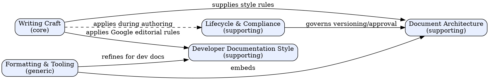

# Technical Writing

## Document Metadata

| Field | Value |
|---|---|
| Document ID | `SKILL-TW-001` |
| Revision | 7 |
| Effective Date | 2026-07-19 |
| Owner | Skills maintainer |
| Approver | Skills maintainer |
| Doc type | Skill reference |

## Audience

The writer states the following audience attributes before drafting any document this skill governs:

- **Primary audience**: Any agent or engineer who writes, reviews, or revises technical or procedural documentation.
- **Secondary audience**: Maintainers who edit this skill; reviewers who audit documents produced from it.
- **Expertise level**: Intermediate — the reader writes prose already and needs the rules that make it survive review and audit.
- **What they already know**: The reader can write grammatical prose and use Markdown.
- **What they need to learn**: The style rules, document structures, and lifecycle controls that turn prose into a document that survives review and audit.
- **What they will do after reading**: Apply the five phases and the four required slots to produce or revise a technical document.

## Purpose / Scope

**Purpose**: This skill gives the rules a writer follows to produce a document that its intended reader can act on or understand first-time-right. The document must also survive review and audit.

**Scope covers**:

- Style, voice, sentence and paragraph structure, terminology.
- Document structure per document type (SOP, work instruction, deviation, RCA, CAPA, reference, tutorial, error message).
- Lifecycle: planning, review, approval, versioning, effective dates.
- Formatting: Markdown, visuals, tables, accessibility, error messages.
- Google developer documentation style guide rules (voice/tone, word list, punctuation, code formatting) for dev-facing documents.

**Scope does NOT cover**:

- Marketing copy, sales decks, blog posts, narrative storytelling.
- Code comments (governed by code conventions, not this skill).
- Legal contract drafting.
- Localization tooling beyond the "one term per concept" rule.

## Definitions

The writer defines every acronym and term on first use. This section collects them in one place for reference.

| Term | Meaning |
|---|---|
| SOP | Standard Operating Procedure |
| RCA | Root-Cause Analysis |
| CAPA | Corrective and Preventive Action |
| API | Application Programming Interface |
| DDD | Domain-Driven Design |
| 5W1H | Who, What, When, Where, Why, How |
| Diátaxis | Documentation framework that classifies content into Tutorial, How-to, Reference, and Explanation modes |
| Ishikawa | Fishbone diagram method for root-cause analysis, named after Kaoru Ishikawa |
| GMP | Good Manufacturing Practice |
| TBD | To Be Determined (banned as an Effective Date value) |
| Sentence case | Capitalize only the first word of a heading or title, plus proper nouns |
| Oxford comma | Comma before the final item in a list of 3+ items (optional but must be consistent within a document) |
| Cross-reference | Descriptive link whose anchor text identifies the target by name or topic |

## When to Use

Use this skill when the writer faces any of these tasks:

- Writing or revising an SOP, work instruction, runbook, user guide, README, API reference, tutorial, or error message.
- Writing a deviation, root-cause analysis (RCA), or CAPA report in a regulated environment.
- Reviewing another writer's technical document.
- Setting up document control or versioning.

## When NOT to Use

Do not use this skill for the following:

- Marketing copy, sales decks, blog posts.
- Pure narrative or storytelling.
- Code comments (covered by code conventions).

## Core Principle

**Simplify the complex.** A document succeeds when its intended reader performs the task or understands the system first-time-right. The writer spends ~20% of the effort drafting prose. The remaining ~80% goes to the four non-drafting phases: planning, structuring, reviewing, publishing (source: Google Technical Writing One). A writer who skips any of those four phases produces documents that fail audits, mislead readers, and invent facts.

## Iron Rule — No Skipping Phases

The writer follows five phases in order:

1. **Plan** — define audience, purpose, scope.
2. **Structure** — choose the document type and its section template.
3. **Draft** — write prose following the style rules.
4. **Review** — read aloud once; run the review checklist.
5. **Publish** — set the effective date; archive the prior revision.

Skipping any phase produces a document that fails. Pressure to "just write it" is the #1 red flag.

## Required Slots (every document)

Every technical document MUST contain four slots near the top:

1. **Audience** — primary + secondary readers, expertise level.
2. **Purpose / Scope** — what the document covers AND what it explicitly does NOT cover.
3. **When to use** — the tasks that trigger this document.
4. **When not to use** — the tasks that do not trigger this document (instructions and reference documents only).

SOPs and regulated documents add: **Document ID, Revision, Effective Date, Approver, Revision History**. The writer never leaves Effective Date as "TBD".

## Domain Model (DDD)

Technical writing is one domain with five bounded contexts. Each context owns its rules and ubiquitous language. The writer identifies which context the task lives in before writing — that determines which rules apply. See Figure 1.



*Figure 1: The five bounded contexts of technical writing and the relationships between them.*

| Context | Owns | Ubiquitous language (excerpts) |
|---|---|---|
| **Writing Craft** (core) | Clarity, voice, sentences, audience, terminology | `clarity`, `active voice`, `curse of knowledge`, `5W1H`, `lead sentence`, `audience profile` |
| **Document Architecture** (supporting) | Structure per document type, sections, templates, Diátaxis mode | `SOP`, `work instruction`, `scope`, `procedure`, `revision history`, `Diátaxis mode` |
| **Lifecycle & Compliance** (supporting) | Planning, review, approval, versioning, deviations/RCA/CAPA, audit traceability | `deviation`, `root cause`, `CAPA`, `approver`, `effective date`, `control` |
| **Formatting & Tooling** (generic) | Markdown, visuals, tables, accessibility, error messages | `markdown`, `alt text`, `fenced code block`, `callout`, `error message` |
| **Developer Documentation Style** (supporting) | Google dev docs style guide: voice/tone, word list, punctuation, formatting, linking, computer interfaces, API reference comments | `sentence case`, `active voice`, `second person`, `cross-reference`, `code-in-text`, `placeholder`, `UI element`, `contraction` |

Every document touches all five contexts. The writer decides the document *type* first (Architecture), then states the *audience* (Craft). The writer then follows *lifecycle* rules — review, version, approve — applies *formatting* via Markdown and visuals, and applies *Google editorial rules* (DevStyle) when the audience is developers.

If the audience is software developers or technical practitioners, the Developer Documentation Style context is active and its rules apply during the Draft phase. If the audience is GMP operators, auditors, or a regulated environment, the SOP rules (existing `reference/sops-and-regulated-docs.md`) keep priority; the Google style guide is a secondary source in that case.

## Core Pattern — Before / After

```markdown
❌ "Cleaning should be performed as soon as possible and the line
    will be stopped by the operator if contamination is observed."
✅ "Operator stops the line and cleans the surface within 5 minutes
    of observing contamination."
```

The second sentence follows three rules:

- Active voice and present tense for procedures.
- A concrete bound ("within 5 minutes"), not a vague phrase ("as soon as possible").
- An actor that acts on a target.

## Quick Reference — Document Types → Structure

| Doc type | Diátaxis mode | Required sections |
|---|---|---|
| Tutorial | Learning | Goal, prerequisites, step-by-step, "what you learned" |
| How-to guide | Learning | Goal, when to use, steps, troubleshooting |
| Reference | Reference | Signature, parameters, returns, examples, errors |
| Explanation | Reference | Concept, context, trade-offs |
| SOP | (procedural) | Audience, scope, responsibilities, materials, procedure, records, references, revision history, approvals |
| Work instruction | (procedural) | Subset of SOP: single task, detailed steps |
| Deviation | (compliance) | Event (5W1H), facts only, immediate actions, impact, investigation plan, CAPA pending |
| RCA | (compliance) | Evidence, method (5-Why / Ishikawa), root cause, probable cause if not identified |
| Error message | (reference) | What happened, why, what the user can do, error code |

## Quick Reference — Banned Vague Words

| Banned | Replace with |
|---|---|
| soon, ASAP, promptly, quickly | a concrete duration ("within 5 minutes") |
| often, sometimes, frequently, regularly | a frequency ("every shift", "3×/day") |
| some, many, a few, several, various | a count or range ("7 vials", "3–5 batches") |
| appropriate, applicable, relevant | name the thing ("21 CFR 211.22") |
| properly, correctly, adequately | name the criterion ("per SOP-CR-0042 §7.2") |

## Citing Regulations (compliance context)

The writer never writes "per applicable regulations" or "per relevant procedure". Auditors reject generic references.

The writer cites **regulation + clause + paragraph**: `21 CFR 211.22(a)`, `ICH Q7 §8.14`, `ISO 13485 §4.2.4`, `SOP-CR-0042 §7.2`.

## Hallucination Prohibition (API / reference documents)

The writer follows three rules to avoid fabricating content:

- If the writer does not know the exact shape of a type, parameter, or return value, the writer says so explicitly or marks it `(to be documented)`. The writer never invents.
- The writer never cross-references a document that does not exist without marking it `[(to be published)]`.
- "Reasonable assumptions" in code are bugs; in documents they are misinformation.

## Implementation

The writer finds the detailed rules and templates in the following files:

- Style rules, sentence/paragraph patterns, lists/tables, audience analysis → `reference/style-and-clarity.md`
- SOP structure, work instructions, deviations, RCA, CAPA, regulatory citations → `reference/sops-and-regulated-docs.md`
- Developer documentation style rules (Google) — voice/tone, word list, punctuation, code formatting, cross-refs → `reference/dev-doc-style.md`
- Copy-paste starting points → `templates/*.md`

## Rationalization Table

| Excuse | Reality |
|---|---|
| "Don't overthink it" | Audience definition takes 10 seconds and saves the document from being useless to half its readers. |
| "Just put it in the README" | Inventing API types from a signature alone = hallucination that misleads every reader. |
| "Reasonable assumptions about the API" | In code, assumptions = bugs. In documents, assumptions = misinformation. Flag the gap instead. |
| "We're behind on audit prep" | TBD effective dates and generic "applicable regulation" citations fail audits faster than no SOP. |
| "Auditor is coming tomorrow" | Generic refs fail audits; clause numbers pass them. The extra 30 seconds is the audit. |
| "Write what feels right" | Deviation reports that mix facts and opinions taint the investigation and lose auditor trust. |
| "I'll review later" | Later never comes. Typos in regulated documents are deviations. Review now, publish once. |
| "The reader will figure it out" | If the reader could figure it out, the document would not exist. |
| "Audience doesn't matter for this one" | Every document has a reader. Every reader has an expertise level. State both. |
| "It's just an internal doc" | Internal documents become external evidence in audits, incidents, and lawsuits. Write accordingly. |

## Red Flags — STOP and Re-plan

The writer is about to violate this skill on catching any of these thoughts:

- "Just write it, refine later."
- "The reader will figure it out."
- "I'll add structure / audience / scope after drafting."
- "Passive voice sounds more professional here."
- "Audience is obvious, no need to state it."
- "This regulation reference is good enough without the clause."
- "The API shape is probably like X, let me write it down."
- "Effective Date TBD — we'll fill it when approved."

Each of these means: stop, apply the four required slots, cite clauses, flag unknowns, and review once.

## Common Mistakes

| Mistake | Fix |
|---|---|
| Effective Date = TBD | Pick a real future date aligned with approval; never "TBD". |
| No Audience section | Add "Audience: <primary>, <secondary> — expertise: <level>". |
| Passive voice in procedures | Rewrite active + present: "Operator stops the line." |
| Vague temporal words | Replace with concrete bounds (count, duration, frequency). |
| Generic regulation refs | Cite regulation + clause + paragraph. |
| Inventing API types | Mark `(to be documented)` or omit; never fabricate. |
| Mixing facts and opinions in deviations | Separate "Observed facts" from "Preliminary assessment". |
| Cross-refs to nonexistent documents | Mark `[(to be published)]` or remove. |
| Skipping review under pressure | Pressure is the signal that review matters most. Read the document aloud once before publishing. |
| Leftover `<...>` template placeholders | Replace every placeholder before publishing. A leftover `<name>` or `<e.g. ...>` is an unfilled slot, not a finished document. |
| Broken `(to be published)` link syntax | Use `[(to be published)]` as link text, not `((to be published))`. One set of brackets, single parens inside. |

## Revision History

| Rev | Date | Description | Author | Approver |
|---|---|---|---|---|
| 0 | 2026-01-15 | Initial skill creation | Skills team | Skills maintainer |
| 1 | 2026-04-02 | Added Hallucination Prohibition and Common Mistakes table | Skills team | Skills maintainer |
| 2 | 2026-07-19 | Self-compliance rewrite: added Document Metadata, Audience, Purpose/Scope (with "does NOT cover"), active voice throughout, Revision History, numbered phases | Skills team | Skills maintainer |
| 3 | 2026-07-19 | Consistency fixes: Approver added to metadata; four slots (split When to use / When not to use); lead sentences on all lists; split >2-comma sentence; sourced 80% claim | Skills team | Skills maintainer |
| 4 | 2026-07-19 | Full self-compliance: lead sentence on Hallucination list; standardized "document" over "doc"; completed 6-point audience analysis; accurate Doc type (Skill reference) | Skills team | Skills maintainer |
| 5 | 2026-07-19 | Terminology and visuals compliance: added Definitions section (SOP, RCA, CAPA, API, DDD, 5W1H, Diátaxis, Ishikawa, GMP, TBD); numbered caption on Figure 1; split 35-word sentence; parallelized Core Pattern list | Skills team | Skills maintainer |
| 6 | 2026-07-19 | Style §2: split the 3-comma sentences in Core Principle and Domain Model (parenthetical lists → em-dash apposition or separate sentence) | Skills team | Skills maintainer |
| 7 | 2026-08-20 | Added Developer Documentation Style bounded context (supporting) + `reference/dev-doc-style.md` capturing Google dev docs style guide SOTA; added 3 Definitions (Sentence case, Oxford comma, Cross-reference); added routing rule (dev audience → Google rules active; regulated audience → SOP priority); updated Domain Model digraph with DevStyle node | Skills maintainer | Skills maintainer |
| 8 | 2026-08-26 | IDDD typology sweep: added type frontmatter, reordered Related Skills by category per _shared/SKILL-ARCH.md | Skills maintainer | Skills maintainer |