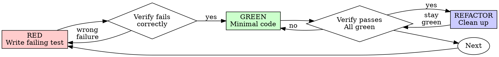

# Test-Driven Development (TDD)

Test-drive the code: write the failing test first, watch it fail, write minimal code to pass, refactor under green.

## Document Metadata

| Field | Value |
|---|---|
| Document ID | `SKILL-TDD-001` |
| Revision | 2 |
| Effective Date | 2026-07-19 |
| Owner | Skills maintainer |
| Approver | Skills maintainer |
| Doc type | Skill reference |
| Identity strategy | descriptive-name, stable (`# identity: descriptive-name, stable`) |
| Maintainer | Skills maintainer |

## Snapshot

This skill forces a failing test to exist before any production code. The Iron Law: **NO PRODUCTION CODE WITHOUT A FAILING TEST FIRST**. The writer follows Red-Green-Refactor on every behavior: write one minimal failing test, verify it fails for the right reason, write minimal code to pass, verify all tests pass, refactor under green, repeat.

Use this skill for new features, bug fixes, refactoring, and behavior changes — especially when the writer is tempted to code first or "test after." Code written before the test passes immediately and proves nothing: it may test the wrong thing, test implementation not behavior, or miss edge cases the writer forgot. Test-first forces the writer to see the test fail, proving the test tests something real.

The writer deletes any code written before its test, without keeping it as "reference." Rationalizations ("too simple to test," "I'll test after," "deleting is wasteful") are listed and refuted below. Throwaway prototypes and generated code are the only exceptions, and only with the human partner's permission. Reading only this snapshot, the writer can announce the skill and begin the cycle.

## Quick Reference

| Field | Value |
|---|---|
| Audience | Any agent or engineer writing production code or fixing bugs |
| Triggers | New feature; bug fix; refactoring; behavior change; temptation to code-first or test-after |
| Inputs | A behavior to implement or a bug to fix |
| Outputs | A failing test → minimal code → passing test → refactored code |
| Key files | `testing-anti-patterns.md` (this directory) |
| Iron Law | No production code without a failing test first |
| Public surface | The Iron Law, the Red-Green-Refactor cycle, the verify steps (see Public Interface for Composition) |

*This table is a projection — see the Process (Red-Green-Refactor) for full rules. When this table and the Process disagree, the Process wins.*

## Related Skills

| Skill | Relationship | What this skill uses from it / gives to it |
|---|---|---|
| `systematic-debugging` | downstream | Phase 4 step 1 delegates the failing-test write to this skill |
| `verification-before-completion` | shared-kernel | Both enforce "watch it fail / prove it works"; co-maintain the verify vocabulary — flag both revision histories when the verify-step wording changes |
| `writing-skills` | downstream | Applies this skill's Red-Green-Refactor cycle to skills themselves (RED-GREEN-REFACTOR for documentation) |
| `subagent-driven-development` | downstream | Implementer subagents follow this skill per task |
| `executing-plans` | downstream | Plan steps that include a "write the failing test" step invoke this skill |
| `writing-plans` | downstream | Plans assume the engineer applies this skill per task |

*Translation note for each reference: for `downstream` siblings, this skill publishes the Iron Law, the cycle, and the verify steps as the stable contract; the sibling calls this skill by `name` and hands it a behavior to implement, and this skill returns a failing test → minimal code → passing test → refactor. For the `shared-kernel` relationship with `verification-before-completion`, the two skills co-own the "watch it fail / watch it pass" verify vocabulary; a change to that wording in one must be mirrored in the other and flagged in both revision histories. This skill does not adopt any sibling's internal vocabulary — it consumes only the sibling's named trigger and returns an artifact (a test, a passing suite).*

## Audience

The writer states the following audience attributes before applying this skill:

- **Primary audience**: Any agent or engineer who writes production code or fixes bugs.
- **Secondary audience**: Reviewers who audit code for TDD compliance; maintainers who edit this skill.
- **Expertise level**: Intermediate — the reader writes code already and needs the discipline that makes tests prove behavior.
- **What they already know**: The reader writes functions, runs a test runner, and reads stack traces.
- **What they need to learn**: The Red-Green-Refactor cycle, the Iron Law, and the rationalizations that defeat TDD.
- **What they will do after reading**: Apply the Red-Green-Refactor cycle to every feature and bugfix, and reject every rationalization to skip it.

## Purpose / Scope

**Purpose**: This skill gives the rules a writer follows to produce code that a failing test drove into existence. The test must fail first, then the writer writes minimal code to pass it, then the writer refactors under green.

**Scope covers**:

- The Red-Green-Refactor cycle and its verify steps.
- The Iron Law that forbids production code without a failing test first.
- The rationalizations writers use to skip TDD, and the reality that refutes each.
- The bug-fix workflow that uses TDD to prove the fix and prevent regression.

**Scope does NOT cover**:

- Test framework setup or runner configuration.
- Mocking libraries beyond the "real code first" rule.
- Performance testing, load testing, or property-based testing frameworks.
- Code review conventions outside the verification checklist.

## Definitions

The writer defines every acronym on first use. This section collects them in one place for reference.

| Term | Meaning |
|---|---|
| TDD | Test-Driven Development — the cycle of writing a failing test, then minimal code, then refactor |
| RED | The phase where the writer writes one failing test and verifies it fails for the right reason |
| GREEN | The phase where the writer writes minimal code to pass the test and verifies all tests pass |
| REFACTOR | The phase where the writer cleans up code while keeping all tests green |
| YAGNI | You Aren't Gonna Need It — the rule against adding code the current test does not require |
| DRY | Don't Repeat Yourself — the rule against duplicating code that a single abstraction can hold |
| Production code | Code shipped to users, as opposed to test code; governed by the Iron Law |
| Minimal code | The simplest code that passes the current failing test and no more; over-engineering violates YAGNI |
| Rationalization | An excuse that justifies skipping the cycle; each is refuted in Common Rationalizations |
| Regression | A previously-fixed bug returning because no failing test guarded it |
| Mock | A test double standing in for a dependency; use only when real code is unavoidable |

## Write The Test First

Write the test first. Watch it fail. Write minimal code to pass.

**Core principle:** If the writer did not watch the test fail, the writer does not know if the test tests the right thing.

**Two scenarios that motivate "always watch it fail":**

1. **Retry counter test** — a writer writes a retry test after the code; it passes, but the assertion checked the wrong counter (`attempts` vs `calls`), so it tested a variable the code never increments. The writer never saw the test fail, so the false green shipped unnoticed.
2. **Validation test** — a writer adds an empty-email test after writing the validator; it passes, but the test called a different form function that already validated, so the test never reached the new branch. Without watching it fail first, the writer shipped a test that could not catch the bug.

**Violating the letter of the rules is violating the spirit of the rules.**

## When to Use

The writer applies this skill in the following cases:

- New features
- Bug fixes
- Refactoring
- Behavior changes

The writer asks the human partner before skipping TDD for the following cases:

- Throwaway prototypes
- Generated code
- Configuration files

Thinking "skip TDD just this once"? Stop. That is rationalization.

## The Iron Law

```
NO PRODUCTION CODE WITHOUT A FAILING TEST FIRST
```

The writer wrote code before the test? The writer deletes it and starts over.

The writer follows these rules with no exceptions:

- Do not keep it as "reference"
- Do not "adapt" it while writing tests
- Do not look at it
- Delete means delete

Implement fresh from tests. Period.

## Environment Adapter

This skill triggers test commands: run the new test, then run the full suite. The concrete commands vary per repo and host.

**If `AGENTS.md` (or the repo's equivalent) specifies test commands, use those.** Otherwise fall back to these defaults:

- Run one test: `npm test path/to/test.test.ts` / `pytest path/to/test_test.py` / `go test ./path/...` / `cargo test path::` — whichever the repo's lockfile implies.
- Run the full suite: `npm test` / `pytest` / `go test ./...` / `cargo test`.

When a sibling skill owns a related command (`verification-before-completion` for the completion-claim verify gate), delegate by name — do not restate its commands here.

## Red-Green-Refactor

See Figure 1 for the cycle the writer follows on every test.



*Figure 1: The Red-Green-Refactor cycle the writer repeats for every behavior.*

### RED - Write Failing Test

Write one minimal test showing what should happen.

<Good>
```typescript
test('retries failed operations 3 times', async () => {
  let attempts = 0;
  const operation = () => {
    attempts++;
    if (attempts < 3) throw new Error('fail');
    return 'success';
  };

  const result = await retryOperation(operation);

  expect(result).toBe('success');
  expect(attempts).toBe(3);
});
```
Clear name, tests real behavior, one thing
</Good>

<Bad>
```typescript
test('retry works', async () => {
  const mock = jest.fn()
    .mockRejectedValueOnce(new Error())
    .mockRejectedValueOnce(new Error())
    .mockResolvedValueOnce('success');
  await retryOperation(mock);
  expect(mock).toHaveBeenCalledTimes(3);
});
```
Vague name, tests mock not code
</Bad>

The writer requires the following of every RED test:

- One behavior
- Clear name
- Real code (no mocks unless unavoidable)

### Verify RED - Watch It Fail

**MANDATORY. Never skip.**

```bash
npm test path/to/test.test.ts
```

The writer confirms the following:

- Test fails (not errors)
- Failure message matches expectation
- Fails because feature missing (not typos)

The test passes? The writer is testing existing behavior. Fix the test.

The test errors? Fix the error, re-run until it fails correctly.

### GREEN - Minimal Code

Write simplest code to pass the test.

<Good>
```typescript
async function retryOperation<T>(fn: () => Promise<T>): Promise<T> {
  for (let i = 0; i < 3; i++) {
    try {
      return await fn();
    } catch (e) {
      if (i === 2) throw e;
    }
  }
  throw new Error('unreachable');
}
```
Just enough to pass
</Good>

<Bad>
```typescript
async function retryOperation<T>(
  fn: () => Promise<T>,
  options?: {
    maxRetries?: number;
    backoff?: 'linear' | 'exponential';
    onRetry?: (attempt: number) => void;
  }
): Promise<T> {
  // YAGNI
}
```
Over-engineered
</Bad>

Do not add features, refactor other code, or "improve" beyond the test.

### Verify GREEN - Watch It Pass

**MANDATORY.**

```bash
npm test path/to/test.test.ts
```

The writer confirms the following:

- Test passes
- Other tests still pass
- Output pristine (no errors, warnings)

The test fails? Fix the code, not the test.

Other tests fail? Fix them now.

### REFACTOR - Clean Up

The writer performs the following refactor steps after green only:

- Remove duplication
- Improve names
- Extract helpers

Keep tests green. Do not add behavior.

### Repeat

Next failing test for next feature.

## Good Tests

| Quality | Good | Bad |
|---------|------|-----|
| **Minimal** | One thing. "and" in name? Split it. | `test('validates email and domain and whitespace')` |
| **Clear** | Name describes behavior | `test('test1')` |
| **Shows intent** | Demonstrates desired API | Obscures what code should do |

*This table is a projection — see the Process (Red-Green-Refactor, RED step) for full rules. When this table and the Process disagree, the Process wins.*

## Why Order Matters

**"I'll write tests after to verify it works"**

The writer who writes tests after the code sees them pass immediately. Passing immediately proves nothing:

- Might test wrong thing
- Might test implementation, not behavior
- Might miss edge cases the writer forgot
- The writer never saw the test catch the bug

Test-first forces the writer to see the test fail, proving the test actually tests something.

**"I already manually tested all the edge cases"**

Manual testing is ad-hoc. The writer thinks they tested everything but faces the following limits:

- No record of what the writer tested
- Cannot re-run when code changes
- Easy to forget cases under pressure
- "It worked when I tried it" ≠ comprehensive

Automated tests are systematic. They run the same way every time.

**"Deleting X hours of work is wasteful"**

Sunk cost fallacy. The time is already gone. The writer chooses between the following options:

- Delete and rewrite with TDD (X more hours, high confidence)
- Keep it and add tests after (30 min, low confidence, likely bugs)

The "waste" is keeping code the writer cannot trust. Working code without real tests is technical debt.

**"TDD is dogmatic, being pragmatic means adapting"**

TDD IS pragmatic:

- Finds bugs before commit (faster than debugging after)
- Prevents regressions (tests catch breaks immediately)
- Documents behavior (tests show how to use code)
- Enables refactoring (change freely, tests catch breaks)

"Pragmatic" shortcuts = debugging in production = slower.

**"Tests after achieve the same goals - it's spirit not ritual"**

No. Tests-after answer "What does this do?" Tests-first answer "What should this do?"

The implementation biases tests-after. The writer tests what they built, not what the requirement asks for. The writer verifies remembered edge cases, not discovered ones.

Tests-first force edge case discovery before implementing. Tests-after verify the writer remembered everything (they did not).

30 minutes of tests after ≠ TDD. The writer gets coverage and loses proof the tests work.

## Common Rationalizations

| Excuse | Reality |
|--------|---------|
| "Too simple to test" | Simple code breaks. Test takes 30 seconds. |
| "I'll test after" | Tests passing immediately prove nothing. |
| "Tests after achieve same goals" | Tests-after = "what does this do?" Tests-first = "what should this do?" |
| "Already manually tested" | Ad-hoc ≠ systematic. No record, can't re-run. |
| "Deleting X hours is wasteful" | Sunk cost fallacy. Keeping unverified code is technical debt. |
| "Keep as reference, write tests first" | The writer will adapt it. That is testing after. Delete means delete. |
| "Need to explore first" | Fine. Throw away exploration, start with TDD. |
| "Test hard = design unclear" | Listen to the test. Hard to test = hard to use. |
| "TDD will slow me down" | TDD faster than debugging. Pragmatic = test-first. |
| "Manual test faster" | Manual doesn't prove edge cases. The writer re-tests every change. |
| "Existing code has no tests" | The writer is improving it. Add tests for existing code. |

*This table is a projection — see Why Order Matters for full rules. When this table and the Process disagree, the Process wins.*

## Red Flags - STOP and Start Over

The writer stops and starts over on catching any of these flags:

- Code before test
- Test after implementation
- Test passes immediately
- Cannot explain why test failed
- Tests added "later"
- Rationalizing "just this once"
- "I already manually tested it"
- "Tests after achieve the same purpose"
- "It's about spirit not ritual"
- "Keep as reference" or "adapt existing code"
- "Already spent X hours, deleting is wasteful"
- "TDD is dogmatic, I'm being pragmatic"
- "This is different because..."

**All of these mean: Delete code. Start over with TDD.**

## Example: Bug Fix

**Given** the submit form accepts an empty email (the bug).
**When** the writer test-drives the fix.
**Expect** a failing test first, then minimal code, then a passing test, then a refactor.

**Bug:** Empty email accepted

**RED**
```typescript
test('rejects empty email', async () => {
  const result = await submitForm({ email: '' });
  expect(result.error).toBe('Email required');
});
```

**Verify RED**
```bash
$ npm test
FAIL: expected 'Email required', got undefined
```

**GREEN**
```typescript
function submitForm(data: FormData) {
  if (!data.email?.trim()) {
    return { error: 'Email required' };
  }
  // ...
}
```

**Verify GREEN**
```bash
$ npm test
PASS
```

**REFACTOR**
Extract validation for multiple fields if needed.

## Verification Checklist

The writer checks every box before marking work complete:

- [ ] Every new function/method has a test
- [ ] Watched each test fail before implementing
- [ ] Each test failed for expected reason (feature missing, not typo)
- [ ] Wrote minimal code to pass each test
- [ ] All tests pass
- [ ] Output pristine (no errors, warnings)
- [ ] Tests use real code (mocks only if unavoidable)
- [ ] Edge cases and errors covered

Cannot check all boxes? The writer skipped TDD. Start over.

## When Stuck

| Problem | Solution |
|---------|----------|
| Don't know how to test | Write wished-for API. Write assertion first. Ask the human partner. |
| Test too complicated | Design too complicated. Simplify interface. |
| Must mock everything | Code too coupled. Use dependency injection. |
| Test setup huge | Extract helpers. Still complex? Simplify design. |

*This table is a projection — see the Process (Red-Green-Refactor) for full rules. When this table and the Process disagree, the Process wins.*

## Debugging Integration

The writer finds a bug? First isolate the root cause — see the `systematic-debugging` skill for the investigation; this skill owns the failing-test step, not the root-cause hunt. Write a failing test reproducing the bug. Follow the Red-Green-Refactor cycle. The test proves the fix and prevents regression.

Never fix bugs without a test.

## Testing Anti-Patterns

When adding mocks or test utilities, read `testing-anti-patterns.md` — it defines the three iron laws (never test mock behavior, never add test-only methods to production classes, never mock without understanding dependencies) and the full anti-pattern catalog that strict TDD prevents.

## Public Interface for Composition

This skill is a sub-skill: `systematic-debugging` (Phase 4 step 1), `writing-skills` (the skill-creation cycle), `subagent-driven-development` (implementer subagents), and `executing-plans` / `writing-plans` (per-task test steps) all invoke it. The following is the stable contract a parent may rely on.

**What a parent may invoke:**

- The Iron Law (`NO PRODUCTION CODE WITHOUT A FAILING TEST FIRST`) as a guard a parent may assert before accepting any code from a child.
- The Red-Green-Refactor cycle (RED → verify RED → GREEN → verify GREEN → REFACTOR → Repeat).
- The verify steps (watch it fail for the right reason; watch it pass with pristine output; keep green while refactoring).

**What a parent should expect back:**

- A failing test that fails for the right reason (feature missing, not a typo).
- Minimal code that passes that test and all other tests, with pristine output.
- A refactored codebase with all tests still green.

**What a parent must NOT assume:**

- This skill does not return a test plan, a coverage report, or a root-cause statement; it returns the cycle and the proof that the test tests the right thing. Coverage auditing belongs to `verification-before-completion`; root-cause investigation belongs to `systematic-debugging`.
- This skill's internal sections (Common Rationalizations, Red Flags, When Stuck, Examples) are implementation, not contract; they may change between revisions. Only the Iron Law, the cycle, and the verify steps are stable.

## Final Rule

```
Production code → test exists and failed first
Otherwise → not TDD
```

No exceptions without the human partner's permission.

## Deviations

No structural rules from the IDDD spec were broken in this revision. If a future revision inlines a sibling's prose or pastes a reference file's contents (e.g., to support a subagent without filesystem access, the "missing mechanism" reason per L10.7), the author must record here which of the four legitimate reasons applies (UI convenience, missing mechanism, global transaction, query performance) and flag it in Revision History.

## Revision History

| Rev | Date | Description | Author | Approver |
|---|---|---|---|---|
| 1 | 2026-07-19 | Technical-writing compliance rewrite: added Document Metadata, Audience, Purpose/Scope, Definitions; lead sentences on all lists; active voice throughout; Figure 1 caption; Revision History | Skills team | Skills maintainer |
| 2 | 2026-07-19 | IDDD layer: added Snapshot, Quick Reference (DTO), Related Skills with typed relationships + translation notes, Public Interface for Composition, Environment Adapter, Deviations note, Given/When/Expect framing on the Bug Fix example; rewrote `description` as a specific trigger naming the failure mode (code-first passes immediately and proves nothing); added announce line; renamed Overview → Write The Test First; added two motivating scenarios to the core principle; labeled Good Tests / Common Rationalizations / When Stuck tables as projections; replaced the inline testing-anti-patterns bullet list with a path reference + one-line purpose; added Production code / Minimal code / Rationalization / Regression / Mock to Definitions; delegated the bug root-cause hunt to `systematic-debugging` by name; abstracted test commands behind the AGENTS.md-first Environment Adapter | Skills maintainer | Skills maintainer |