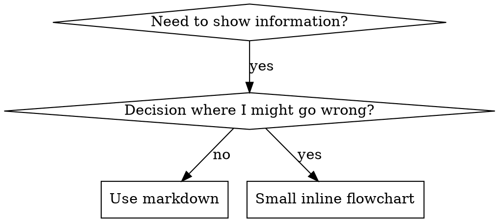

# Writing Skills

## Snapshot

Writing skills IS Test-Driven Development applied to process documentation. The writer runs a failing test (a pressure scenario with a subagent, or an in-memory micro-test) BEFORE writing the skill, writes the minimal skill that makes the agent comply, then closes every loophole until bulletproof. The Iron Law — **no skill without a failing test first** — governs every new skill and every edit.

This skill owns three things: (1) the TDD mapping (RED-GREEN-REFACTOR for skills), (2) Skill Discovery Optimization (description, keywords, naming, token efficiency, cross-referencing), and (3) the testing methodology (pressure scenarios, micro-test wording checks, rationalization bulletproofing). It is the meta-skill: anyone creating or editing a skill invokes it.

**Announce when starting any skill authoring or revision work:** "I'm using the `writing-skills` skill to test, write, and verify this skill." Then run RED before touching GREEN.

## Quick Reference (projection — see Process sections for full rules)

| Aspect | Value |
|---|---|
| Audience | Any agent or engineer who creates, edits, or verifies skills before deployment |
| Triggers | Creating a skill; editing a skill; verifying a skill before deployment; about to ship guidance without a failing test first |
| Inputs | A candidate skill idea or draft; access to a subagent or fresh-context API call for testing |
| Outputs | A tested SKILL.md with a baseline (RED), compliance (GREEN), loophole closure (REFACTOR), and micro-test evidence |
| Key files | `anthropic-best-practices.md`, `testing-skills-with-subagents.md`, `persuasion-principles.md`, `graphviz-conventions.dot`, `render-graphs.js` (see Reference Files) |
| Iron Law | NO SKILL WITHOUT A FAILING TEST FIRST |
| Cycle | RED (baseline) → GREEN (write minimal skill) → REFACTOR (close loopholes) |
| Identity | Descriptive name (`writing-skills`); stable — do not rename |

## Related Skills

| Sibling | Relationship | What crosses the boundary |
|---|---|---|
| `test-driven-development` | shared-kernel | Co-maintain RED/GREEN/REFACTOR vocabulary and the "watch it fail before you write it" discipline. This skill IS TDD applied to skills; the two Definitions blocks must agree on RED/GREEN/REFACTOR. Translation: TDD's "test case" = this skill's "pressure scenario with subagent"; TDD's "production code" = this skill's "SKILL.md". |
| `technical-writing` | shared-kernel | Co-maintain document structure rules: Definitions block, required slots (Audience, Purpose/Scope, When to Use, When not to Use), lead sentences, active voice, captions. This skill adds the IDDD layer on top; the technical-writing layer stays in force. Translation: `technical-writing`'s "document" = this skill's "SKILL.md". |
| `brainstorming` | upstream | A new skill starts as a brainstorm. `brainstorming`'s output (a shaped intent) is this skill's input. Translation: `brainstorming`'s "shaped intent" = this skill's "RED-phase trigger to write a failing test for." |
| `documenting-codebases` | downstream | `documenting-codebases` is a documentation skill whose TDD process this skill would test. Translation: this skill's "skill" = `documenting-codebases`'s "SKILL.md under test." |
| `systematic-debugging` | downstream | When a skill's wording micro-test fails (agents still misbehave), reach for `systematic-debugging` to root-cause the wording fault. Translation: this skill's "wording fault" = `systematic-debugging`'s "bug." |
| `verification-before-completion` | shared-kernel | Both enforce "evidence before assertion." This skill's micro-test evidence is the same shape as `verification-before-completion`'s verification ledger. Co-maintain the "no claim without a run" rule. |
| `requesting-code-review` | downstream | A finished skill may need review; `requesting-code-review` is the consumer of this skill's output. Translation: this skill's "tested SKILL.md" = `requesting-code-review`'s "artifact to review." |
| `using-superpowers` | upstream | `using-superpowers` is the router that loads this skill when a skill-authoring trigger fires. Translation: `using-superpowers`'s "trigger match" = this skill's "description Domain Event." |
| `subagent-driven-development` | upstream | Used to dispatch the RED-phase baseline test and GREEN-phase compliance test across subagents. Translation: `subagent-driven-development`'s "dispatch" = this skill's "pressure scenario run." |
| `executing-plans` | none | `executing-plans` executes implementation plans; this skill writes skills. Do not chain them — different triggers. |

## Public Interface for Composition

This skill IS a sub-skill: any parent (e.g., `using-superpowers`, `subagent-driven-development`, a custom orchestration skill) that creates, edits, or verifies a skill must invoke it. The interface below is the published contract; everything else in this file is private implementation.

**What a parent may invoke:**
- The **Iron Law** — "no skill without a failing test first" (see The Iron Law). Use this as the gating rule before any skill authoring.
- The **TDD mapping** — RED (baseline) → GREEN (write minimal skill) → REFACTOR (close loopholes) (see TDD Mapping for Skills; RED-GREEN-REFACTOR for Skills).
- The **Skill Creation Checklist** — the per-skill todo list a parent hands to a child (see Skill Creation Checklist).
- The **In-memory micro-test recipe** — the no-tool-call verification a parent runs to confirm the candidate skill announces and follows its Process (see In-Memory Micro-Test Recipe).
- The **SDO rules** — description, keywords, naming, token efficiency, cross-referencing (see Skill Discovery Optimization).

**What this skill expects back from a parent:**
- A **tested SKILL.md** carrying: (a) a baseline (RED) recording of how agents failed without it, (b) compliance (GREEN) evidence that agents now follow it, (c) micro-test evidence that its wording lands (5+ reps, every flagged match read manually), and (d) the four required slots (Audience, Purpose/Scope, When to Use, When not to Use) filled and internally consistent.
- A **revision-history row** stating the IDDD-layer additions and any deviations.

**Stable contract:** Only this section, the frontmatter `description`, and the announce line are public. Section names, examples, reference files, and the Process body may change between revisions. Parents depend on the contract, not the internals.

## Environment Adapter

This skill triggers test commands (`wc -w`, micro-test API/subagent calls, pressure-scenario dispatches). If `AGENTS.md` (or the project's skill-host config) specifies test commands, use those; otherwise fall back to these defaults:

- Word count: `wc -w <path-to-SKILL.md>` (target <200 words for frequently-loaded skills, <500 for others).
- Micro-test: a raw API call or a single-shot subagent in a fresh context (no shared memory with the authoring session).
- Pressure scenario: dispatch via `subagent-driven-development` with a fully-formed brief.

## Deviations

None at this revision. Any structural rule broken in a future revision must be recorded here with one of the four reasons (UI convenience, missing mechanism, global transaction, query performance) per L10.7.

## Document Metadata

| Field | Value |
|---|---|
| Document ID | `SKILL-WS-001` |
| Revision | 2 |
| Effective Date | 2026-07-20 |
| Owner | Skills maintainer |
| Approver | Skills maintainer |
| Doc type | Skill reference |

## Audience

The writer states the following audience attributes before drafting any document this skill governs:

- **Primary audience**: Any agent or engineer who creates, edits, or verifies skills before deployment.
- **Secondary audience**: Maintainers who edit this skill; reviewers who audit skills produced from it.
- **Expertise level**: Intermediate — the reader writes documentation already and needs the rules that make a skill survive testing and reuse.
- **What they already know**: The reader can write prose, use Markdown, and apply Test-Driven Development (TDD) to code.
- **What they need to learn**: The RED-GREEN-REFACTOR adaptation, the Skill Discovery Optimization (SDO) rules, the in-memory micro-test recipe, and the testing methodology that turns prose into a bulletproof skill.
- **What they will do after reading**: Apply the Iron Law and the Skill Creation Checklist to produce or revise a skill.

## Purpose / Scope

**Purpose**: This skill gives the rules the writer follows to produce a skill that future agents can find, load, and comply with first-time-right. The skill must also survive pressure testing with subagents and micro-testing of wording in fresh contexts.

**Scope covers**:

- Style, voice, sentence structure, and terminology for skills.
- Document structure per skill type (technique, pattern, reference).
- Skill Discovery Optimization (SDO): description, keywords, naming, token efficiency, cross-referencing.
- Flowchart usage, code examples, and file organization.
- The Iron Law, testing all skill types, rationalization bulletproofing, the in-memory micro-test recipe, and the Skill Creation Checklist.

**Scope does NOT cover**:

- General technical writing for SOPs, runbooks, or API docs (governed by the `technical-writing` skill — see Related Skills).
- Code comments (governed by code conventions).
- Marketing copy, blog posts, or narrative storytelling.
- Localization tooling beyond the "one term per concept" rule.

## Definitions

The writer defines every acronym and term on first use. This section collects them in one place for reference.

| Term | Meaning |
|---|---|
| TDD | Test-Driven Development |
| SDO | Skill Discovery Optimization |
| RED | The TDD phase where the writer runs a failing test (baseline) |
| GREEN | The TDD phase where the writer writes the minimal passing code (skill) |
| REFACTOR | The TDD phase where the writer closes loopholes while keeping tests green |
| YAGNI | You Aren't Gonna Need It |
| DRY | Don't Repeat Yourself |
| API | Application Programming Interface |
| Micro-test | A no-real-tool-call verification: load the candidate SKILL.md into a fresh context, pose a tiny trigger prompt, assert the agent announces the skill and follows its Process steps verbatim |
| Pressure scenario | A subagent run under combined pressures (time, sunk cost, authority, exhaustion) used as the RED/GREEN test case |
| Baseline | The recorded behavior of agents WITHOUT the skill — the failing test result |
| Wording fault | A defect where the skill's prose lets an agent negotiate around the intent; detected by micro-test, root-caused with `systematic-debugging` |

## Overview

**Writing skills IS Test-Driven Development applied to process documentation.**

**Personal skills live in your runtime's skills directory.**

The writer creates test cases (pressure scenarios with subagents, or in-memory micro-tests), watches them fail (baseline behavior), writes the skill (documentation), watches tests pass (agents comply), and refactors (closes loopholes).

**Core principle:** If the writer did not watch an agent fail without the skill, the writer does not know if the skill teaches the right thing.

**REQUIRED BACKGROUND:** The writer MUST understand the `test-driven-development` skill before using this skill. That skill defines the fundamental RED-GREEN-REFACTOR cycle. This skill adapts TDD to documentation. (Translation note: `test-driven-development`'s "test case" = this skill's "pressure scenario with subagent"; the two Definitions blocks co-maintain RED/GREEN/REFACTOR as a shared kernel.)

**Official guidance:** For Anthropic's official skill authoring best practices, see `anthropic-best-practices.md` in this directory — it provides additional patterns and guidelines that complement the TDD-focused approach in this skill. (Referenced by path; do not inline its contents.)

## What is a Skill?

A **skill** is a reference guide for proven techniques, patterns, or tools. Skills help future agents find and apply effective approaches.

**Skills are:**

- Reusable techniques
- Patterns
- Tools
- Reference guides

**Skills are NOT:**

- Narratives about how the writer solved a problem once

## TDD Mapping for Skills

| TDD Concept | Skill Creation |
|-------------|----------------|
| **Test case** | Pressure scenario with subagent (or in-memory micro-test) |
| **Production code** | Skill document (SKILL.md) |
| **Test fails (RED)** | Agent violates rule without skill (baseline) |
| **Test passes (GREEN)** | Agent complies with skill present |
| **Refactor** | Close loopholes while maintaining compliance |
| **Write test first** | Run baseline scenario BEFORE writing skill |
| **Watch it fail** | Document exact rationalizations agent uses |
| **Minimal code** | Write skill addressing those specific violations |
| **Watch it pass** | Verify agent now complies |
| **Refactor cycle** | Find new rationalizations → plug → re-verify |

*(Projection — see RED-GREEN-REFACTOR for Skills for the full rules.)*

The entire skill creation process follows RED-GREEN-REFACTOR.

## When to Create a Skill

**Create when:**

- The technique did not feel intuitively obvious to the writer
- The writer would reference this again across projects
- The pattern applies broadly (not project-specific)
- Others would benefit

**Don't create for:**

- One-off solutions
- Standard practices well-documented elsewhere
- Project-specific conventions (put in your instructions file)
- Mechanical constraints (if enforceable with regex or validation, automate it — save documentation for judgment calls)

## Skill Types

### Technique

Concrete method with steps to follow (condition-based-waiting, root-cause-tracing).

### Pattern

Way of thinking about problems (flatten-with-flags, test-invariants).

### Reference

API docs, syntax guides, tool documentation (office docs).

## Directory Structure

```
skills/
  skill-name/
    SKILL.md              # Main reference (required)
    supporting-file.*     # Only if needed
```

**Flat namespace** — all skills live in one searchable namespace.

**Separate files for:**

1. **Heavy reference** (100+ lines) — API docs, comprehensive syntax
2. **Reusable tools** — Scripts, utilities, templates

**Keep inline:**

- Principles and concepts
- Code patterns (< 50 lines)
- Everything else

## SKILL.md Structure

**Frontmatter (YAML):**

- Two required fields: `name` and `description` (see [agentskills.io/specification](https://agentskills.io/specification) for all supported fields)
- Max 1024 characters total
- `name`: Use letters, numbers, and hyphens only (no parentheses, special chars)
- `description`: Third-person, describes ONLY when to use (NOT what it does)
- Start with "Use when..." to focus on triggering conditions
- Include specific symptoms, situations, and contexts
- **NEVER summarize the skill's process or workflow** (see SDO section for why)
- Keep under 500 characters if possible

```markdown
---
name: Skill-Name-With-Hyphens
description: Use when [specific triggering conditions and symptoms]
---

# Skill Name

## Overview
What is this? Core principle in 1-2 sentences.

## When to Use
[Small inline flowchart IF decision non-obvious]

Bullet list with SYMPTOMS and use cases
When NOT to use

## Core Pattern (for techniques/patterns)
Before/after code comparison

## Quick Reference
Table or bullets for scanning common operations

## Implementation
Inline code for simple patterns
Link to file for heavy reference or reusable tools

## Common Mistakes
What goes wrong + fixes

## Real-World Impact (optional)
Concrete results
```

## Skill Discovery Optimization (SDO)

**Critical for discovery:** Future agents need to FIND the skill.

### 1. Rich Description Field

**Purpose:** The agent reads the description to decide which skills to load for a given task. Make it answer: "Should I read this skill right now?"

**Format:** Start with "Use when..." to focus on triggering conditions.

**CRITICAL: Description = When to Use, NOT What the Skill Does**

The description should ONLY describe triggering conditions. Do NOT summarize the skill's process or workflow in the description.

**Why this matters:** Testing revealed that when a description summarizes the skill's workflow, an agent may follow the description instead of reading the full skill content. A description saying "code review between tasks" caused an agent to do ONE review, even though the skill's flowchart clearly showed TWO reviews (spec compliance then code quality).

When the writer changed the description to just "Use when executing implementation plans with independent tasks" (no workflow summary), the agent correctly read the flowchart and followed the two-stage review process.

**The trap:** Descriptions that summarize workflow create a shortcut agents will take. The skill body becomes documentation agents skip.

```yaml
# ❌ BAD: Summarizes workflow - agents may follow this instead of reading skill
description: Use when executing plans - dispatches subagent per task with code review between tasks

# ❌ BAD: Too much process detail
description: Use for TDD - write test first, watch it fail, write minimal code, refactor

# ✅ GOOD: Just triggering conditions, no workflow summary
description: Use when executing implementation plans with independent tasks in the current session

# ✅ GOOD: Triggering conditions only
description: Use when implementing any feature or bugfix, before writing implementation code
```

**Content:**

- Use concrete triggers, symptoms, and situations that signal this skill applies
- Describe the *problem* (race conditions, inconsistent behavior) not *language-specific symptoms* (setTimeout, sleep)
- Keep triggers technology-agnostic unless the skill itself is technology-specific
- If the skill is technology-specific, make that explicit in the trigger
- Write in third person (injected into system prompt)
- **NEVER summarize the skill's process or workflow**

```yaml
# ❌ BAD: Too abstract, vague, doesn't include when to use
description: For async testing

# ❌ BAD: First person
description: I can help you with async tests when they're flaky

# ❌ BAD: Mentions technology but skill isn't specific to it
description: Use when tests use setTimeout/sleep and are flaky

# ✅ GOOD: Starts with "Use when", describes problem, no workflow
description: Use when tests have race conditions, timing dependencies, or pass/fail inconsistently

# ✅ GOOD: Technology-specific skill with explicit trigger
description: Use when using React Router and handling authentication redirects
```

### 2. Keyword Coverage

**Use words an agent would search for:**

- Error messages: "Hook timed out", "ENOTEMPTY", "race condition"
- Symptoms: "flaky", "hanging", "zombie", "pollution"
- Synonyms: "timeout/hang/freeze", "cleanup/teardown/afterEach"
- Tools: Actual commands, library names, file types

### 3. Descriptive Naming

**Use active voice, verb-first:**

- ✅ `creating-skills` not `skill-creation`
- ✅ `condition-based-waiting` not `async-test-helpers`

### 4. Token Efficiency (Critical)

**Problem:** getting-started and frequently-referenced skills load into EVERY conversation. Every token counts.

**Target word counts:**

- getting-started workflows: <150 words each
- Frequently-loaded skills: <200 words total
- Other skills: <500 words (still be concise)

**Techniques:**

**Move details to tool help:**

```bash
# ❌ BAD: Document all flags in SKILL.md
search-conversations supports --text, --both, --after DATE, --before DATE, --limit N

# ✅ GOOD: Reference --help
search-conversations supports multiple modes and filters. Run --help for details.
```

**Use cross-references:**

```markdown
# ❌ BAD: Repeat workflow details
When searching, dispatch subagent with template...
[20 lines of repeated instructions]

# ✅ GOOD: Reference other skill
Always use subagents (50-100x context savings). REQUIRED: Use [other-skill-name] for workflow.
```

**Compress examples:**

```markdown
# ❌ BAD: Verbose example (42 words)
your human partner: "How did we handle authentication errors in React Router before?"
You: I'll search past conversations for React Router authentication patterns.
[Dispatch subagent with search query: "React Router authentication error handling 401"]

# ✅ GOOD: Minimal example (20 words)
Partner: "How did we handle auth errors in React Router?"
You: Searching...
[Dispatch subagent → synthesis]
```

**Eliminate redundancy:**

- Don't repeat what cross-referenced skills already cover
- Don't explain what the command makes obvious
- Don't include multiple examples of the same pattern

**Verification:**

```bash
wc -w skills/path/SKILL.md
# getting-started workflows: aim for <150 each
# Other frequently-loaded: aim for <200 total
```

**Name by what you DO or core insight:**

- ✅ `condition-based-waiting` > `async-test-helpers`
- ✅ `using-skills` not `skill-usage`
- ✅ `flatten-with-flags` > `data-structure-refactoring`
- ✅ `root-cause-tracing` > `debugging-techniques`

**Gerunds (-ing) work well for processes:**

- `creating-skills`, `testing-skills`, `debugging-with-logs`
- Active, describes the action the writer takes

### 5. Cross-Referencing Other Skills

**When writing documentation that references other skills, use skill name only with explicit requirement markers:**

- ✅ Good: `**REQUIRED SUB-SKILL:** Use superpowers:test-driven-development`
- ✅ Good: `**REQUIRED BACKGROUND:** You MUST understand superpowers:systematic-debugging`
- ❌ Bad: `See skills/testing/test-driven-development` (unclear if required)
- ❌ Bad: `@skills/testing/test-driven-development/SKILL.md` (force-loads, burns context)

**Why no @ links:** `@` syntax force-loads files immediately, consuming 200k+ context before the writer needs them.

## Flowchart Usage

See Figure 1.



*Figure 1: Decision flow for choosing between markdown and a small inline flowchart.*

**Use flowcharts ONLY for:**

- Non-obvious decision points
- Process loops where the writer might stop too early
- "When to use A vs B" decisions

**Never use flowcharts for:**

- Reference material → Tables, lists
- Code examples → Markdown blocks
- Linear instructions → Numbered lists
- Labels without semantic meaning (step1, helper2)

See `graphviz-conventions.dot` in this directory — it defines the graphviz style rules this skill's diagrams follow. (Referenced by path; do not inline its contents.)

**Visualizing for your human partner:** Use `render-graphs.js` in this directory — it renders a skill's flowcharts to SVG. (Referenced by path; do not inline its contents.)

```bash
./render-graphs.js ../some-skill           # Each diagram separately
./render-graphs.js ../some-skill --combine # All diagrams in one SVG
```

## Code Examples

**One excellent example beats many mediocre ones.**

**Choose the most relevant language:**

- Testing techniques → TypeScript/JavaScript
- System debugging → Shell/Python
- Data processing → Python

**A good example is:**

- Complete and runnable
- Well-commented explaining WHY
- From a real scenario
- Shows the pattern clearly
- Ready to adapt (not generic template)

**Don't:**

- Implement in 5+ languages
- Create fill-in-the-blank templates
- Write contrived examples

The writer is good at porting — one great example is enough.

## File Organization

### Self-Contained Skill

```
defense-in-depth/
  SKILL.md    # Everything inline
```

When: All content fits, no heavy reference needed.

### Skill with Reusable Tool

```
condition-based-waiting/
  SKILL.md    # Overview + patterns
  example.ts  # Working helpers to adapt
```

When: Tool is reusable code, not just narrative.

### Skill with Heavy Reference

```
pptx/
  SKILL.md       # Overview + workflows
  pptxgenjs.md   # 600 lines API reference
  ooxml.md       # 500 lines XML structure
  scripts/       # Executable tools
```

When: Reference material too large for inline.

## Reference Files (Repository — indexed by path)

This skill ships supporting files in its directory. They are indexed by path (collection-oriented Repository); the writer reads them on demand and never inlines their contents into the SKILL.md body.

| File | Purpose |
|---|---|
| `anthropic-best-practices.md` | Anthropic's official skill authoring patterns and guidelines — the canonical reference for conventions beyond TDD. Read when the writer needs the upstream, vendor-published view of skill authoring. |
| `testing-skills-with-subagents.md` | The complete testing methodology — how to write pressure scenarios, the pressure types (time, sunk cost, authority, exhaustion), how to plug holes systematically, and meta-testing techniques. Read during REFACTOR when a discipline skill needs full pressure testing. |
| `persuasion-principles.md` | The research foundation (Cialdini, 2021; Meincke et al., 2025) for the persuasion techniques this skill uses in bulletproofing — authority, commitment, scarcity, social proof, unity. Read when the writer needs the psychology behind a rationalization counter. |
| `graphviz-conventions.dot` | The graphviz style rules this skill's flowcharts must follow. Read when authoring or editing a diagram. |
| `render-graphs.js` | The renderer script that turns a skill's `.dot` files into SVG for human review. Run when the writer wants a visual artifact of a flowchart. |

## The Iron Law (Same as TDD)

```
NO SKILL WITHOUT A FAILING TEST FIRST
```

This applies to NEW skills AND EDITS to existing skills.

Write skill before testing? Delete it. Start over.
Edit skill without testing? Same violation.

**No exceptions:**

- Not for "simple additions"
- Not for "just adding a section"
- Not for "documentation updates"
- Don't keep untested changes as "reference"
- Don't "adapt" while running tests
- Delete means delete

**REQUIRED BACKGROUND:** The `test-driven-development` skill explains why this matters. Same principles apply to documentation. (Translation note: `test-driven-development`'s "no code without a failing test" = this skill's "no skill without a failing test first"; the two co-maintain this rule as a shared kernel.)

## Testing All Skill Types

Different skill types need different test approaches:

### Discipline-Enforcing Skills (rules/requirements)

**Examples:** TDD, verification-before-completion, designing-before-coding

**Test with:**

- Academic questions: Do they understand the rules?
- Pressure scenarios: Do they comply under stress?
- Multiple pressures combined: time + sunk cost + exhaustion
- Identify rationalizations and add explicit counters

**Success criteria:** Agent follows rule under maximum pressure.

### Technique Skills (how-to guides)

**Examples:** condition-based-waiting, root-cause-tracing, defensive-programming

**Test with:**

- Application scenarios: Can they apply the technique correctly?
- Variation scenarios: Do they handle edge cases?
- Missing information tests: Do instructions have gaps?

**Success criteria:** Agent successfully applies technique to new scenario.

### Pattern Skills (mental models)

**Examples:** reducing-complexity, information-hiding concepts

**Test with:**

- Recognition scenarios: Do they recognize when pattern applies?
- Application scenarios: Can they use the mental model?
- Counter-examples: Do they know when NOT to apply?

**Success criteria:** Agent correctly identifies when/how to apply pattern.

### Reference Skills (documentation/APIs)

**Examples:** API documentation, command references, library guides

**Test with:**

- Retrieval scenarios: Can they find the right information?
- Application scenarios: Can they use what they found correctly?
- Gap testing: Are common use cases covered?

**Success criteria:** Agent finds and correctly applies reference information.

## Common Rationalizations for Skipping Testing

| Excuse | Reality |
|--------|---------|
| "Skill is obviously clear" | Clear to you ≠ clear to other agents. Test it. |
| "It's just a reference" | References can have gaps, unclear sections. Test retrieval. |
| "Testing is overkill" | Untested skills have issues. Always. 15 min testing saves hours. |
| "I'll test if problems emerge" | Problems = agents can't use skill. Test BEFORE deploying. |
| "Too tedious to test" | Testing is less tedious than debugging bad skill in production. |
| "I'm confident it's good" | Overconfidence guarantees issues. Test anyway. |
| "Academic review is enough" | Reading ≠ using. Test application scenarios. |
| "No time to test" | Deploying untested skill wastes more time fixing it later. |

**All of these mean: Test before deploying. No exceptions.**

*(Projection — see Match the Form to the Failure and Bulletproofing for the full rules.)*

## Match the Form to the Failure

Before writing guidance, classify the baseline failure. The form that bulletproofs one failure type measurably backfires on another.

| Baseline failure | Right form | Wrong form |
|---|---|---|
| Skips/violates a rule under pressure (knows better, does it anyway) | Prohibition + rationalization table + red flags (see Bulletproofing below) | Soft guidance ("prefer...", "consider...") |
| Complies, but output has the wrong shape (bloated prompt, buried verdict, restated spec) | Positive recipe or contract: state what the output IS — its parts, in order | Prohibition list ("don't restate", "never narrate") |
| Omits a required element from something they already produce | Structural: REQUIRED field or slot in the template they fill in | Prose reminders near the template |
| Behavior should depend on a condition | Conditional keyed to an observable predicate ("if the brief exists, reference it") | Unconditional rule + exemption clauses |

*(Projection — the prose below is the source of truth.)*

**Why prohibitions backfire on shaping problems:** under a competing incentive ("make the prompt self-contained"), agents negotiate with "don't X". In head-to-head wording tests on dispatch-prompt guidance, the prohibition arm produced clearly more of the unwanted content than the recipe arm (fully separated distributions), and trended worse than even the no-guidance control — micro-test your own case rather than assuming, but never reach for the prohibition by default. A recipe leaves nothing to negotiate: the output matches the stated shape or it doesn't.

**Rules for whichever form you pick:**

- **No nuance clauses.** "Don't X unless it matters" reopens the negotiation — appending a single nuance clause to a winning recipe degraded it from consistent to noisy in the same wording tests. Express a real exception as its own conditional on an observable predicate.
- **Exemption clauses don't scope.** "This limit doesn't apply to code blocks" still suppresses code blocks. If part of the output must be exempt, restructure so the rule can't reach it.

## Bulletproofing Skills Against Rationalization

Skills that enforce discipline (like TDD) need to resist rationalization. Agents are smart and will find loopholes when under pressure.

**Scope:** this toolkit is for discipline failures — an agent that knows the rule and skips it under pressure. For wrong-shaped output or omitted elements, prohibition-based bulletproofing backfires; use the forms in Match the Form to the Failure instead.

**Psychology note:** Understanding WHY persuasion techniques work helps the writer apply them systematically. See `persuasion-principles.md` in this directory — it provides the research foundation (Cialdini, 2021; Meincke et al., 2025) on authority, commitment, scarcity, social proof, and unity principles. (Referenced by path; do not inline its contents.)

### Close Every Loophole Explicitly

Don't just state the rule — forbid specific workarounds:

<Bad>
```markdown
Write code before test? Delete it.
```
</Bad>

<Good>
```markdown
Write code before test? Delete it. Start over.

**No exceptions:**
- Don't keep it as "reference"
- Don't "adapt" it while writing tests
- Don't look at it
- Delete means delete
```
</Good>

### Address "Spirit vs Letter" Arguments

Add foundational principle early:

```markdown
**Violating the letter of the rules is violating the spirit of the rules.**
```

This cuts off an entire class of "I'm following the spirit" rationalizations.

### Build Rationalization Table

Capture rationalizations from baseline testing (see Testing section below). Every excuse agents make goes in the table:

```markdown
| Excuse | Reality |
|--------|---------|
| "Too simple to test" | Simple code breaks. Test takes 30 seconds. |
| "I'll test after" | Tests passing immediately prove nothing. |
| "Tests after achieve same goals" | Tests-after = "what does this do?" Tests-first = "what should this do?" |
```

### Create Red Flags List

Make it easy for agents to self-check when rationalizing:

```markdown
## Red Flags - STOP and Start Over

- Code before test
- "I already manually tested it"
- "Tests after achieve the same purpose"
- "It's about spirit not ritual"
- "This is different because..."

**All of these mean: Delete code. Start over with TDD.**
```

### Update SDO for Violation Symptoms

Add to description: symptoms of when the writer is ABOUT to violate the rule:

```yaml
description: use when implementing any feature or bugfix, before writing implementation code
```

## RED-GREEN-REFACTOR for Skills

Follow the TDD cycle:

### RED: Write Failing Test (Baseline)

Run pressure scenario with subagent WITHOUT the skill. Document exact behavior:

- What choices did they make?
- What rationalizations did they use (verbatim)?
- Which pressures triggered violations?

This is "watch the test fail" — the writer must see what agents naturally do before writing the skill.

### GREEN: Write Minimal Skill

Write skill that addresses those specific rationalizations. Don't add extra content for hypothetical cases.

Run same scenarios WITH skill. Agent should now comply.

### REFACTOR: Close Loopholes

Agent found new rationalization? Add explicit counter. Re-test until bulletproof.

### Micro-Test Wording Before Full Scenarios

Full pressure-scenario runs are the final gate, but they are slow and expensive per iteration. Verify the wording itself first with micro-tests:

1. **One fresh-context sample per call** — a raw API call, or a single-shot subagent if you don't have API access. System prompt = the realistic context the guidance will live in (the full skill or prompt template, not the guidance in isolation); user message = a task that tempts the failure.
2. **Always include a no-guidance control.** If the control doesn't exhibit the failure, there is nothing to fix — stop, don't author the guidance.
3. **5+ reps per variant.** Single samples lie.
4. **Manually read every flagged match.** Score programmatically if you like, but template echoes and quoted counter-examples masquerade as hits; automated counts alone overstate both failure and success.
5. **Variance is a metric.** When guidance lands, reps converge on the same shape. Five different interpretations across five reps means the wording isn't binding — tighten the form before adding words.

Micro-tests verify wording; they do not replace pressure scenarios for discipline skills.

**Testing methodology:** See `testing-skills-with-subagents.md` in this directory for the complete testing methodology — how to write pressure scenarios, the pressure types (time, sunk cost, authority, exhaustion), how to plug holes systematically, and meta-testing techniques. (Referenced by path; do not inline its contents.)

## In-Memory Micro-Test Recipe

This recipe verifies a candidate SKILL.md **without deploying it and without real tool calls** — the in-memory Repository equivalent (L12.4). It is the cheapest test that still catches wording and announce-pattern faults. Run it on every skill revision, including this one.

### Recipe

1. **Load:** Open a fresh context (new API call or single-shot subagent) with the candidate SKILL.md as the system prompt — not a shared session, no prior conversation, no other skills loaded.
2. **Pose a tiny trigger prompt:** a one-sentence user message that should fire the skill (see Given/When/Expect triples below for the canonical inputs).
3. **Assert, in the model's reply:**
   - **Announce:** the agent states it is using the skill (verb matching the skill's `name`) before doing anything else.
   - **Process verbatim:** the agent's first actions follow the skill's Process steps in order — no skipped steps, no invented steps, no paraphrasing that changes the rule.
   - **No hallucinated tool calls:** the agent does not fabricate commands, file paths, or sibling-skill content it was not given.
4. **Repeat with 5+ reps.** A single pass is not evidence; variance across reps is a wording fault, not a pass.
5. **Always run a no-skill control** with the same trigger prompt. If the control already does the right thing, there is nothing to fix — stop.

### When this recipe is enough

- Verifying the announce line and Process step order.
- Catching description-as-workflow leakage (the agent follows the description and skips the body).
- Catching ambiguous Process headings (reps diverge on which step to take).

### When this recipe is NOT enough

- Discipline skills under combined pressure — escalate to full pressure scenarios (see RED-GREEN-REFACTOR for Skills).
- Behavior-shaping recipes — escalate to head-to-head wording tests against a no-guidance control (see Match the Form to the Failure).
- Reference skills — escalate to retrieval and gap testing (see Reference Skills).

### Given/When/Expect examples

Each triple below is a self-contained micro-test. The same triples feed the full RED-phase pressure scenario; the only difference is the harness (fresh-context API call vs. dispatched subagent).

**Example 1 — announce-pattern test for a discipline skill:**

> **Given** a fresh context with only `writing-skills/SKILL.md` as the system prompt, and the user message "I need to add a new section to the `requesting-code-review` skill."
> **When** the agent replies.
> **Expect** the first sentence of the reply announces the `writing-skills` skill ("I'm using the `writing-skills` skill to…") and the next action it proposes is to write a failing test for the edit (RED) — not to open the file and start writing the section.

**Example 2 — description-as-workflow-leak test:**

> **Given** a fresh context with only the candidate `requesting-code-review/SKILL.md` as the system prompt (description rewritten to summarize the workflow), and the user message "I just finished a feature; review it."
> **When** the agent replies.
> **Expect** the agent does NOT act on the description alone — it loads and follows the body's Process (which mandates a report file and a verification ledger). If the agent produces a one-shot review with no report file, the description is leaking the workflow; rewrite it to triggering conditions only.

**Example 3 — Process-step-order test for this skill:**

> **Given** a fresh context with only this `writing-skills/SKILL.md` as the system prompt, and the user message "I want to write a skill for `condition-based-waiting`."
> **When** the agent replies.
> **Expect** the agent's first proposed action is to run a baseline pressure scenario (RED), not to draft frontmatter; the reply must name the RED phase before the GREEN phase.

## Anti-Patterns

### ❌ Narrative Example

"In session 2025-10-03, we found empty projectDir caused..."

**Why bad:** Too specific, not reusable.

### ❌ Multi-Language Dilution

example-js.js, example-py.py, example-go.go

**Why bad:** Mediocre quality, maintenance burden.

### ❌ Code in Flowcharts

```dot
step1 [label="import fs"];
step2 [label="read file"];
```

**Why bad:** Can't copy-paste, hard to read.

### ❌ Generic Labels

helper1, helper2, step3, pattern4

**Why bad:** Labels should have semantic meaning.

## STOP: Before Moving to Next Skill

**After writing ANY skill, the writer MUST STOP and complete the deployment process.**

**Don't:**

- Create multiple skills in batch without testing each
- Move to next skill before current one is verified
- Skip testing because "batching is more efficient"

**The deployment checklist below is MANDATORY for EACH skill.**

Deploying untested skills = deploying untested code. It's a violation of quality standards.

## Skill Creation Checklist (TDD Adapted)

**IMPORTANT: Create a todo for EACH checklist item below.**

**RED Phase - Write Failing Test:**

- [ ] Create pressure scenarios (3+ combined pressures for discipline skills)
- [ ] Run scenarios WITHOUT skill - document baseline behavior verbatim
- [ ] Identify patterns in rationalizations/failures
- [ ] Run an in-memory micro-test with a no-skill control (5+ reps)

**GREEN Phase - Write Minimal Skill:**

- [ ] Name uses only letters, numbers, hyphens (no parentheses/special chars)
- [ ] YAML frontmatter with required `name` and `description` fields (max 1024 chars; see [spec](https://agentskills.io/specification))
- [ ] Description starts with "Use when..." and includes specific triggers/symptoms, names the failure mode
- [ ] Description written in third person
- [ ] Keywords throughout for search (errors, symptoms, tools)
- [ ] Clear overview with core principle
- [ ] Announce line present (verb matches `name`)
- [ ] Address specific baseline failures identified in RED
- [ ] Guidance form matches the failure type (see Match the Form to the Failure)
- [ ] For behavior-shaping guidance: wording micro-tested against a no-guidance control (5+ reps, every flagged match read manually) — N/A for pure reference skills
- [ ] At least one Example in Given/When/Expect form
- [ ] Code inline OR link to separate file
- [ ] One excellent example (not multi-language)
- [ ] Run scenarios WITH skill - verify agents now comply

**REFACTOR Phase - Close Loopholes:**

- [ ] Identify NEW rationalizations from testing
- [ ] Add explicit counters (if discipline skill)
- [ ] Build rationalization table from all test iterations
- [ ] Create red flags list
- [ ] Re-test until bulletproof

**Quality Checks:**

- [ ] Snapshot at top (≤200 words)
- [ ] Quick Reference table labeled as projection
- [ ] Related Skills section with typed relationships
- [ ] Translation note at each `upstream:` reference
- [ ] Public interface for composition section present
- [ ] Environment adapter note present
- [ ] Small flowchart only if decision non-obvious
- [ ] Common mistakes section
- [ ] No narrative storytelling
- [ ] Supporting files only for tools or heavy reference
- [ ] Reference files indexed by path, not inlined

**Deployment:**

- [ ] Commit skill to git and push to your fork (if configured)
- [ ] Consider contributing back via PR (if broadly useful)

## Discovery Workflow

How future agents find the skill:

1. **Encounters problem** ("tests are flaky")
2. **Searches skills** (greps descriptions, browses categories)
3. **Finds SKILL** (description matches)
4. **Scans overview** (is this relevant?)
5. **Reads patterns** (quick reference table)
6. **Loads example** (only when implementing)

**Optimize for this flow** — put searchable terms early and often.

## The Bottom Line

**Creating skills IS TDD for process documentation.**

Same Iron Law: No skill without failing test first.
Same cycle: RED (baseline) → GREEN (write skill) → REFACTOR (close loopholes).
Same benefits: Better quality, fewer surprises, bulletproof results.

If the writer follows TDD for code, the writer follows it for skills. It's the same discipline applied to documentation.

## Revision History

| Rev | Date | Description | Author | Approver |
|---|---|---|---|---|
| 1 | 2026-07-19 | Self-compliance rewrite: applied technical-writing rules — added Document Metadata, Audience, Purpose/Scope, Definitions; lead sentences on all lists; active voice throughout; numbered Figure 1 caption; Revision History | Skills maintainer | Skills maintainer |
| 2 | 2026-07-20 | IDDD layer applied: added Snapshot, Quick Reference (projection-labeled), Related Skills with typed relationships + Translation notes, Public Interface for Composition, Environment Adapter, Deviations, Reference Files (Repository indexed by path), In-Memory Micro-Test Recipe with Given/When/Expect triples; rewrote `description` to name the failure mode; added announce-line imperative; renamed generic headings; replaced inline reference-file contents with path references + one-line purpose; labeled quick-reference tables as projections; added micro-test recipe and RED-phase micro-test to checklist; co-maintained shared-kernel notes with `test-driven-development` and `technical-writing` | Skills maintainer | Skills maintainer |