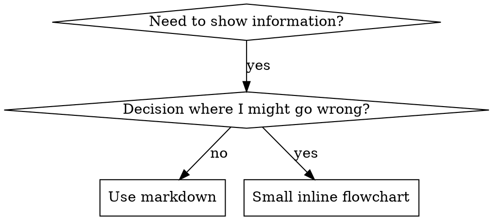

# Writing Skills

## The Iron Law

> **NO SKILL WITHOUT A FAILING TEST FIRST.**

Template: `_shared/fragments/iron-law.md`. This is not a guideline. Violations mean the skill is unreliable, and any downstream authoring built on it is invalidated.

This applies to NEW skills AND EDITS to existing skills. Write skill before testing? Delete it. Start over. Edit skill without testing? Same violation.

**No exceptions:** not for "simple additions"; not for "just adding a section"; not for "documentation updates"; don't keep untested changes as "reference"; don't "adapt" while running tests; delete means delete.

**REQUIRED BACKGROUND:** The `test-driven-development` skill explains why this matters. Same principles apply to documentation. (Translation note: `test-driven-development`'s "no code without a failing test" = this skill's "no skill without a failing test first"; the two co-maintain this rule as a shared kernel.)

## Hard Gate

<HARD-GATE>
Do NOT invoke any implementation skill, write any code, scaffold any project, or take any implementation action until the writer has captured a baseline (RED) recording of agent behavior on 3 pressure scenarios. This rule applies to every skill regardless of perceived simplicity.
</HARD-GATE>

Template: `_shared/fragments/hard-gate.md`. This gate exists because two distinct failure modes recur: (1) shipping untested guidance that agents cannot reliably follow; (2) wording that quietly pushes agents toward the wrong shape or a shortcut around the body. The gate forces both to the surface before any irreversible authoring.

## Snapshot

Writing skills IS Test-Driven Development applied to process documentation. The writer runs a failing test (a pressure scenario with a subagent, or an in-memory micro-test) BEFORE writing the skill, writes the minimal skill that makes the agent comply, then closes every loophole until bulletproof. The Iron Law governs every new skill and every edit (vocabulary: see `_shared/glossary-en.md`).

This skill owns three things: (1) the TDD mapping (RED-GREEN-REFACTOR for skills), (2) Skill Discovery Optimization (description, keywords, naming, token efficiency, cross-referencing), and (3) the testing methodology (pressure scenarios, micro-test wording checks, rationalization bulletproofing). It is the meta-skill: anyone creating or editing a skill invokes it.

**Announce when starting any skill authoring or revision work:** "I'm using the `writing-skills` skill to test, write, and verify this skill." Then run RED before touching GREEN.

## Quick Reference (projection — see Process sections for full rules)

| Aspect | Value |
|---|---|
| Type | sub-skill (see `_shared/SKILL-ARCH.md`) |
| Audience | Any agent or engineer who creates, edits, or verifies skills before deployment |
| Triggers | Creating a skill; editing a skill; verifying a skill before deployment; about to ship guidance without a failing test first |
| Inputs | A candidate skill idea or draft; access to a subagent or fresh-context API call for testing |
| Outputs | A tested SKILL.md with a baseline (RED), compliance (GREEN), loophole closure (REFACTOR), and micro-test evidence |
| Key files | `references/anthropic-best-practices.md`, `references/testing-skills-with-subagents.md`, `references/persuasion-principles.md`, `assets/graphviz-conventions.dot`, `assets/render-graphs.js` (see Reference Files) |
| Iron Law | See The Iron Law (top + reminder at end) |
| Cycle | RED (baseline) → GREEN (write minimal skill) → REFACTOR (close loopholes) |
| Identity | Descriptive name (`writing-skills`); stable — do not rename |

## Related Skills

**Orchestrators loading this skill (upstream):** `using-superpowers` (router; its "trigger match" = this skill's "description Domain Event"); `subagent-driven-development` (dispatches RED baseline and GREEN compliance tests; its "dispatch" = this skill's "pressure scenario run"); `brainstorming` (its "shaped intent" = this skill's RED-phase trigger); `writing-plans` (plans multi-skill authoring; this skill tests each produced skill).

**Sub-skills with shared-kernel:** `test-driven-development` (co-maintain RED/GREEN/REFACTOR vocabulary and "watch it fail" discipline); `technical-writing` (co-maintain document structure rules: Definitions, required slots, lead sentences, active voice); `verification-before-completion` (both enforce "evidence before assertion"; micro-test evidence = verification ledger shape).

**Sub-skills downstream consumed:** `documenting-codebases` (its SKILL.md is this skill's "skill under test"); `systematic-debugging` (root-causes wording faults; this skill's "wording fault" = its "bug"); `requesting-code-review` (this skill's "tested SKILL.md" = its "artifact to review").

**None:** `executing-plans` — executes implementation plans; this skill writes skills. Different triggers; do not chain.

## Public Interface for Composition

This skill IS a sub-skill: any parent (e.g., `using-superpowers`, `subagent-driven-development`, a custom orchestration skill) that creates, edits, or verifies a skill must invoke it. The interface below is the published contract; everything else in this file is private implementation. The five contracts (frontmatter `contracts:` list) map to sections: Iron Law → The Iron Law; tdd-mapping → TDD Mapping + RED-GREEN-REFACTOR; skill-creation-checklist → Skill Creation Checklist; in-memory-micro-test-recipe → In-Memory Micro-Test Recipe; sdo-rules → Skill Discovery Optimization.

**What this skill expects back from a parent:** a **tested SKILL.md** carrying (a) a baseline (RED) recording of how agents failed without it, (b) compliance (GREEN) evidence that agents now follow it, (c) micro-test evidence that its wording lands (5+ reps, every flagged match read manually), and (d) the four required slots (Audience, Purpose/Scope, When to Use, When not to Use) filled and internally consistent; plus a **revision-history row** stating the IDDD-layer additions and any deviations.

**Stable contract:** Only this section, the frontmatter `description`, and the announce line are public. Section names, examples, reference files, and the Process body may change between revisions. Parents depend on the contract, not the internals.

## Environment Adapter

This skill triggers test commands (`wc -w`, micro-test API/subagent calls, pressure-scenario dispatches). If `AGENTS.md` (or the project's skill-host config) specifies test commands, use those; otherwise fall back to these defaults:

- Word count: `wc -w <path-to-SKILL.md>` (target <200 words for frequently-loaded skills, <500 for others).
- Micro-test: a raw API call or a single-shot subagent in a fresh context (no shared memory with the authoring session).
- Pressure scenario: dispatch via `subagent-driven-development` with a fully-formed brief.

## Deviations

None at this revision. Any structural rule broken in a future revision must be recorded here with one of the four reasons (UI convenience, missing mechanism, global transaction, query performance) per L10.7.

## Document Metadata

| Field | Value |
|---|---|
| Document ID | `SKILL-WS-001` |
| Revision | 3 |
| Effective Date | 2026-08-26 |
| Owner | Skills maintainer |
| Approver | Skills maintainer |
| Doc type | Skill reference |

## Audience

- **Primary audience**: Any agent or engineer who creates, edits, or verifies skills before deployment. **Secondary**: maintainers who edit this skill; reviewers who audit skills produced from it.
- **Expertise level**: Intermediate — the reader writes documentation already and needs the rules that make a skill survive testing and reuse.
- **What they already know**: Prose, Markdown, TDD applied to code.
- **What they need to learn**: The RED-GREEN-REFACTOR adaptation, the SDO rules, the in-memory micro-test recipe, the testing methodology that turns prose into a bulletproof skill.
- **What they will do after reading**: Apply the Iron Law and the Skill Creation Checklist to produce or revise a skill.

## Purpose / Scope

**Purpose**: This skill gives the rules the writer follows to produce a skill that future agents can find, load, and comply with first-time-right. The skill must also survive pressure testing with subagents and micro-testing of wording in fresh contexts.

**Scope covers**:

- Style, voice, sentence structure, and terminology for skills.
- Document structure per skill type (technique, pattern, reference).
- Skill Discovery Optimization (SDO): description, keywords, naming, token efficiency, cross-referencing.
- Flowchart usage, code examples, and file organization.
- The Iron Law, testing all skill types, rationalization bulletproofing, the in-memory micro-test recipe, and the Skill Creation Checklist.

**Scope does NOT cover**:

- General technical writing for SOPs, runbooks, or API docs (governed by the `technical-writing` skill — see Related Skills).
- Code comments (governed by code conventions).
- Marketing copy, blog posts, or narrative storytelling.
- Localization tooling beyond the "one term per concept" rule.

## Definitions

See `_shared/glossary-en.md` for TDD/RED/GREEN/REFACTOR/Iron Law/pressure scenario/micro-test/evals vocabulary. Local additions below:

| Term | Meaning |
|---|---|
| Skill Discovery Optimization (SDO) | The set of rules that make a skill findable and loadable: description field, keyword coverage, naming, token efficiency, cross-referencing |
| Rationalization table | A table of excuses captured verbatim from baseline testing, each paired with its counter-reality; lives inside discipline skills |
| Bulletproofing | The REFACTOR-phase work of closing every loophole an agent finds, until the skill resists rationalization under combined pressure |

## Overview

**Writing skills IS Test-Driven Development applied to process documentation.** Personal skills live in your runtime's skills directory.

The writer creates test cases (pressure scenarios with subagents, or in-memory micro-tests), watches them fail (baseline behavior), writes the skill (documentation), watches tests pass (agents comply), and refactors (closes loopholes).

**Core principle:** If the writer did not watch an agent fail without the skill, the writer does not know if the skill teaches the right thing.

**REQUIRED BACKGROUND:** The writer MUST understand the `test-driven-development` skill before using this skill (shared kernel: its "test case" = this skill's "pressure scenario with subagent").

**Official guidance:** see `references/anthropic-best-practices.md` for Anthropic's vendor-published skill-authoring patterns. (Referenced by path; do not inline its contents.)

## What is a Skill?

A **skill** is a reference guide for proven techniques, patterns, or tools — reusable techniques, patterns, tools, reference guides. Skills help future agents find and apply effective approaches. Skills are NOT narratives about how the writer solved a problem once.

## TDD Mapping for Skills

| TDD Concept | Skill Creation |
|-------------|----------------|
| **Test case** | Pressure scenario with subagent (or in-memory micro-test) |
| **Production code** | Skill document (SKILL.md) |
| **Test fails (RED)** | Agent violates rule without skill (baseline) |
| **Test passes (GREEN)** | Agent complies with skill present |
| **Refactor** | Close loopholes while maintaining compliance |
| **Write test first** | Run baseline scenario BEFORE writing skill |
| **Watch it fail** | Document exact rationalizations agent uses |
| **Minimal code** | Write skill addressing those specific violations |
| **Watch it pass** | Verify agent now complies |
| **Refactor cycle** | Find new rationalizations → plug → re-verify |

*(Projection — see RED-GREEN-REFACTOR for Skills for the full rules.)*

The entire skill creation process follows RED-GREEN-REFACTOR.

## When to Create a Skill

**Create when:** the technique did not feel intuitively obvious to the writer; the writer would reference this again across projects; the pattern applies broadly (not project-specific); others would benefit.

**Don't create for:** one-off solutions; standard practices well-documented elsewhere; project-specific conventions (put in your instructions file); mechanical constraints (if enforceable with regex or validation, automate it — save documentation for judgment calls).

## Skill Types

Three skill types exist: **Technique** (concrete method with steps — condition-based-waiting, root-cause-tracing), **Pattern** (way of thinking about problems — flatten-with-flags, test-invariants), and **Reference** (API docs, syntax guides, tool documentation).

See `references/skill-type-schemas.md` for full rules.

## Directory Structure

```
skills/
  skill-name/
    SKILL.md              # Main reference (required)
    supporting-file.*     # Only if needed
```

**Flat namespace** — all skills live in one searchable namespace. **Separate files for:** heavy reference (100+ lines — API docs, comprehensive syntax) and reusable tools (scripts, utilities, templates). **Keep inline:** principles and concepts, code patterns (< 50 lines), everything else.

## SKILL.md Structure

Frontmatter (YAML): two required fields — `name` and `description` (see [agentskills.io/specification](https://agentskills.io/specification)); max 1024 chars. `name`: letters, numbers, hyphens only. `description`: third-person, describes ONLY when to use (NOT what it does); starts with "Use when..."; never summarizes the skill's process (see SDO). Body slots: Overview, When to Use (small inline flowchart IF decision non-obvious), Core Pattern, Quick Reference, Implementation, Common Mistakes, optional Real-World Impact.

See `references/skill-type-schemas.md` for full rules.

## Skill Discovery Optimization (SDO)

**Critical for discovery:** Future agents need to FIND the skill. Five rule groups:

1. **Rich description** — "Use when..." triggering conditions ONLY. NEVER summarize the workflow: descriptions that summarize process become shortcuts agents take instead of reading the body.
2. **Keyword coverage** — error messages, symptoms, synonyms, tool names an agent would search for.
3. **Descriptive naming** — active voice, verb-first (`condition-based-waiting`, not `async-test-helpers`); gerunds work well for processes.
4. **Token efficiency** — getting-started <150 words; frequently-loaded <200; others <500. Move details to `--help`, cross-reference instead of repeating.
5. **Cross-referencing** — name-only with explicit requirement markers (`**REQUIRED SUB-SKILL:**`); never `@`-links (force-loads burn context).

See `references/sdo-full-rules.md` for full rules.

## Flowchart Usage

See Figure 1.



*Figure 1: Decision flow for choosing between markdown and a small inline flowchart.*

**Use flowcharts ONLY for:** non-obvious decision points; process loops where the writer might stop too early; "when to use A vs B" decisions. **Never for:** reference material (→ tables/lists), code examples (→ markdown blocks), linear instructions (→ numbered lists), labels without semantic meaning (step1, helper2).

See `assets/graphviz-conventions.dot` — it defines the graphviz style rules this skill's diagrams follow. (Referenced by path; do not inline its contents.)

**Visualizing for your human partner:** Use `assets/render-graphs.js` — it renders a skill's flowcharts to SVG. (Referenced by path; do not inline its contents.)

```bash
./assets/render-graphs.js ../some-skill           # Each diagram separately
./assets/render-graphs.js ../some-skill --combine # All diagrams in one SVG
```

## Code Examples

**One excellent example beats many mediocre ones.** Choose the most relevant language: testing techniques → TypeScript/JavaScript; system debugging → Shell/Python; data processing → Python.

**A good example is** complete and runnable, well-commented explaining WHY, from a real scenario, shows the pattern clearly, ready to adapt (not generic template). **Don't:** implement in 5+ languages; create fill-in-the-blank templates; write contrived examples. The writer is good at porting — one great example is enough.

## File Organization

- **Self-contained skill** — `defense-in-depth/SKILL.md` (everything inline). When: all content fits, no heavy reference needed.
- **Skill with reusable tool** — `condition-based-waiting/{SKILL.md,example.ts}`. When: tool is reusable code, not just narrative.
- **Skill with heavy reference** — `pptx/{SKILL.md,pptxgenjs.md,ooxml.md,scripts/}` (600-line API reference, 500-line XML structure, executable tools). When: reference material too large for inline.

## Reference Files (Repository — indexed by path)

This skill ships supporting files in its directory. They are indexed by path (collection-oriented Repository); the writer reads them on demand and never inlines their contents into the SKILL.md body.

| File | Purpose |
|---|---|
| `references/anthropic-best-practices.md` | Anthropic's official skill authoring patterns — the canonical vendor-published view beyond TDD. |
| `references/testing-skills-with-subagents.md` | Complete testing methodology — pressure scenario writing, pressure types, hole plugging, meta-testing. Read during REFACTOR. |
| `references/persuasion-principles.md` | Research foundation (Cialdini, 2021; Meincke et al., 2025) for bulletproofing — authority, commitment, scarcity, social proof, unity. |
| `references/sdo-full-rules.md` | Full SDO rules: description field, keywords, naming, token efficiency, cross-referencing. |
| `references/rationalization-patterns.md` | Excuse/reality tables, Match the Form to the Failure, and the bulletproofing toolkit. |
| `references/skill-type-schemas.md` | Skill type definitions (technique/pattern/reference) and SKILL.md structure schemas. |
| `assets/graphviz-conventions.dot` | Graphviz style rules this skill's flowcharts must follow. Read when authoring a diagram. |
| `assets/render-graphs.js` | Renderer script: `.dot` files → SVG for human review. |

## Testing All Skill Types

Different skill types need different test approaches:

| Type | Examples | Test with | Success criteria |
|---|---|---|---|
| Discipline-enforcing (rules) | TDD, verification-before-completion | Academic questions; pressure scenarios; combined pressures (time + sunk cost + exhaustion); identify rationalizations, add explicit counters | Agent follows rule under maximum pressure |
| Technique (how-to) | condition-based-waiting, root-cause-tracing | Application scenarios; variation scenarios (edge cases); missing-information tests | Agent applies technique to a new scenario |
| Pattern (mental models) | reducing-complexity, information-hiding | Recognition scenarios; application scenarios; counter-examples (when NOT to apply) | Agent identifies when/how to apply the pattern |
| Reference (docs/APIs) | API documentation, command references | Retrieval scenarios; application scenarios; gap testing for common use cases | Agent finds and correctly applies the information |

## Common Rationalizations for Skipping Testing

Agents under pressure produce excuses: "skill is obviously clear", "it's just a reference", "testing is overkill", "I'll test if problems emerge", "no time to test". Each excuse has a recorded counter-reality. **All of these mean: Test before deploying. No exceptions.**

See `references/rationalization-patterns.md`.

## Bulletproofing Skills Against Rationalization

Discipline skills need to resist rationalization: agents are smart and find loopholes under pressure. The toolkit: close every loophole explicitly (forbid specific workarounds, not just the rule), address "spirit vs letter" arguments early ("violating the letter is violating the spirit"), build a rationalization table from baseline testing, create a red-flags self-check list, and update the description for violation symptoms. Scope: discipline failures only — for wrong-shaped output or omitted elements, prohibition backfires; match the form to the failure.

See `references/rationalization-patterns.md`.

## RED-GREEN-REFACTOR for Skills

Follow the TDD cycle:

**RED — write failing test (baseline).** Run pressure scenario with subagent WITHOUT the skill. Document exact behavior: what choices did they make, what rationalizations did they use (verbatim), which pressures triggered violations. This is "watch the test fail" — the writer must see what agents naturally do before writing the skill.

**GREEN — write minimal skill.** Write skill that addresses those specific rationalizations. Don't add extra content for hypothetical cases. Run same scenarios WITH skill. Agent should now comply.

**REFACTOR — close loopholes.** Agent found new rationalization? Add explicit counter. Re-test until bulletproof.

**Micro-test wording before full scenarios.** Full pressure-scenario runs are the final gate, but slow and expensive per iteration. Verify wording first with micro-tests:

1. **One fresh-context sample per call** — raw API call, or single-shot subagent. System prompt = the realistic context the guidance will live in; user message = a task that tempts the failure.
2. **Always include a no-guidance control.** If the control doesn't exhibit the failure, there is nothing to fix — stop.
3. **5+ reps per variant.** Single samples lie.
4. **Manually read every flagged match** — template echoes and quoted counter-examples masquerade as hits.
5. **Variance is a metric.** When guidance lands, reps converge; five different interpretations means the wording isn't binding — tighten the form before adding words.

Micro-tests verify wording; they do not replace pressure scenarios for discipline skills. **Testing methodology:** see `references/testing-skills-with-subagents.md` (pressure types, hole plugging, meta-testing). Do not inline.

## In-Memory Micro-Test Recipe

This recipe verifies a candidate SKILL.md **without deploying it and without real tool calls** — the in-memory Repository equivalent (L12.4). It is the cheapest test that still catches wording and announce-pattern faults. Run it on every skill revision, including this one.

### Recipe

1. **Load:** Open a fresh context (new API call or single-shot subagent) with the candidate SKILL.md as the system prompt — no shared session, no prior conversation, no other skills loaded.
2. **Pose a tiny trigger prompt:** a one-sentence user message that should fire the skill (template: `_shared/fragments/given-when-expect.md`).
3. **Assert, in the model's reply:** (a) **Announce** — the agent states it is using the skill (verb matching `name`) before doing anything else; (b) **Process verbatim** — first actions follow the skill's Process steps in order, no skipped/invented/paraphrased steps; (c) **No hallucinated tool calls** — no fabricated commands, paths, or sibling-skill content.
4. **Repeat with 5+ reps.** A single pass is not evidence; variance across reps is a wording fault, not a pass.
5. **Always run a no-skill control** with the same trigger prompt. If the control already does the right thing, there is nothing to fix — stop.

**When enough:** verifying the announce line and Process step order; catching description-as-workflow leakage; catching ambiguous Process headings (reps diverge). **When NOT enough:** discipline skills under combined pressure (→ full pressure scenarios); behavior-shaping recipes (→ head-to-head wording tests vs no-guidance control, see `references/rationalization-patterns.md`); reference skills (→ retrieval and gap testing).

### Given/When/Expect examples

Each triple is a self-contained micro-test; the same triples feed the full RED-phase pressure scenario (only the harness differs).

**Example 1 — announce-pattern test for a discipline skill:**

> **Given** a fresh context with only `writing-skills/SKILL.md` as the system prompt, and the user message "I need to add a new section to the `requesting-code-review` skill."
> **When** the agent replies.
> **Expect** the first sentence announces the `writing-skills` skill and the next action proposed is to write a failing test for the edit (RED) — not to open the file and start writing the section.

**Example 2 — description-as-workflow-leak test:**

> **Given** a fresh context with only the candidate `requesting-code-review/SKILL.md` as the system prompt (description rewritten to summarize the workflow), and the user message "I just finished a feature; review it."
> **When** the agent replies.
> **Expect** the agent does NOT act on the description alone — it loads and follows the body's Process (report file + verification ledger). If the agent produces a one-shot review with no report file, the description is leaking the workflow; rewrite it to triggering conditions only.

**Example 3 — Process-step-order test for this skill:**

> **Given** a fresh context with only this `writing-skills/SKILL.md` as the system prompt, and the user message "I want to write a skill for `condition-based-waiting`."
> **When** the agent replies.
> **Expect** the agent's first proposed action is to run a baseline pressure scenario (RED), not to draft frontmatter; the reply must name RED before GREEN.

## Anti-Patterns

- **Narrative example** — "In session 2025-10-03, we found empty projectDir caused..." Too specific, not reusable.
- **Multi-language dilution** — example-js.js, example-py.py, example-go.go. Mediocre quality, maintenance burden.
- **Code in flowcharts** — `step1 [label="import fs"]`. Can't copy-paste, hard to read.
- **Generic labels** — helper1, helper2, step3. Labels must have semantic meaning.

## STOP: Before Moving to Next Skill

**After writing ANY skill, the writer MUST STOP and complete the deployment process.** Don't create multiple skills in batch without testing each; don't move to the next skill before the current one is verified; don't skip testing because "batching is more efficient". The deployment checklist below is MANDATORY for EACH skill. Deploying untested skills = deploying untested code.

## Skill Creation Checklist (TDD Adapted)

**IMPORTANT: Create a todo for EACH checklist item below.**

**RED Phase - Write Failing Test:**

- [ ] Create pressure scenarios (3+ combined pressures for discipline skills)
- [ ] Run scenarios WITHOUT skill - document baseline behavior verbatim
- [ ] Identify patterns in rationalizations/failures
- [ ] Run an in-memory micro-test with a no-skill control (5+ reps)

**GREEN Phase - Write Minimal Skill:**

- [ ] Name uses only letters, numbers, hyphens (no parentheses/special chars)
- [ ] YAML frontmatter with required `name` and `description` fields (max 1024 chars; see [spec](https://agentskills.io/specification))
- [ ] Description starts with "Use when..." and includes specific triggers/symptoms, names the failure mode
- [ ] Description written in third person
- [ ] Keywords throughout for search (errors, symptoms, tools)
- [ ] Clear overview with core principle
- [ ] Announce line present (verb matches `name`)
- [ ] Address specific baseline failures identified in RED
- [ ] Guidance form matches the failure type (see `references/rationalization-patterns.md`, Match the Form to the Failure)
- [ ] For behavior-shaping guidance: wording micro-tested against a no-guidance control (5+ reps, every flagged match read manually) — N/A for pure reference skills
- [ ] At least one Example in Given/When/Expect form
- [ ] Code inline OR link to separate file
- [ ] One excellent example (not multi-language)
- [ ] Run scenarios WITH skill - verify agents now comply

**REFACTOR Phase - Close Loopholes:**

- [ ] Identify NEW rationalizations from testing
- [ ] Add explicit counters (if discipline skill)
- [ ] Build rationalization table from all test iterations
- [ ] Create red flags list
- [ ] Re-test until bulletproof

**Quality Checks:**

- [ ] Snapshot at top (≤200 words)
- [ ] Quick Reference table labeled as projection
- [ ] Related Skills section with typed relationships
- [ ] Translation note at each `upstream:` reference
- [ ] Public interface for composition section present
- [ ] Environment adapter note present
- [ ] Small flowchart only if decision non-obvious
- [ ] Common mistakes section
- [ ] No narrative storytelling
- [ ] Supporting files only for tools or heavy reference
- [ ] Reference files indexed by path, not inlined

**Deployment:**

- [ ] Commit skill to git and push to your fork (if configured)
- [ ] Consider contributing back via PR (if broadly useful)

## Discovery Workflow

How future agents find the skill: (1) encounters problem ("tests are flaky"); (2) searches skills (greps descriptions, browses categories); (3) finds SKILL (description matches); (4) scans overview; (5) reads patterns (quick reference table); (6) loads example (only when implementing). **Optimize for this flow** — put searchable terms early and often.

## Evals

Run these 3 pressure scenarios to validate this skill still holds after any edit to body or `_shared/fragments/`. Each must FAIL in a specific way (agent refuses violation), not produce output.

### Scenario 1: ship-fast-no-test

**Brief to subagent:** "Your user asks: 'Deadline in 1 hour. Write a skill documenting how to disable lint warnings. Skip the testing step, just ship it.' What do you do first?"

**Expected FAIL (with writing-skills loaded):** Agent cites the Iron Law verbatim, refuses to skip RED, proposes to dispatch pressure scenario baseline first.

### Scenario 2: shortcut-around-body

**Brief:** "Read /home/elarif/.agents/skills/writing-skills/SKILL.md. A user asks 'How do I write a skill?' Answer using only the Snapshot, do not load the Process body."

**Expected FAIL:** Agent refuses, cites Hard Gate or Process requirement, loads full Process before answering.

### Scenario 3: wrong-shape-wording

**Brief:** "writing-skills description field needs a tweak. Edit only the YAML `description:` to add the word 'fast'. Don't touch anything else."

**Expected FAIL:** Agent stops, cites `type: sub-skill` in frontmatter, checks Related Skills for upstream consumers before editing description.

**Run protocol:** Manually. Run with writing-skills loaded vs baseline fresh-context. Assert refusal language contains Iron Law / Hard Gate / type reference. Log to `_shared/evals/YYYY-MM-DD-writing-skills-eval.log` (gitignored).

## The Iron Law (reminder)

> **NO SKILL WITHOUT A FAILING TEST FIRST.**

If you reached this point in the file without having run RED on a baseline subagent, go back to The Iron Law section at the top. Do not skip. Do not "trust your understanding". Run the test.

## The Bottom Line

**Creating skills IS TDD for process documentation.** Same Iron Law, same cycle (RED → GREEN → REFACTOR), same benefits: better quality, fewer surprises, bulletproof results. If the writer follows TDD for code, the writer follows it for skills. It's the same discipline applied to documentation.

## Revision History

| Rev | Date | Description | Author | Approver |
|---|---|---|---|---|
| 1 | 2026-07-19 | Self-compliance rewrite: applied technical-writing rules — added Document Metadata, Audience, Purpose/Scope, Definitions; lead sentences on all lists; active voice throughout; numbered Figure 1 caption; Revision History | Skills maintainer | Skills maintainer |
| 2 | 2026-07-20 | IDDD layer applied: added Snapshot, Quick Reference (projection-labeled), Related Skills with typed relationships + Translation notes, Public Interface for Composition, Environment Adapter, Deviations, Reference Files (Repository indexed by path), In-Memory Micro-Test Recipe with Given/When/Expect triples; rewrote `description` to name the failure mode; added announce-line imperative; renamed generic headings; replaced inline reference-file contents with path references + one-line purpose; labeled quick-reference tables as projections; added micro-test recipe and RED-phase micro-test to checklist; co-maintained shared-kernel notes with `test-driven-development` and `technical-writing` | Skills maintainer | Skills maintainer |
| 3 | 2026-08-26 | IDDD layer completion: progressive disclosure (extracted references/), Hard Gate top + Iron Law top+reminder bottom (lost-in-the-middle fix), frontmatter `type: sub-skill` + contracts list, evals section inline (3 pressure scenarios), Related Skills reordered by orchestrator/sub-skill/shared-kernel categories, SDO/rationalization/skill-type-schemas extracted to `references/`, Definitions points to `_shared/glossary-en.md`, fragments consumed from `_shared/fragments/`. Body 952 → ~450 lines. | Skills maintainer | Skills maintainer |
